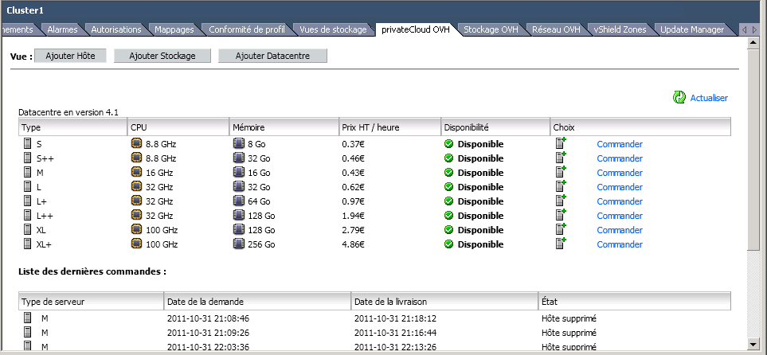
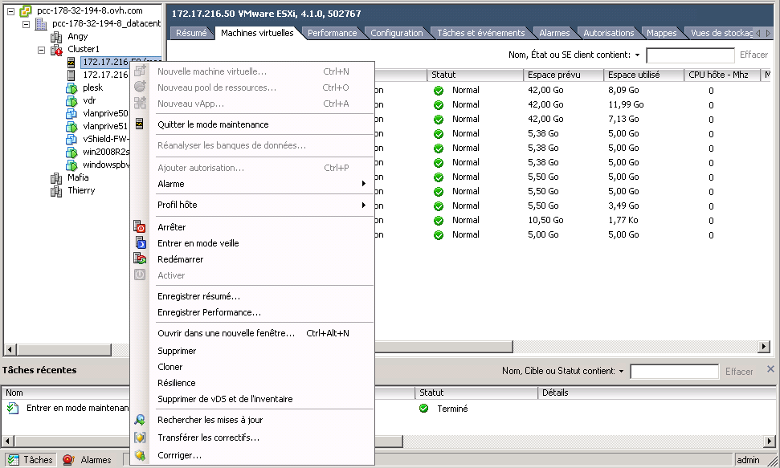

## 
You must use the vSphere Client, or access it by using your own local client, or by using the RDP that we provide to you upon activation of your Private Cloud.

## 
In the vSphere Client, select your PCC, then go to the tab "OVH Private Cloud" on the right hand side, and select "Add Host".
Then all you have to do is click on the "Order" button.

{.thumbnail}
Once you have made the order, a task will appear in your vSphere with the added host in your datacentre.

## 

## WARNING!
You must move the host into maintenance before deleting your datacentre.
To do this, simply right-click on the host to delete and click on "Delete":

{.thumbnail}

