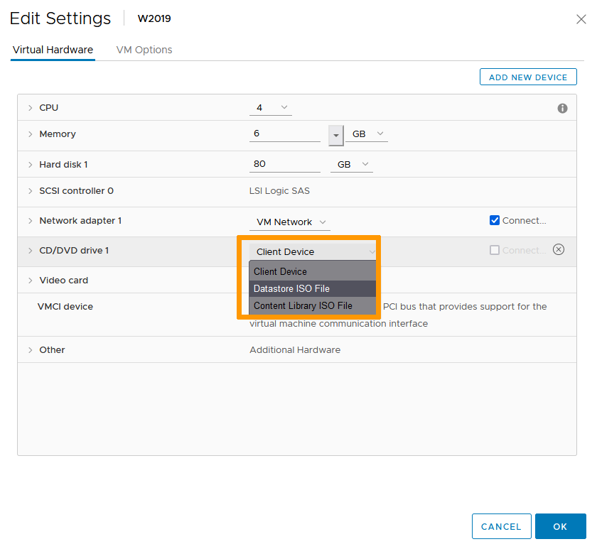

**Dernière mise à jour le 11/01/2022**

## Objectif

Vous pouvez créer une librairie de fichiers ISO à utiliser pour vos déploiements de systèmes et de logiciels dans votre infrastructure.

**Ce guide vous accompagne tout au long du processus de connexion d'une image ISO à une VM.**

## Prérequis

- Être contact administrateur de l'infrastructure [Hosted Private Cloud](https://www.ovhcloud.com/fr-ca/enterprise/products/hosted-private-cloud/), afin de recevoir les identifiants de connexion.
- Avoir un identifiant utilisateur actif (créé dans l'[espace client OVHcloud](https://ca.ovh.com/auth/?action=gotomanager&from=https://www.ovh.com/ca/fr/&ovhSubsidiary=qc))

## En pratique

### Création de la librairie

Dans l'interface vSphere, allez dans la section `Stockage`{.action}. 
Choisissez le Datastore qui abritera la librairie (préférez les espaces de stockage partagés aux stockage locaux afin d'éviter les problèmes d'accès). 
Dans l'onglet `Fichiers`{.action}, cliquez sur `Nouveau Dossier`{.action}.

{.thumbnail}

Nommez votre dossier (dans notre exemple : ISOs) puis selectionnez-le et cliquez sur `Télécharger des fichiers`{.action}.

{.thumbnail}

Naviguez jusqu'aux fichiers ISO que vous souhaitez uploader et cliquez sur `Ouvrir`{.action}.

{.thumbnail}

Votre librairie est prête. Vous pouvez ajouter des images ISO selon vos besoins et dans la limite de l'espace de stockage disponible.

{.thumbnail}

### Connecter une image à une VM

Dans l'interface vSphere, allez dans la section `Hôtes & clusters`{.action}. 
Faites un clic droit sur la VM qui a besoin de l'image ISO attachée puis cliquez sur `Modifier les paramètres`{.action}. 

{.thumbnail}

Changez le paramètre du lecteur CD/DVD en "Fichier ISO banque de données".

{.thumbnail}

Dans la fenêtre de navigation qui apparait, allez dans la librairie créée précédement et selectionnez l'image à utiliser. 
Cliquez sur `OK`{.action}.

{.thumbnail}

De retour dans la fenêtre de paramétrage, assurez-vous que l'option "Connecter" est cochée avant de cliquer `OK`{.action}.

{.thumbnail}

L'image est désormais connectée et disponible pour votre VM comme si c'était un media physique directement attaché.

## Aller plus loin

Échangez avec notre communauté d'utilisateurs sur <https://community.ovh.com>.
