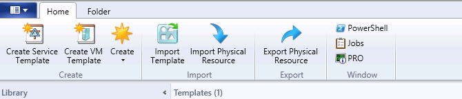
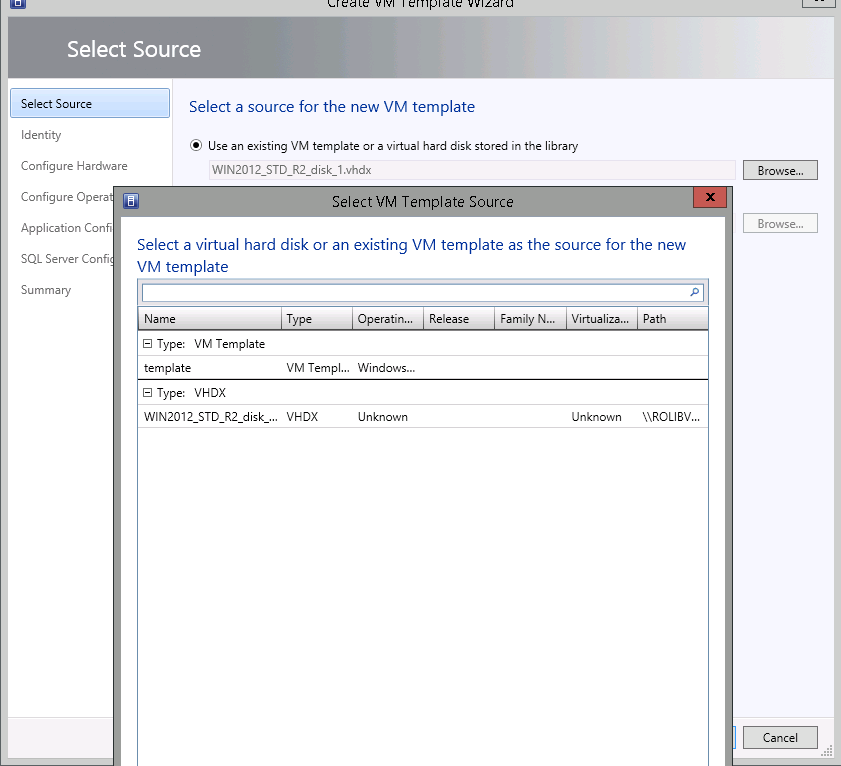
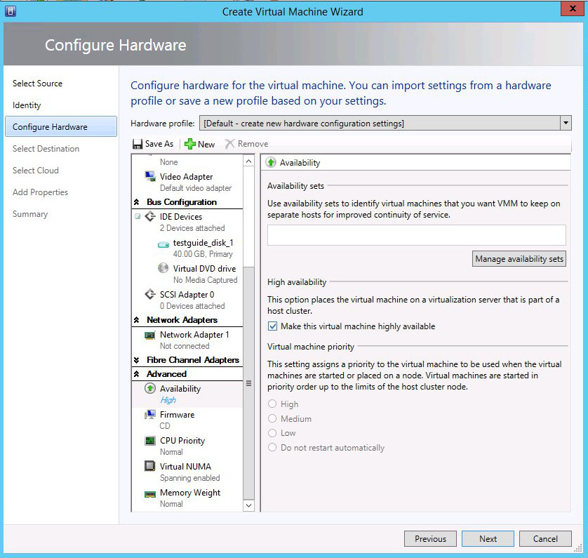
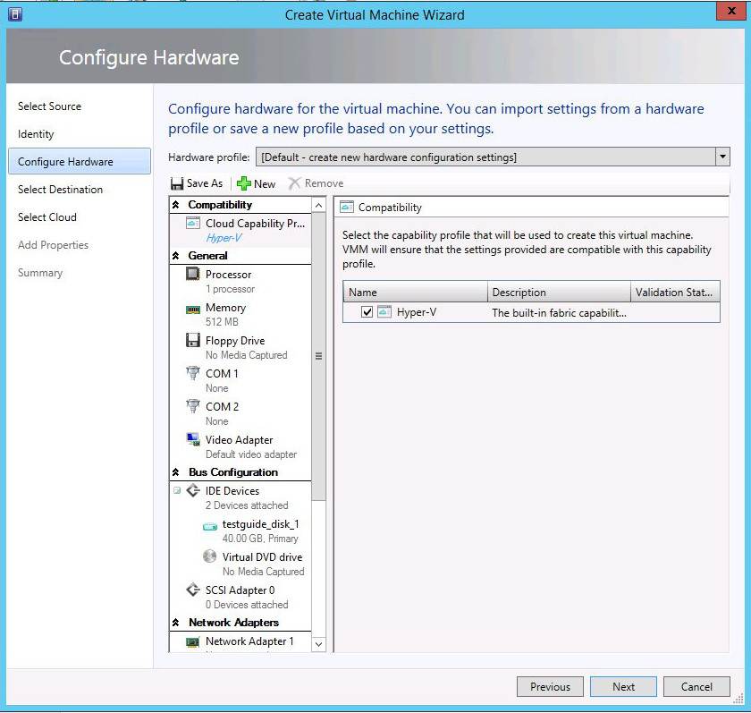
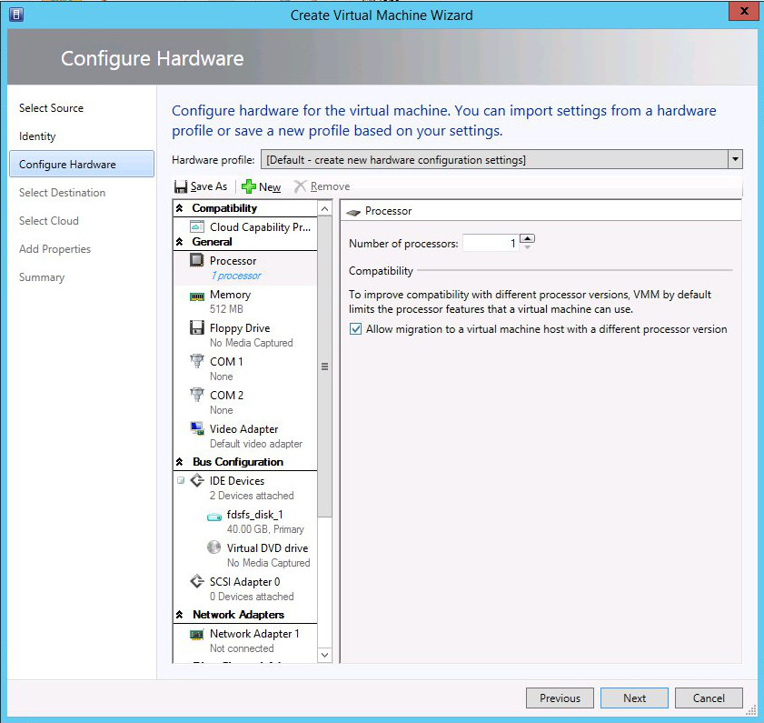
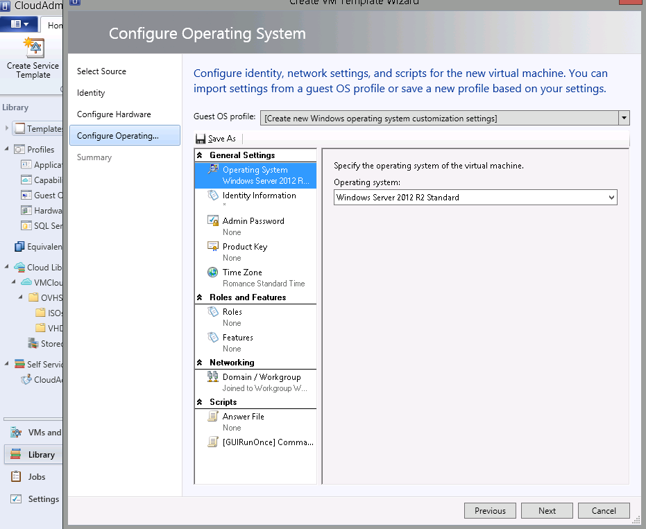
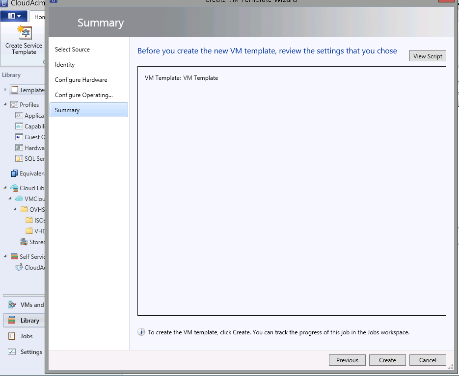
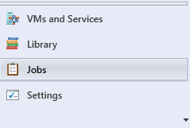
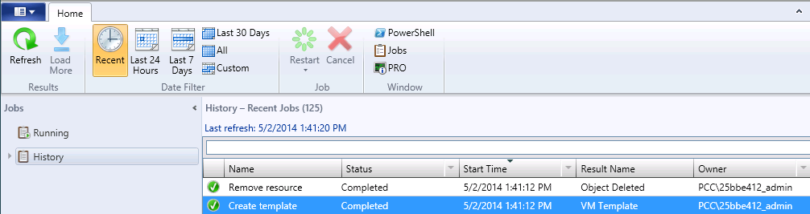

## Library
You create the template in the library section of the VMM:

{.thumbnail}
Here, you will find a "Create VM Template" button.

{.thumbnail}

## Select source:
In the wizard, select the option of your choice. Here, we're going to choose to create the template from an existing drive.
The selected disk is provided by OVH in the library.

{.thumbnail}

## Identity:
Select the template name and add a description if necessary.

## Configure hardware:
You can choose the configuration that you want.
Don't forget HA, cloud compatibility and migration permissions.
HA:

{.thumbnail}
Compatibility Cloud:

{.thumbnail}
Permission to migrate in the event of a different CPU:

{.thumbnail}

## Configure operating system:
Select the configuration of your choice: the default password, the rules or associated features, RunOnce keys, etc.

{.thumbnail}

## Summary:
You have finished creating the template. You just need to complete it by clicking create.

{.thumbnail}

## Jobs
You can follow the progress of created jobs under the "Jobs" menu.

{.thumbnail}
The job is listed in the right-hand side under history.

{.thumbnail}

