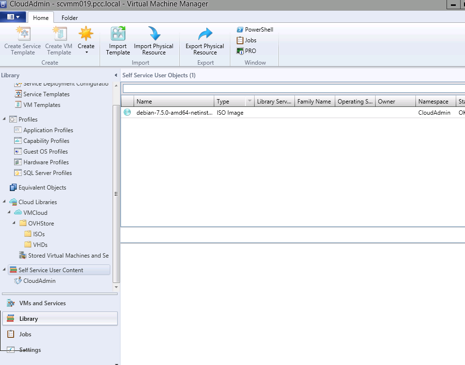

## Library
Tworzenie szablonu odbywa się w części Library w VMM:

{.thumbnail}

## 
OVH daje do dyspozycji ISO oraz VHD, aby można było w prosty sposób korzystać z VMM.

{.thumbnail}
ISO mogą być montowane na wirtualnych maszynach a VHD mogą być używane podczas tworzenia wirtualnych maszyn / szablonów.

## 
OVH daje do dyspozycji przestrzeń dyskową do wgrywania własnych VHD / ISO.

{.thumbnail}

