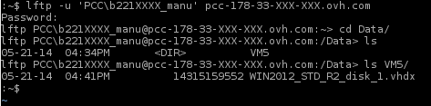
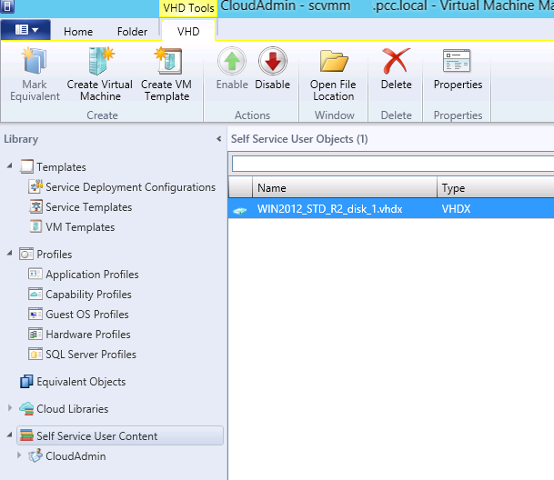

## Export your VM
The export process varies depending on the infrastructure on which your VM is running, and therefore, we can't explain it here. Instead, use the function at your disposal to retrieve your VM. What's important is to be able to recover the virtual machine disk, under Hyper-V: VHDX or VMDK in VMware.

- I've retrieved my VHDX:

In this case, you can move on to the import step.

- I've retrieved my VMDK:

First of all, you need to convert your VMDK to VHDX to make it compatible with HyperV. To do this, you can use one of the following tools:
[Microsoft Virtual Machine Converter Solution Accelerator](http://www.microsoft.com/en-us/download/details.aspx?id=34591)
[2Tware Convert VHD](http://www.2tware.com/product/6/2twareconvertvhdfree)
OVH provides information on these tools for guidance. You can also use other tools.
OVH can't provide support for tools that are developed by third party.

## Connect to the library via FTPS
Once you have retreived your disk, you must insert it into your VMM library so that you can deploy a VM from this disk. To connect to the FTPs service and upload your disk, please follow this guide:.
Remember to upload your disk into the "Data" folder.

{.thumbnail}

## Check that the imported disk is in the VMM library
The VMM library needs to refresh before it displays the disk. This occurs every hour, so you may need to wait a short while before you can see it.

{.thumbnail}

## Create a template from the disk
You can create a template from this disk. This will allow you customise any future VM deployments from the disk. Everything is detailed in this guide:

## Create a VM from the disk
If you don't want to customize anything, you can directly deploy a VM from the disk. Everything is detailed in this guide: 

