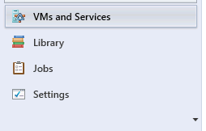
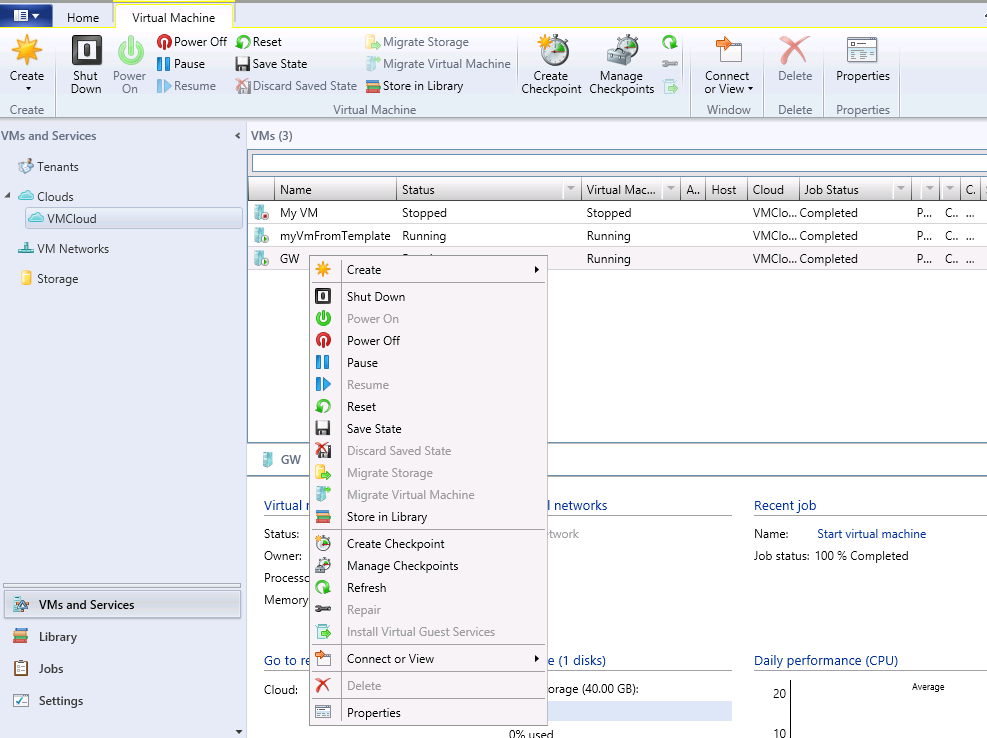
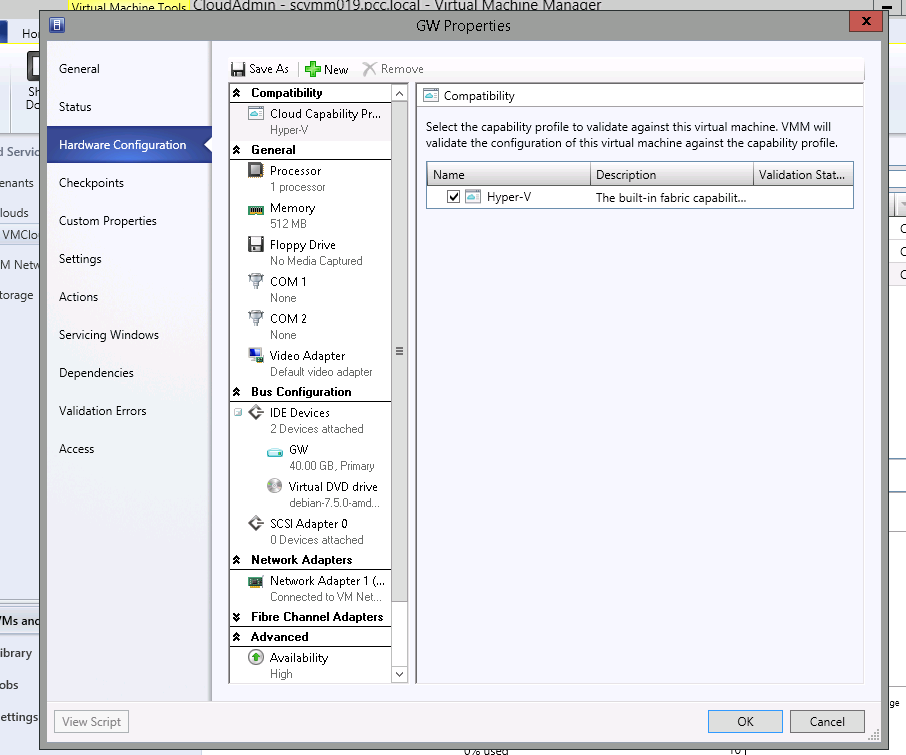
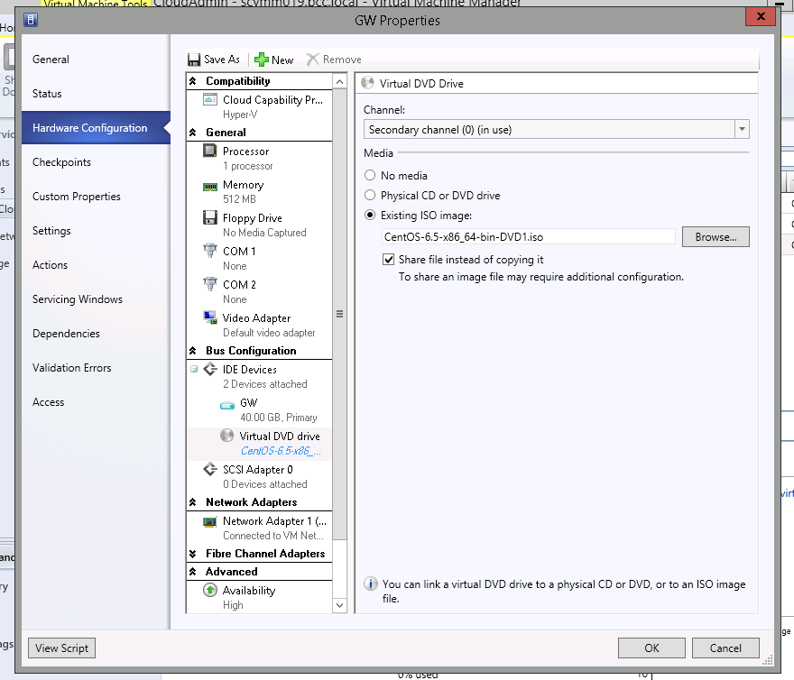

## VMs and templates
You can change this in VM and Templates under the Cloud section where your VMs are listed.

{.thumbnail}

## 
Right click on the VM rules under rules, and go to "Hardware Configuration".

{.thumbnail}

{.thumbnail}

## 
Once you're in the Virtual DVD drive, click on "Existing ISO image" and then select the ISO you want
to upload to the VM.
The ISO can come from the OVH library or your own library.
Don't forget to tick the "Share file instead of copying it" box, otherwise you will have to wait for the ISO to copy over to the host.

{.thumbnail}

