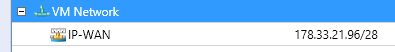

## Overview of the VM Network
OVH has created VM Network, a network predefined with an IP pool that contains your RIPE IP block configuration.
This VM Network also enables you to use the vRack 1.5.

{.thumbnail}

## Get a dynamic RIPE IP block (example with a Windows VM)

- Create a template:

To retrieve an IP from the VM Network IP pool, you must create a template so that you can properly deploy the VM. (A reminder on how to create a template: .)
Firstly, you need to add the correct network configuration to your template:

{.thumbnail}
To respond to the machine's Sysprep (System Preparation), you need to firstly follow the template customisation step:

{.thumbnail}

- Deploy the VM:

Once you have completed the previous steps, you can deploy the VM from the template.
Once deployed, the VM should be configured as follows:

{.thumbnail}
If the network settings match the above image, you can launch the VM and check that the IP is properly connected to your VM.

## Connect a RIPE IP block manually
If you want to configure the VM's IP manually (deployed or not deployed from a template), you simply need to connect to VM Network.

{.thumbnail}
Then, once the VM has launched, you can connect it to the IP address you want directly in the operating system.
You will find information on the RIPE block in the delivery email in your Control Panel, or in the VM Network rules:

{.thumbnail}

## VMM and vRack 1.5
A VMM also communicates with the vRack 1.5 via the VM Network.
To communicate with an IP in vRack 1.5, you must configure your VM to connect with the VM Network:

{.thumbnail}
Then, you just need to configure the IP setting manually so that your VM can communicate with the other elements in vRack 1.5.

