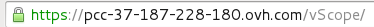
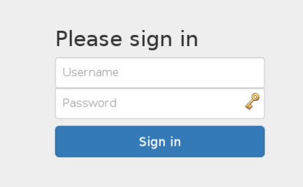
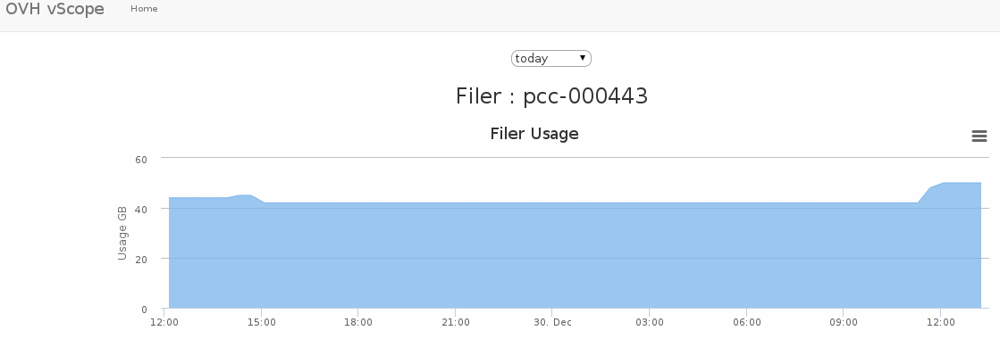
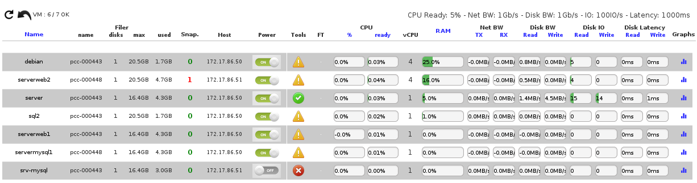

**Last updated 28th January 2022**

## Objective

OVHcloud puts an infrastructure **supervision** and **monitoring** tool called **vScope** at your disposal.

It's a web based utility gathering and presenting all the **useful** information on your resources.

**This guide describes the functionalities of the vScope interface.**

## Requirements

- Being an administrative contact of your [Hosted Private Cloud infrastructure](https://www.ovhcloud.com/pt/enterprise/products/hosted-private-cloud/) to receive login credentials
- A user account (created in the [OVHcloud Control Panel](https://www.ovh.com/auth/?action=gotomanager&from=https://www.ovh.pt/&ovhSubsidiary=pt))

## Instructions

To access the vScope interface, click the vScope icon in the login window of your Hosted Private Cloud.

{.thumbnail}

A **vScope** access link is also available in your OVHcloud Control Panel.

{.thumbnail}

In both cases, you'll be directed to a new browser tab with this URL.

{.thumbnail}

Use your vSphere **username** and **password** to log on the interface.

{.thumbnail}

You are now connected to **vScope** and can monitor your resources. For example, you can see in the main window the number of Cores and VMs on each host as well as CPU and RAM consumption or network traffic.

{.thumbnail}

In case of multiple **datacenters** inside a single **Hosted Private Cloud**, you can select them in the scrolling menu. **Last refresh** is the last **web page** refresh, not the **vScope** one. vScope refreshes every **2 to 5 minutes**.

{.thumbnail}

The **Filer** menu gives an insight on datastore usage in terms of VMs and storage space.

{.thumbnail}

Clicking on the **Graphs** icon, you can see more details on the chosen resource.

{.thumbnail}

The Hosts menu offers all the characteristics for each host in your datacenter (**Cores, vCPUs, VM**) and the usage percentage as well as network connectivity on all physical network cards (**VMNic**).

{.thumbnail}

The detailed view also shows historical data over a day, week, month or year as needed.

{.thumbnail}

The last section details each VM's usage with the following data :

- VMtools state
- Network traffic
- VM size
- FT (Fault Tolerance) activation state
- CPU Ready Time
- Disk IO
- Disk Latency

{.thumbnail}

## Go further

Join our community of users on <https://community.ovh.com/en/>.
