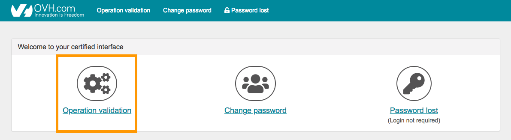
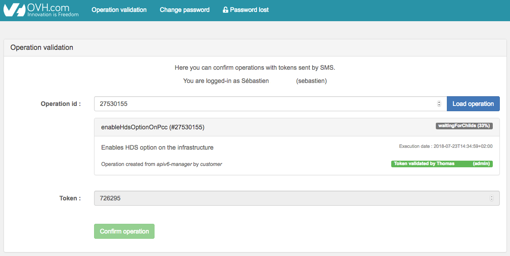
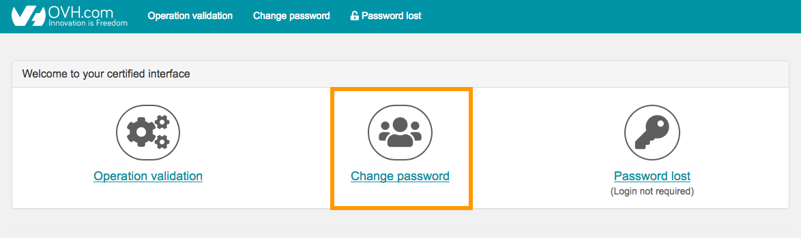
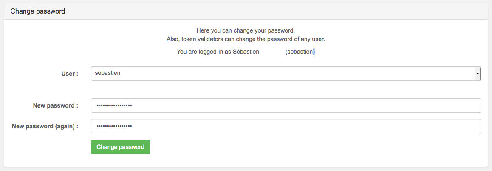
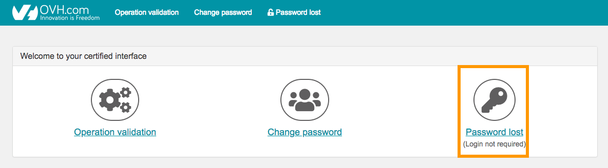
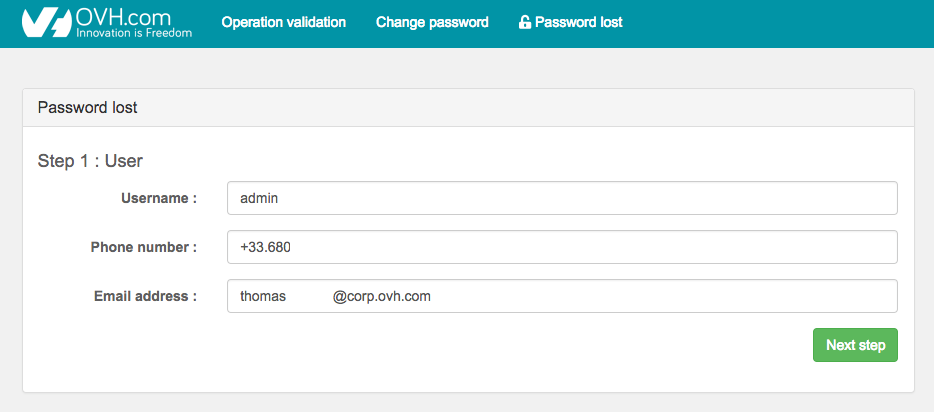
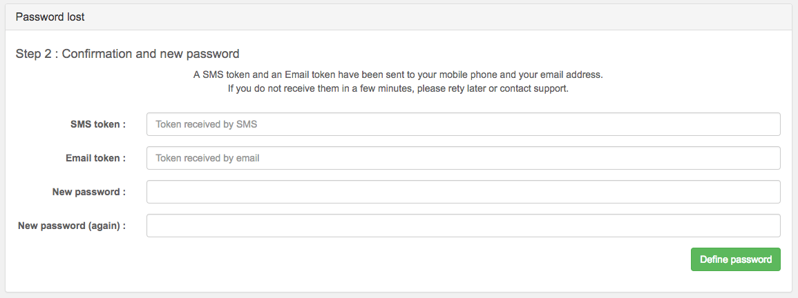

**Ultimo aggiornamento: 09/12/2019**

## Obiettivo

L’interfaccia sicura è un sistema che permette di confermare le operazioni sensibili (come modificare la password o aggiungere nuovi account) effettuate da altri utenti o da terzi sui servizi Private Cloud con certificazione HDS o PCI-DSS.

**Questa guida ti mostra come utilizzare l’interfaccia per convalidare questo tipo di operazioni.**

## Prerequisiti

- Disporre di un’infrastruttura con l’opzione _security advanced_ (inclusa nelle soluzioni [PCI-DSS e HDS](https://www.ovh.com/it/private-cloud/payment-infrastructure/){.external}), necessaria per confermare le operazioni
- Avere accesso all’interfaccia sicura del Private Cloud in questione, ad esempio `https://pcc-xxx-xxx-xxx-xxx.ovh.com/secure/` (facendo attenzione a non dimenticare “/” alla fine dell’indirizzo)

## Procedura

La conferma delle operazioni sensibili tramite l’interfaccia sicura è possibile esclusivamente per gli utenti che dispongono del permesso **token validator**. Questo privilegio, indispensabile all’attivazione dell’opzione “**security advanced**”, viene attribuito di default all’utente “admin” e può essere assegnato direttamente dallo Spazio Cliente anche ad altri utilizzatori. In caso di necessità, consulta la nostra guida [Introduzione allo Spazio Cliente Private Cloud OVH](https://docs.ovh.com/it/private-cloud/spazio-cliente-private-cloud-ovh/#utenti){.external}.

Dall’interfaccia sicura è possibile eseguire tre diverse azioni. Prosegui nella lettura di questa guida in base all’operazione che vuoi effettuare: 

- [confermare un’operazione tramite token](./#confermare-un-operazione-tramite-token)
- [modificare la password associata a un utente](./#modificare-la-password-associata-a-un-utente)
- [reimpostare una password](./#reimpostare-una-password)

### Confermare un’operazione tramite token

Una volta ricevuto il token per SMS, è necessario inserirlo nell’interfaccia sicura per eseguire l’operazione in attesa.

> [!warning]
>
> Il token ha una validità di 15 minuti e il suo mancato utilizzo comporta l’annullamento dell’operazione.
> 
> Per le manutenzioni l’intervento verrà riproposto successivamente in modo automatico, negli altri casi  sarà invece l’utente a dover pianificare nuovamente l’operazione. 
> 

Ecco un esempio di SMS: 

{.thumbnail}

Questo messaggio contiene: 

- il **token validator** che ha ricevuto l’SMS (questa informazione potrebbe rivelarsi utile per la gestione dei token da confermare nel caso in cui l’utente abbia inserito il proprio numero di telefono in diversi account)
- il nome dell’operazione che richiede la conferma
- l’ID dell'operazione
- il token
- un link che consente di confermare l’operazione (attenzione: se l’indirizzo IP della rete a cui è connesso il telefono [non è autorizzato](https://docs.ovh.com/it/private-cloud/spazio-cliente-private-cloud-ovh/#sicurezza), la pagina non verrà visualizzata)

Per confermare l’operazione clicca sul link presente nell’SMS ricevuto e seleziona `Operation Validation`{.action}.

{.thumbnail}

Si aprirà una nuova finestra, a cui potranno autenticarsi soltanto gli utenti che dispongono del permesso **token validator**.

Predisponi l’operazione inserendone l’ID nel campo `Operation id` e clicca su `Load operation`{.action}. Digita il token ricevuto via SMS e clicca sul pulsante `Confirm operation`{.action}.

{.thumbnail}

A questo punto gli utenti che dispongono del permesso **token validator** riceveranno un SMS di questo tipo: 

{.thumbnail}

Questo messaggio contiene: 

- l’utente con il permesso **token validator** che ha ricevuto l’SMS
- il nome e l’ID dell’operazione
- l’utente con il permesso **token validator** che ha confermato l’operazione 

### Modificare la password associata a un utente

La modifica della password può essere effettuata da qualsiasi utente, indipendentemente dal fatto che disponga o meno del permesso **token validator**. Per poter procedere con questa operazione è però necessario che l’utente sia in possesso della password corrente.

> [!primary]
>
> Nel caso in cui l’utente non disponga più della password, dovrà richiedere a un altro utente con permesso “token validator” attivo di eseguire la modifica per suo conto tramite la procedura di [reimpostazione della password](./#reimposta-password).
> 

Per modificare la password associata a un utente, accedi all’interfaccia sicura (ad esempio, `https://pcc-xxx-xxx-xxx-xxx.ovh.com/secure/`) e clicca su `Change password`{.action}.

{.thumbnail}

Nella nuova pagina seleziona il nome utente e definisci la nuova password.

Gli utenti  con permesso “token validator” riceveranno un token per [confermare l’operazione](./#confermare-unoperazione-tramite-token).

{.thumbnail}

### Reimpostare una password

Questa procedura è valida soltanto per gli utenti che dispongono del diritto **token validator**.

> [!primary]
>
> Se un utente senza permesso **token validator** non dispone più della sua password, dovrà chiederne la reimpostazione a un utente che lo possiede.
> 

Per reimpostare la password, accedi all’interfaccia sicura (ad esempio, `https://pcc-xxx-xxx-xxx-xxx.ovh.com/secure/`) e clicca sul pulsante `Password lost`{.action}.

{.thumbnail}

Un messaggio ti indicherà che, per continuare, è necessario essere in grado di ricevere SMS. Se questo è il tuo caso, completa le informazioni richieste (incluso il nome utente associato alla password di cui stai richiedendo la reimpostazione) e clicca su`Next step`{.action}.

{.thumbnail}

A questo punto inserisci i due token ricevuti via SMS e posta elettronica e definisci la nuova password.

> [!primary]
>
> Se la procedura di reimpostazione viene effettuata per conto di un altro utente, chi ha eseguito l’operazione dovrà trasmettere la nuova password. È inoltre preferibile che l’utente che la riceve la [modifichi appena possibile](./#modificare-la-password-diun-utente).
> 

{.thumbnail}

## Per saperne di più

Contatta la nostra Community di utenti all’indirizzo <https://www.ovh.it/community/>.