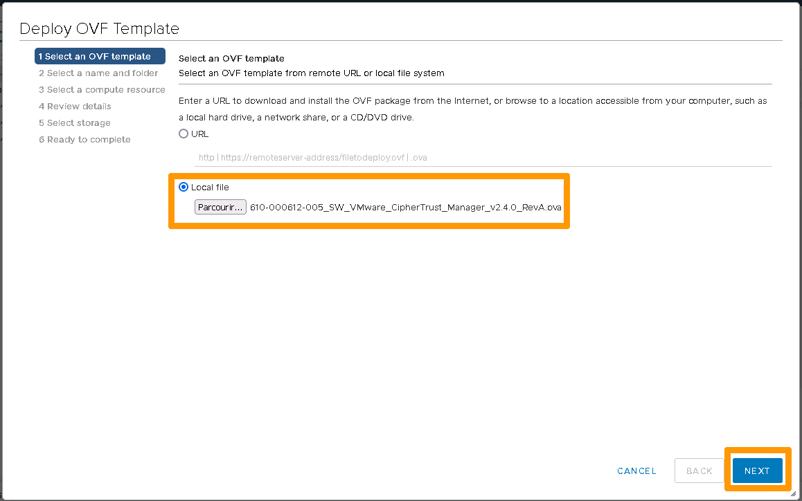
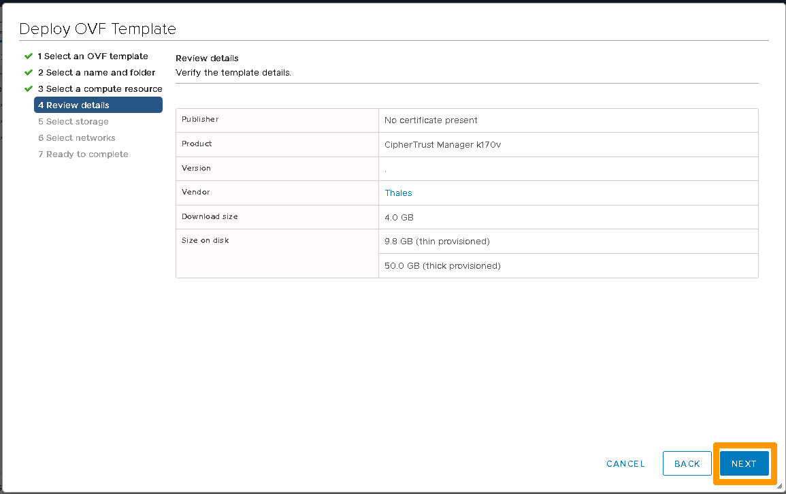
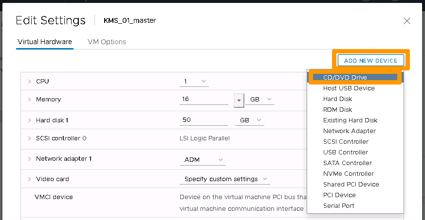
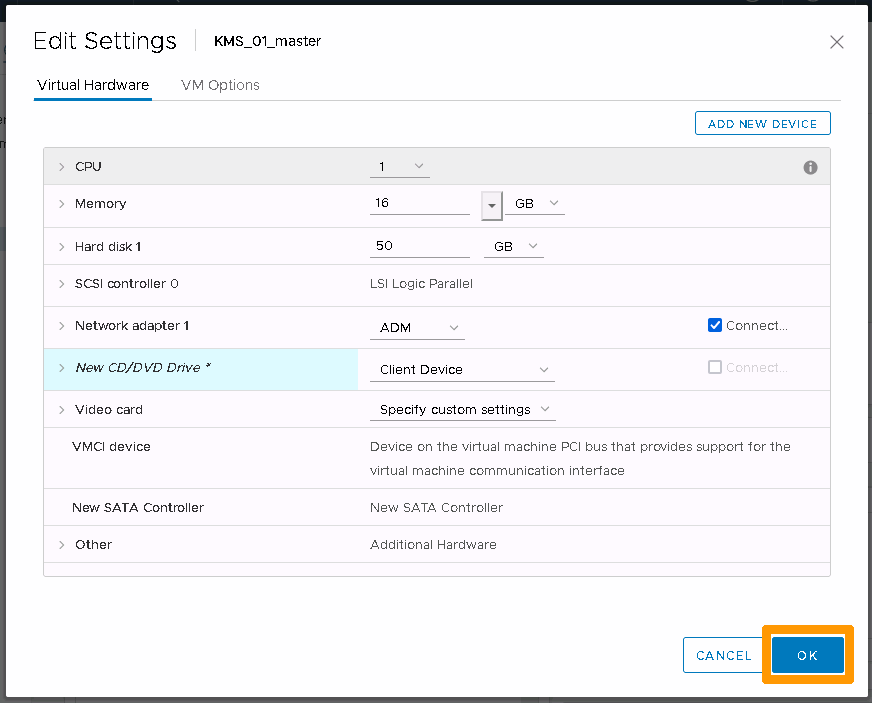
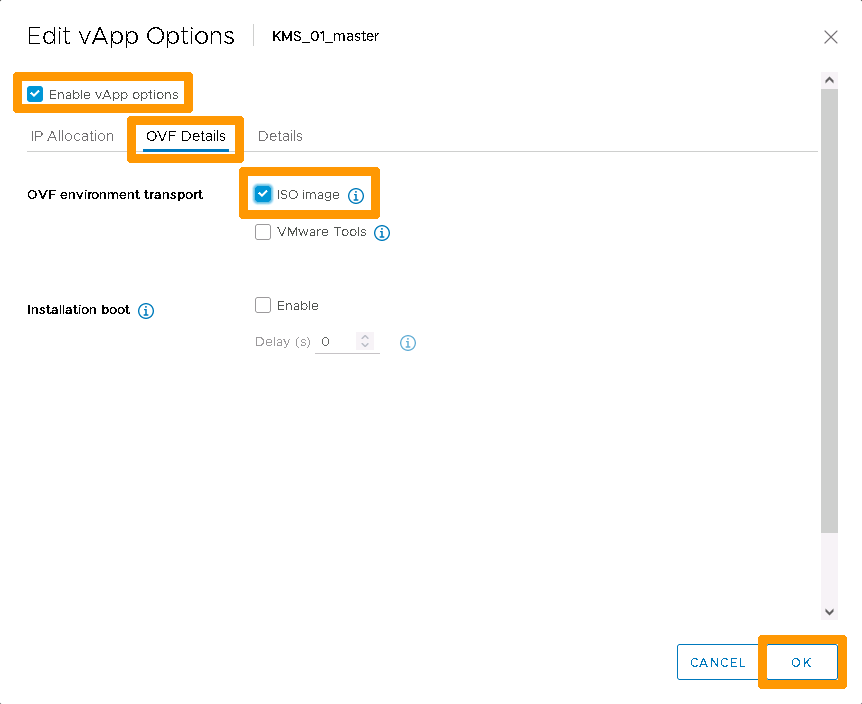
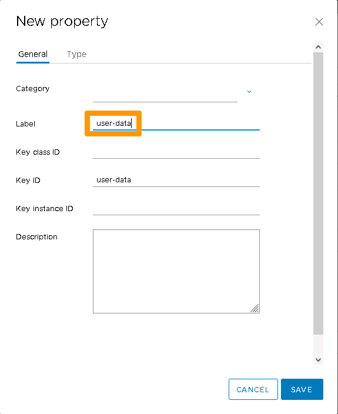
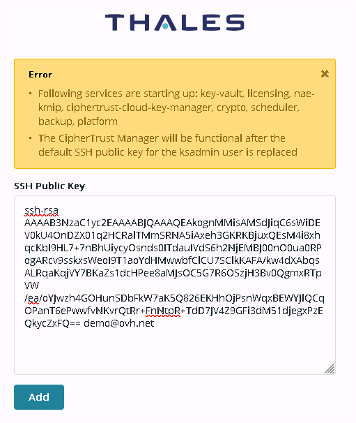
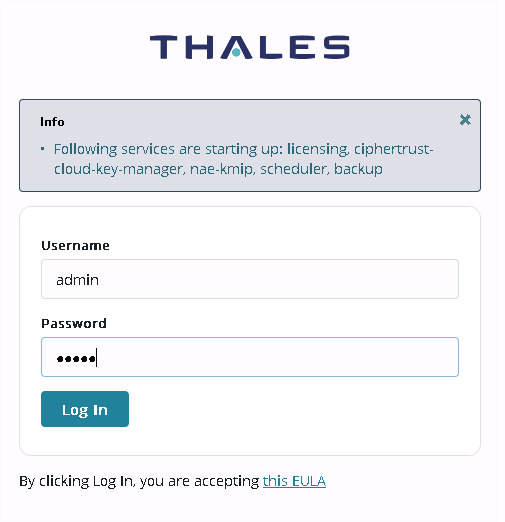
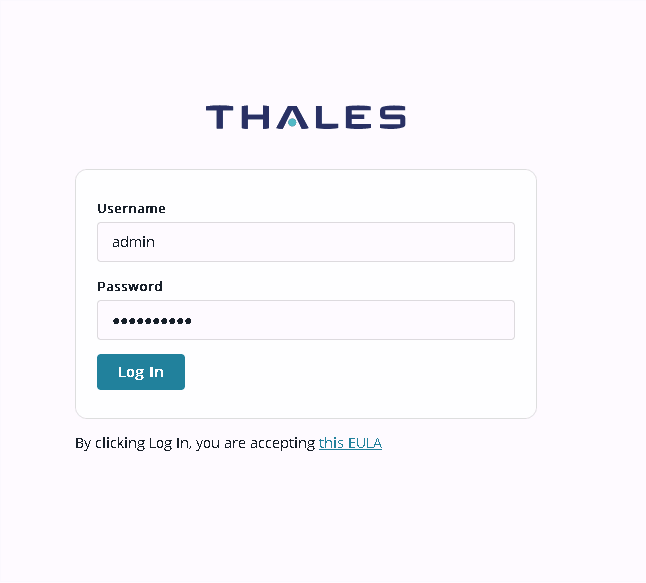

**Dernière mise à jour le 04/11/2021**

## Objectif

Vous trouverez dans ce guide les différentes étapes permettant la configuration du Key Management System (**KMS**) CipherTrust de Thales dans l'interface vSphere de votre Hosted Private Cloud.

**Découvrez comment configuer un KMS Thales CipherTust.**

## Prérequis

* Disposer d'un service [Hosted Private Cloud](https://www.ovhcloud.com/fr/enterprise/products/hosted-private-cloud/){.external}
* Être connecté à l'[interface vSphere](../connexion-interface-vsphere/) de votre service Hosted Private Cloud
* Avoir une adresse IP par instance de KMS
* Avoir les fichiers du modèle OVF présents sur votre poste de travail
* Avoir une clé publique SSH
* Avoir récupéré l'OVA [KMS CipherTrust Manager](https://ovh.to/W2gBYe)

> [!primary]
>
> Dans les étapes ci-dessous, nous utiliserons les informations suivantes :
> 
> *	portgroup vSphere : ADM
> *	sous-réseau local : 192.0.2.64/28
> 

## En pratique 

### Installer les OVA CipherTrust Manager

* Connectez-vous au vCenter avec un compte permettant le déploiement d’un modèle OVF.

{.thumbnail}

* Dirigez-vous dans le menu `Hôte et cluster`{.action}, puis sélectionnez le cluster.
* Cliquez sur `Actions`{.action} > `Déployer un modèle OVF`{.action}.
* Suivez les étapes d’installation :

{.thumbnail}

* Sélectionnez les fichiers locaux liés au modèle OVA `610-000612-005_SW_VMware_CipherTrust_Manager_v2.4.0_RevA.ova`.
* Cliquez sur le bouton `Next`{.action}.

{.thumbnail}

* Renseignez le nom de la machine virtuelle. Le nom doit être différent pour chaque instance. Ici, nous l’appellerons **KMS_01_master**.
* Sélectionnez le datacenter où sera placé la machine virtuelle.
* Cliquez sur le bouton `Next`{.action}.

{.thumbnail}

* Sélectionnez la ressource de calcul (compute resource), ici **Cluster1**.
* Cliquez sur le bouton `Next`{.action}.

{.thumbnail}

* Vérifiez les informations.
* Cliquez sur le bouton `Next`{.action}.

{.thumbnail}

* Sélectionnez le périphérique de stockage.
* Cliquez sur le bouton `Next`{.action}.

{.thumbnail}

* Sélectionnez le réseau approprié, ici **ADM**.
* Cliquez sur le bouton `Next`{.action}.

{.thumbnail}

* Vérifiez les informations liées au déploiement.
* Cliquez sur le bouton `Finish`{.action}.

Une fois la machine virtuelle déployée :

{.thumbnail}

* Sélectionnez la machine virtuelle.
* Cliquez sur `Edit Settings`{.action}.

{.thumbnail}

* Dans l’onglet **Virtual Hardware**, cliquez sur `Add New Device`{.action}.
* Sélectionner **CD/DVD Drive**.

{.thumbnail}

* Validez avec le bouton `OK`{.action}.

Configuration de la machine virtuelle :

{.thumbnail}

* Allez dans l’onglet **Configure**.
* Dans le menu de gauche **vApp Options**.
* Cliquez sur `Edit...`{.action}.

{.thumbnail}

* Vérifiez que **Enable vApp options** est bien coché.
* Allez dans l’onglet **OVF Details**.
* Cochez **ISO images**.
* Cliquez sur `OK`{.action}.

Preparez le fichier cloud.init selon le modèle suivant.

```
#cloud-config
keysecure:
  netcfg:
    iface:
      name: eth0
      type: static
      address: 192.0.2.67
      netmask: 255.255.252.240
      gateway: 192.0.2.65
      dns1: 192.0.2.65
```

Attention : 

* Ce fichier ne doit pas contenir de tabulation, seuls les espaces sont acceptés.
* Toutes les valeurs entre « < » et « > » doivent être remplacées par les bonnes valeurs.


Modifiez le fichier cloud.init en base 64. Exemple : 

```console
openssl base64 -A -in cloud.init -out cloudb64.init
```

> [!warning]
>
> La chaine en base 64 doit être sur une seule ligne pour le reste de l’opération.
> 

Finalisation de la configuration de la machine virtuelle :

{.thumbnail}

* Dirigez-vous sur l’onglet **Configure**.
* Dans le menu de gauche **vApp Options**.
* Puis dans la section **Properties**, cliquez sur `ADD`{.action}.

{.thumbnail}

* Dans l’onglet **General**, définissez le label à **user-data**.

{.thumbnail}

* Dans l’onglet **Type**, saisissez dans **Default value**, la chaine en base 64.
* Cliquez sur `SAVE`{.action} pour valider.

Démarrez la machine virtuelle et vérifiez qu’à l’issue du démarrage l’adresse IP configurée est bien présente.

Repétez les étapes pour la seconde instance **KMS_01_slave**

A l’issue de ces étapes, les différentes instances doivent être visibles. Exemple : 

{.thumbnail}

{.thumbnail}

### Pré-configurer chaque instance

> [!warning]
>
> Il est important que la clé SSH ainsi que les mots de passe définis dans les différentes instances soient identiques.
> 

{.thumbnail}

Première authentification au KMS :

* Connectez-vous sur l’appliance : [192.0.2.68](https://192.0.2.68/){.external}.
* Renseignez la clé SSH publique.
* Cliquez sur `ADD`{.action}.

> [!primary]
>
> L’insertion peut prendre quelques minutes afin que les microservices puissent se lancer.
> 

{.thumbnail}

Authentification :

* Depuis la fenêtre, renseignez les mots de passe par défaut :
    * Username : **admin**
    * Password : **admin**
* Cliquez sur `Log In`{.action}.

{.thumbnail}

Une nouvelle fenêtre apparaît pour renouveler le mot de passe.

* Current Password : **admin**
* New Password : NouveauMotDePasse
* Retype New Password : NouveauMotDePasse
* Cliquez sur `Change Password`{.action}.

{.thumbnail}

Utilisez le nouveau mot de passe pour vous authentifier.

{.thumbnail}

L'instance de KMS est prête a être utilisée.

### Activer la licence KMS

Dans le cadre de l’installation, deux types de licences sont à installer :

1. Virtual CipherTrust Manager : licence propre à une instance
    * Il faudra activer les licences unitairement pour chaque instance à l’aide du "Key Manager Lock Code".
    * L’installation devra être réalisée par appliance.
2. KMIP : licence pour les clients KMIP
    * Activation de la licence en fonction du besoin. L’activation est réalisée à l’aide du "Connector Lock Code".
    * L’installation devra être réalisée une seule fois avant d’être propagée sur les membres du cluster.

Afin de réaliser l’activation et l’installation des licences, connectez-vous sur chacune des instances du client.

* Dirigez-vous dans `Admin Settings`{.action} > `Licensing`{.action} > `Lock Codes`{.action}, puis récupérez :
    * Key Manager Lock Code
    * Connector Lock Code
    * Récupérez le(s) document(s) livré(s) par Thales concernant la commande de licences.
* Transmettez ces informations au support OVHcloud.

> [!primary]
> 
> *	Le Key Manager Lock Code est à utiliser pour l’activation de la licence de l’appliance virtuelle.
> *	Le Connector Lock Code est à utiliser pour les licences de connecteur comme KMIP.

Votre KMS est désormais prêt à etre utilisé.

## Aller plus loin

Rejoignez notre communauté d'utilisateurs sur <https://community.ovh.com/>.

