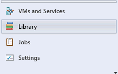
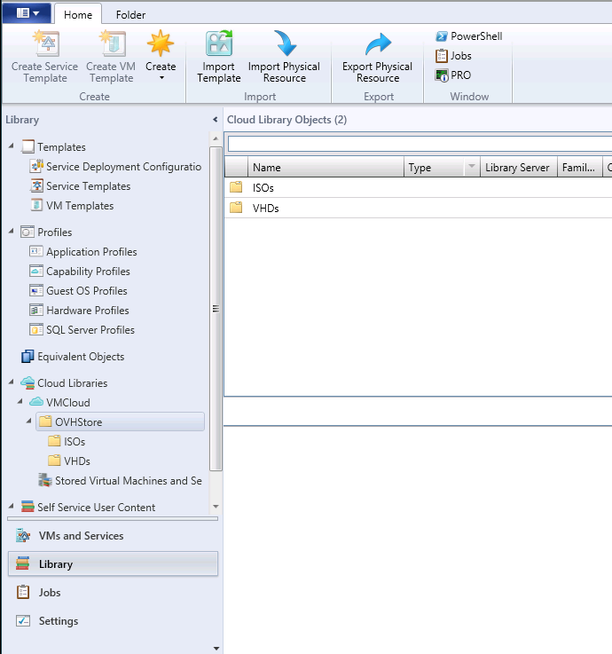

## Library
You create the template in the VMM's library:

{.thumbnail}

## 
OVH provides ISOs and VHDs so you can begin using the VMM easily.

{.thumbnail}
ISOs can be uploaded to VMs, and VHDs can be used for creating VMs/templates.

## 
OVH provides a storage space which is used as a library. Here you can upload your own VHDs/ISOs.

{.thumbnail}

