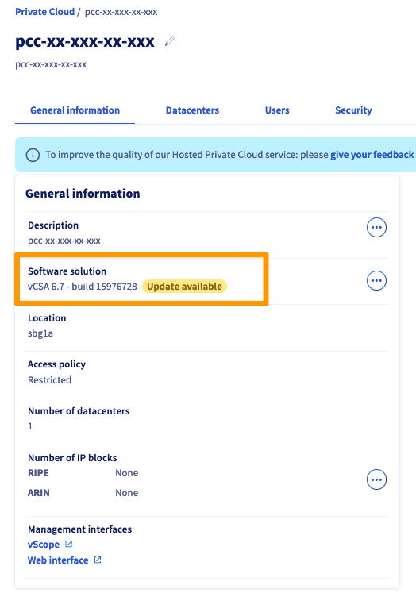

**Last updated 27th December 2022**

## Objective

The aim of this guide is to list the actions you may need to take as part of lifecycle management for VMware products hosted at OVHcloud. The key elements of this lifecycle can be linked to our datacentre operations, our supplies, the lifespan of physical resources, and even the versions of software we deploy.

In this guide, we detail the actions to take for the topics in progress:

- Roubaix datacentre, Room 29
- Datastore prior to 2020
- Hosts before 2018
- vSphere version prior to vCSA 7.0 (build 20845200)
- Version of NSX-v before 6.4.14

**Find out what to do with your Hosted Private Cloud powered by VMware solution, depending on its features.**

## Requirements

- a [Hosted Private Cloud solution powered by VMware](https://www.ovhcloud.com/en/enterprise/products/hosted-private-cloud/){.external}
- Access to the [OVHcloud Control Panel](https://ca.ovh.com/auth/?action=gotomanager&from=https://www.ovh.com/world/&ovhSubsidiary=we)
- Access to the [OVHcloud API](https://api.ovh.com/){.external}. If required, please refer to our guide on [Getting started with OVHcloud](https://docs.ovh.com/us/en/api/first-steps-with-ovh-api/) APIs.
- You need to have [created your login credentials for the OVHcloud API](https://docs.ovh.com/us/en/api/first-steps-with-ovh-api/){.external}.

## Instructions

### Step 1 - Retrieve your Hosted Private Cloud service information

Log in to the OVHcloud APIv6 using our guide on [Getting started with the OVHcloud API](https://docs.ovh.com/us/en/api/first-steps-with-ovh-api/).

Once logged in, follow the four steps described below.

#### Step 1.1 - Retrieve your serviceName

Run the following call:

> [!api]
>
> @api {GET} /dedicatedCloud
>

You will see a list of your services. Please note the **serviceName** you have retrieved.

#### Step 1.2 - Retrieve your datacentreId

Run the following call:

> [!api]
>
> @api {GET} /dedicatedCloud/{serviceName}/datacenter
>

Fill in the call fields with the following information:

- **serviceName**: enter the serviceName you obtained in step 1.1

You will see a list of your **datacentreId**, take note of them.

#### Step 1.3 - Retrieve your filerId

Run the following call:

> [!api]
>
> @api {GET} /dedicatedCloud/{serviceName}/datacenter/{datacenterId}/filer
>

Fill in the call fields with the following information:

- **serviceName**: enter the serviceName you obtained in step 1.1
- **datacenterId**: enter the datacentreId you obtained in step 1.2

You will get the list of your **filerId**, take note of them.

#### Step 1.4 - Retrieve your hostId

Run the following call:

> [!api]
>
> @api {GET} /dedicatedCloud/{serviceName}/datacenter/{datacenterId}/host
>

Fill in the call fields with the following information:

- **serviceName**: enter the serviceName you obtained in step 1.1
- **datacenterId**: enter the datacentreId you obtained in step 1.2

You will get a list of your **hostId**, please note down these.

You must now have retrieved the following information:

- all your **serviceName**
- all your **datacentreId**
- all your **hostId**
- all your **filerId**

### Datastore lifecycle

The aim of this step is to check if any of your datastores require lifecycle actions from VMware environments hosted at OVHcloud.

#### Retrieve your datastore locations

Run the following call:

> [!api]
>
> @api {GET} /dedicatedCloud/{serviceName}/datacenter/{datacenterId}/filer/{filerId}/location
>

Fill in the call fields with the following information:

- **serviceName**: enter the serviceName you obtained in step 1.1
- **datacenterId**: enter the datacentreId you obtained in step 1.2
- **filerId**: enter the filerId you obtained in step 1.3

If your datastore is located in room 29 of our Roubaix datacentre, you will need to change your storage space. This room no longer meets our security criteria.

Start by adding new datastores, using our guide on [adding storage](https://docs.ovh.com/us/en/private-cloud/how_to_add_a_storage/).

Then use VMware's *Storage vMotion* feature to move your VMs to your new datastores. You can refer to the VMware [Storage vMotion documentation](https://docs.vmware.com/en/VMware-vSphere/7.0/com.vmware.vsphere.vcenterhost.doc/GUID-A15EE2F6-AAF5-40DC-98B7-0DF72E166888.html).

Finally, delete your old datastores by following our guide on [deleting a datastore](https://docs.ovh.com/us/en/private-cloud/remove-data-store/).

#### Retrieve your datastore type

Run the following call:

> [!api]
>
> @api {GET} /dedicatedCloud/{serviceName}/datacenter/{datacenterId}/filer/{filerId}
>

Fill in the call fields with the following information:

- **serviceName**: enter the serviceName you obtained in step 1.1
- **datacenterId**: enter the datacentreId you obtained in step 1.2
- **filerId**: enter the filerId you obtained in step 1.3

If the response to the **fullprofile** field does not start with `2020-`, then it is necessary to switch to the new storage ranges. In addition to higher service quality, they also benefit from higher performance, linked mainly to full-SSD technology.

Start by adding new datastores by following the guide on [adding storage](https://docs.ovh.com/us/en/private-cloud/how_to_add_a_storage/).

Then use VMware's *Storage vMotion* feature to move your VMs to your new datastores. You can refer to the VMware [Storage vMotion documentation](https://docs.vmware.com/en/VMware-vSphere/7.0/com.vmware.vsphere.vcenterhost.doc/GUID-A15EE2F6-AAF5-40DC-98B7-0DF72E166888.html).

Finally, delete your old datastores by following our guide on [deleting a datastore](https://docs.ovh.com/us/en/private-cloud/remove-data-store/).

### Host lifecycle

The aim of this step is to check if any of your hosts require lifecycle actions from VMware environments hosted at OVHcloud.

#### Retrieve your datastore type

Run the following call:

> [!api]
>
> @api {GET} /dedicatedCloud/{serviceName}/datacenter/{datacenterId}/filer/{filerId}
>

Fill in the call fields with the following information:

- **serviceName**: enter the serviceName you obtained in step 1.1
- **datacenterId**: enter the datacentreId you obtained in step 1.2
- **hostId**: enter the hostId you obtained in step 1.4

If the answer in the **profile** field is `Dedicated Cloud`, you will need to switch to the new ranges. These hosts are no longer compatible with the latest versions of ESXi, and therefore can no longer be supported by VMware or OVHcloud.

To complete your migration, you can follow this guide: [Migrate to a new infrastructure](https://docs.ovh.com/gb/en/private-cloud/vdc-migration/).

### Software component lifecycle

#### Retrieving your PCC information in the OVHcloud Control Panel

Log in to the [OVHcloud Control Panel](https://ca.ovh.com/auth/?action=gotomanager&from=https://www.ovh.com/world/&ovhSubsidiary=we) with an administrator account.

Click on the `Hosted Private Cloud`{.action} tab and select your service from the `VMware`{.action} list.

In the `General information`{.action} tab, find the version of your vSphere.

{.thumbnail}

If your version of vSphere is not vCSA 7.0 (build 20845200), please create a ticket to schedule an update to the latest version.

#### Retrieve your PCC information in vSphere

Go to the `Networking and Security`{.action} view of your vSphere client. Then click `Installation and Upgrade`{.action} and click the `Upgrade`{.action} tab.

Please note down the version of your NSX-v.

{.thumbnail}

If your version of NSX-v is not 6.4.14, please create a ticket to schedule an update to the latest version.

## Go further

Join our community of users on <https://community.ovh.com/en/>.
