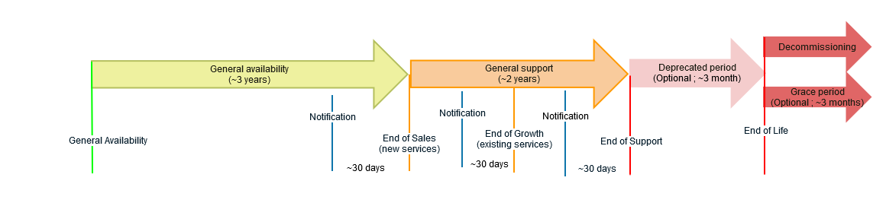

**Last updated 20th September 2022**

> [!warning]
>
> This page is for general information purposes only and OVHcloud does not guarantee that the information will be complete or up-to-date. The contracts governing this product (notably the general and specific terms of use, which can be found in the client account) and the specific communications sent by OVHcloud to the clients will prevail over any information displayed in this web page.
>

## Objective

**This page provides an overview of the lifecycle policy of OVHcloud Hosted Private Cloud powered by VMware services.**

OVHcloud's Hosted Private Cloud VMware service proposes dedicated infrastructure based on VMware SDDC technologies as well as other editors' technologies (such as Veeam or Zerto).

OVHcloud has a lifecycle policy for the service in order to take into account several factors, such as:

* the lifecycle policy of integrated software components as determined by their editors (VMware, Veeam, Zerto, etc.);
* the lifecycle of the hardware components;
* the compatibility between hardware and/or software components;
* any factor affecting the quality of the service.

This lifecycle policy is provided to help clients understand the underlying reasons for version or range changes and the impact of each phase of the lifecycle on the service, and anticipate and prepare the transition to a newer version or range.

### Commercial range concerned

Hosted Private Cloud

* DC2011 & DC2013 (AMD Opteron, AMD Bulldozer)
* DC2014 & DC2016 (AMD PileDriver)
* SDDC2014 & SDDC2016 (Intel Ivy Bridge, Intel Haswell)
* SDDC2018 (Intel Broadwell, Intel Haswell)

## Lifecycle timeframe and definitions

### Definitions

#### End of Sales

This refers to the date when the sales of new service for a commercial range or version is discontinued. Past this date, clients will not be able to start a service on the discontinued commercial range or version anymore.

After the End of Sales for a specific commercial range, the Client will still be able to use and grow existing instances of the Service and add additional individual Host Servers. The Packs from that previous commercial range or any other commercial range before it will not be available anymore for ordering new instances of the Service. The Packs will be sold for the new commercial range launched on the market only.

The End of Sales are usually announced with a thirty (30) days minimum warning.

A commercial range or version will typically reach its End of Sales three (3) years after the beginning of the General Availability phase.

#### End of Growth

This refers to the date when the growth for a commercial range or version is discontinued. Past this date, clients will not be able to order the discontinued commercial range or version anymore.

The End of Sales are usually announced with a thirty (30) days minimum warning.

A commercial range or version will typically reach its End of Growth five (5) years after the beginning of the General Availability phase.

#### End of Life 

This refers to the date when a commercial range or version is being shut down.

The End of Life may involve the unapplicability of SLAs, the absence of support services, and the absence of spares.

Following the End of Life, the servers concerned will be shut down definitively. OVHcloud may offer a grace period of a few months to allow for the last clients using servers of this range to move onto newer ranges.

Clients should anticipate the range change by testing in advance and making sure their configuration and software are compatible with the range they are upgrading to.

### Timeframe

{.thumbnail}

### Summary

This table presents a summary of the different phases of the lifecycle of the service. The impact for each commercial range may differ.

| Phases | General Availability | General Support | Grace Period / Decommissionning |
|:-----:|:-----:|:-----:|:-----:|
| Sales (start new services) | X |  |  |
| Growth (existing services) | X | X |  |
| Maintenance updates and upgrades | X | X |  |
| Support | X | X |  |
| SLA | X | X |  |
| bug fixes | X | X |  |
| Hardware support (spares) | X | X |  |
| Security patches | X | X | X |
| Knowledge Base | X | X | X |

## OVHcloud Commercial Range status

### Hosts (compute)

| Commercial Range | General Availability | End of Sales | End of Growth  | End of Life |
|:-----:|:-----:|:-----:|:-----:|:-----:|
| DC2011 (AMD Opteron) | 2011 | 28/02/2015 | 28/02/2022 | 31/07/2022 |
| DC2013 (AMD Bulldozer) | 2013 | 28/02/2015 | 28/02/2022 | 31/07/2022 |
| DC2014 (AMD PileDriver) | 2014 | 31/08/2017 | 28/02/2022 | 31/07/2022 |
| DC2016 (AMD PileDriver) | 2016 | 30/11/2018 | 28/02/2022 | 31/07/2022 |
| SDDC2014 & SDDC2016 (Intel Ivy Bridge, Intel Haswell) | 2016 | 30/04/2017 | 30/01/2023 | 31/08/2023 |
| SDDC2018 (Intel Broadwell) | 2018 | 30/11/2018 | 30/01/2024 | 31/08/2024 |

### Datastores (storage)

You can get your datastore profile using the following API call :

> [!api]
>
> @api {GET} /dedicatedCloud/{serviceName}/filer/{filerId}
>

If your datastore's full profile does not start with "2020-...", it is urgent and mandatory that you upgrade your storage to newer flavors.

| Commercial Range | General Availability | End of Sales | End of Growth  | End of Life |
|:-----:|:-----:|:-----:|:-----:|:-----:|
| 300Gb | 2013 | 30/11/2021 | 31/03/2022 | 31/10/2022 |
| 600Gb | 2013 | 30/11/2021 | 31/03/2022 | 31/10/2022 |
| 800Gb | 2016 | 30/11/2021 | 31/03/2022 | 31/10/2022 |
| 1.2Tb | 2016 | 30/11/2021 | 31/03/2022 | 31/10/2022 |

## Integrated Software

### VMware lifecycle policy

To know the lifecycle policy of VMware products, please refer to the editor's publication accessible at the following URL:

[VMware Product Lifecycle](https://lifecycle.vmware.com/#/)

#### NSX Datacenter for vSphere (NSX-v)

You can check your version of NSX-v in the "Networking and security" section of vSphere, in the "about NSX" tab. 
If your version is earlier than 6.4.12, please reach out to the support teams to plan an upgrade.

VMware extended the support of NSX Datacenter for vSphere on OVHcloud infrastructures until 15/01/2023. If you are using NSX, you have to plan your migration to NSX Transformers before this date (15/01/2023).

### Veeam Backup & Replication lifecycle policy

To know the lifecycle policy of Veeam products, please refer to the editor's publications accessible at the following URLs:

[Veeam Version release](https://www.veeam.com/releasestatus_rn.pdf)

[Veeam Product Version Lifecycle](https://www.veeam.com/product-lifecycle.html)

### Zerto lifecycle policy

To know the lifecycle policy of Zerto products, please refer to the editor's publication accessible at the following URL:

[Zerto Virtual Replication Product Version Lifecycle Matrix](https://help.zerto.com/bundle/Lifecycle.Matrix.HTML/page/Content/Lifecycle_Matrix/Lifecycle_Matrix.htm#zerto_virtual_replication_product_version_lifecycle_matrix_r_893035264_1010900)

## Go further

Join our community of users on <https://community.ovh.com/en/>.
