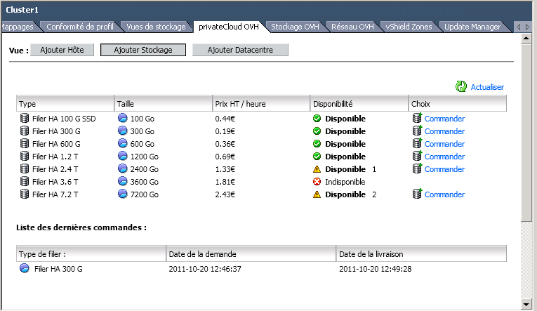
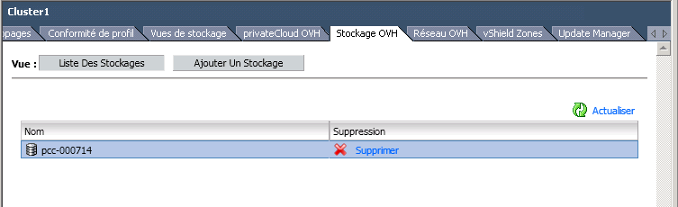

## 
Sinun täytyy käyttää vSphere-asiakasohjelmaa joko omalta tietokoneeltasi tai vaihtoehtoisesti käyttämällä esikonfiguroitua RDP-yhteyttä jonka tarjoamme veloituksetta käyttöösi PCC-palvelun tilauksen yhteydessä.

## 
Valitse PCC vSphere-asiakasohjelmassa. Tämän jälkeen mene ”OVH Private Cloud”-välilehdelle tai oikealla puolella näkyvään ”OVH Storage”-kohtaan. Klikkaa "Order"-linkkiä valitsemassasi tiedostosäilössä:

{.thumbnail}
Vahvista tilauksesi ja klikkaa "Vahvista". Kun tilauksesi on vahvistettu, uusi tiedostosäilö on käytettävissä muutamassa minuutissa. Voit nyt luoda virtuaalikoneita valitsemalla tämän uuden tiedostosäilön.

## 
Poistaaksesi tiedostosäilön mene ”OVH Storage”-välilehdelle klusterissa ja tämän jälkeen klikkaa ”Storage list”:

{.thumbnail}

