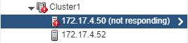
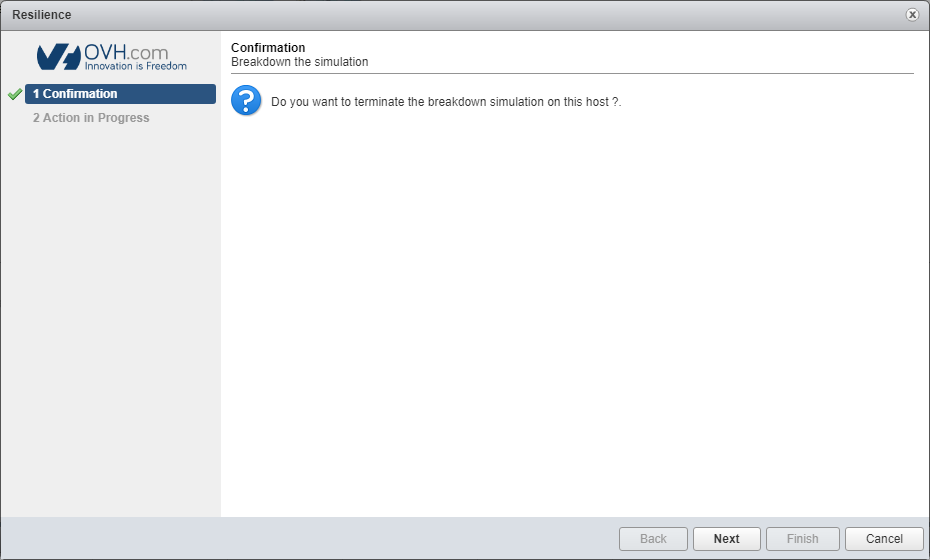

**Dernière mise à jour le 09/08/2018**

## Objectif

Le **mode résilience** est un outil développé par OVH pour simuler une panne sur l'un de vos hôtes et donc de vérifier que le système que vous avez mis en place de type High Availability (HA) et Fault Tolerance (FT) fonctionne correctement dans votre Cluster **en développement**.

**Ce guide vous explique comment utiliser ce mode.**

## Prérequis

* Posséder une offre [Private Cloud](https://www.ovh.com/fr/private-cloud/){.external}.
* Accéder à l’interface de gestion vSphere.

****

1. Le hôte doit être dans un **Cluster**.
2. L'option **HA** (High Availability) doit être activée.
3. Un **autre hôte** dans le Cluster doit être disponible et en état de fonctionnement.

> [!warning]
>
> Attention ceci est un test pour un **environnement de développement**, ne pas réaliser ce type d'opération en **production**.
> 

## En pratique

### Activation

Dirigez-vous sur votre client vSphere, dans l’inventaire de vos hôtes & Cluster et sélectionnez l’hôte concerné avec un simple clic droit, puis sélectionner `OVH Private Cloud`{.action} puis `Resilience`{.action}

{.thumbnail}

#### Validation

Il vous faudra ensuite cliquer sur le bouton `Next`{.action}, après avoir préalablement vérifié que tous les prérequis sont respectés.

{.thumbnail}

#### Conditions d'utilisation

Il sera nécessaire de valider les conditions d'utilisations avant de lancer le test. Après avoir cocher la case "I accept the terms of the failure simulation agreement", cliquer sur le bouton `Next`{.action}.

{.thumbnail}

****

La demande d'activation est bien prise en compte.

{.thumbnail}

#### Résultat

Quelques minutes suffisent pour rendre indisponible votre hôte.

{.thumbnail}

### Désactivation

#### Annulation

Cliquez de nouveau sur le mode résilience pour finaliser la simulation.

{.thumbnail}

****

La demande de désactivation est bien prise en compte.

{.thumbnail}

## Aller plus loin

Échangez avec notre communauté d’utilisateurs sur <https://community.ovh.com/>.
