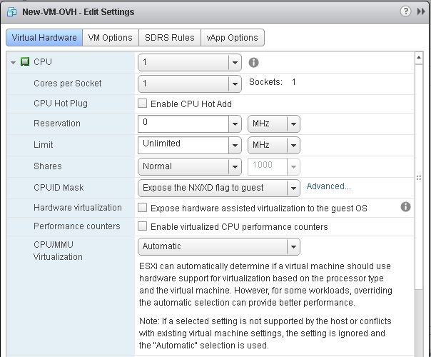
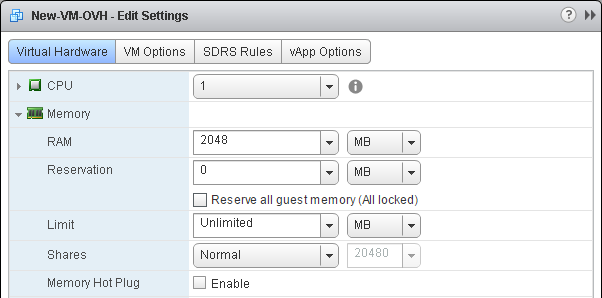

**Last updated 28th December 2017**

## Objective

Once you have created your machine, its resources are not permanently set - they can be reallocated to make your infrastructure more agile, with some restrictions.

**This guide will explain how to scale your virtual machine.**

## Requirements

- You must have already created a virtual machine.
- You must be logged in to your vSphere client.

## Instructions

All the modifications described below must be made from your Private Cloud on vSphere by right-clicking on a virtual machine, then on `Edit Settings`{.action}.

{.thumbnail}

In this menu, you can increase your virtual machine’s resources. At the bottom of this image, you will see that you can choose to add devices. We will come back to this further on in the guide.

### The processor (CPU)

The number of CPUs will be limited to the slots available on the host.

If your virtual machine migrates to a host with fewer processors than those allocated to your machine, it will become `CPU ready`, which will result in performance loss.

{.thumbnail}

You can also set a specific frequency (minimum and maximum) and choose the number of cores per socket.

If you tick the `Enable CPU Hot Add`{.action} box, you can modify these values while the virtual machine is running.

Depending on the operating system you are using, hot adding may not work, and could cause a malfunction on the host.

You can assign a minimum number of *GHz* (gigahertz) to your virtual machine.

The limit, which is unlimited by default, allows you to restrict your virtual machine’s processor to a value in *GHz*. You can, for example, limit a developer virtual machine.

### Memory (RAM)

As with the CPU, the memory (RAM) is limited to the host’s resources.

Again, you can assign RAM so that your virtual machine always has a minimum amount of RAM reserved.

{.thumbnail}

### Hard disk

For the hard disk, you can increase its size according to the space left in the datastore used by the virtual machine.

{.thumbnail}

We recommend that you use SCSI disk controllers rather than IDE ones, as you cannot, for example, perform backups via Veeam with IDE controllers.

You can also select the disk mode:

- `Dependent`: includes the disk during snapshots

- `Independent - persistent`: allows you to store data when you reboot a machine, but this is not taken into account during a snapshot

- `Independent - non-persistent`: is unique in that it does not save data: if you reboot the machine, all the data will be deleted.

### Network adapter

You can modify your virtual machine’s network adapter, the connection to the adapter when starting up the virtual machine, and the adapter type. You can also verify the port ID and your MAC address.

{.thumbnail}

This interface is useful in the event of a network malfunction. You can check that the *port ID* corresponds to the ID listed in the `Networking`{.action} and `Ports`{.action} tabs for that adapter.

### CD/DVD reader

The CD/DVD reader allows you, for example, to mount ISO images on your virtual machine.

{.thumbnail}

We recommend that you delete the CD/DVD reader after using it, as it could in fact prevent the virtual machine from being moved.

### Add a device

At the bottom of this window, you can add additional devices.

You can add disks from another datastore, or network adapters, if you need to use several private networks.

{.thumbnail}

## Go further

Join our community of users on <https://community.ovh.com/en/>.