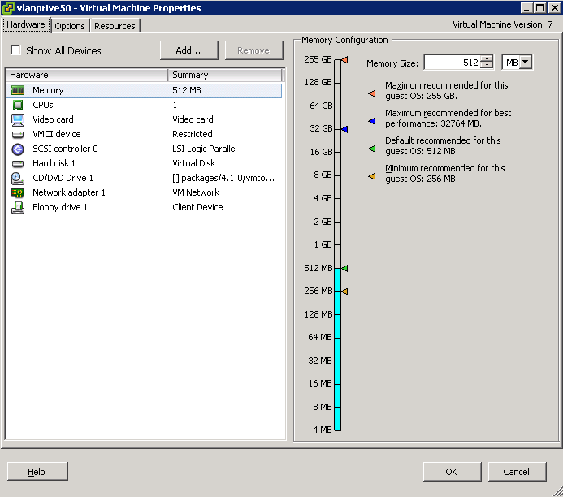
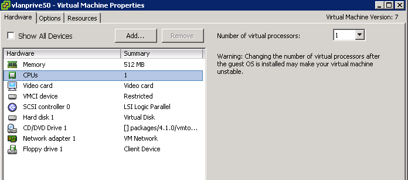
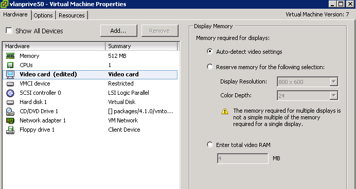
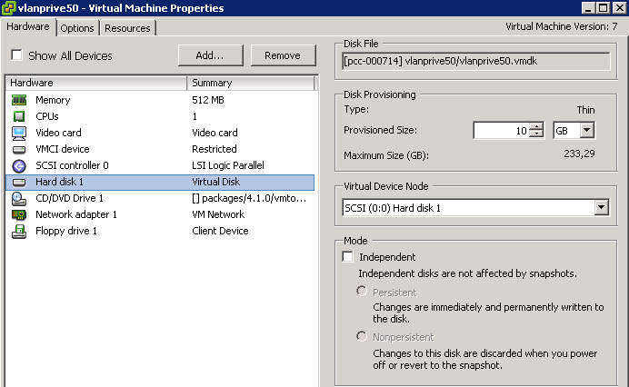
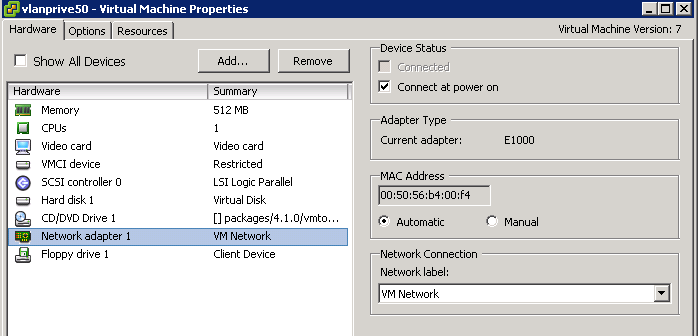

## 
En esta guía explicaremos las modificaciones que son posibles en una máquina virtual (el detalle de la función "edit settings" en VMware).

Es necesario haber creado una máquina virtual previamente, usando esta guía :

- 

## 
Todos los cambios que se describen a continuación se debe realizar desde su Private Cloud en vSphere, haciendo clic en el botón derecho del ratón sobre una máquina virtual, y luego "Edit Settings"

## La memoria (RAM)
La asignación de memoria RAM se puede cambiar en cualquier momento, siempre que se extinga. (La funcionalidad VMware Hot Add le permite realizar esta operación en una máquina encendida a partir de un host L).

Para ello se puede mover el cursor en la pantalla para obtener la memoria deseada:

{.thumbnail}
Para agregar en caliente a través de Hot Add, por favor, visite [ici](#CONFIG_AND_ADVANCED_OPTIONS)

## El procesador (CPU)
Puede cambiar el número de CPU asignado a la máquina virtual cuando la máquina está apagada (se puede hacer con una máquina encendida desde un host L gracias a la funcionalidad VMware Hot Add)

{.thumbnail}
Para agregar en caliente a través de Hot Add, por favor, visite [ici](#CONFIG_AND_ADVANCED_OPTIONS)

## La tarjeta gráfica
Puede configurar los parámetros de la tarjeta de vídeo modificando :

- La detección automática;
- La selección manual de la resolución;
- El número de MB de RAM reservados para vídeo.

{.thumbnail}

## El disco duro
Puede volver a definir en cualquier momento el espacio de disco virtual en su máquina, modificando el espacio provisto:

{.thumbnail}
También puede seleccionar el tipo de disco (SATA o IDE) y el tipo de almacenamiento (persistente o no persistente).

Almacenamiento persistente permite conservar los datos durante el reinicio de una máquina.
El almacenamiento no persistente, por su parte, tiene la particularidad de no mantener los datos: si usted hace un reinicio de la máquina, todos los datos serán borrados.

Con el botón "Add ...", puede agregar un segundo disco en la máquina en cualquier momento, que la MV sea encendida o apagada.

## El lector CD/DVD
Le permite montar fácilmente una imagen de su datastore :

{.thumbnail}

## ¡IMPORTANTE! ! !
Es necesario comprobar la opción "Connect at power on" para que el lector sea detectado y luego cargar la iso.

## La tarjeta de red
Esto le permite elegir el tipo de tarjeta que desea configurar en la máquina virtual así como el tipo de conexión (VM Network o LocalportGroup).

La VM Network permite poner una máquina virtual en la red pública (con una IP RIPE) o en una red local entre los hosts.

El LocalPortGroup sólo permite la comunicación a través de una red privada, y se limita al host (sólo las MV de un mismo host se pueden comunicar entre ellas).

Puede utilizar la siguiente guía para la configuración:

- 

{.thumbnail}

## Opciones generales
Esta opción le permite modificar el tipo de máquina seleccionada en la creación de la MV o, simplemente, modificar el nombre de la misma.

## vApp Options
Esta opción da la posibilidad de definir con mayor precisión el tipo de IP deseada o los parámetros OVF de la máquina virtual.

## VMware Tools
Esta sección le permite gestionar las acciones de los botones que utilizan las herramientas de VMware.
El botón "Stop", por ejemplo, puede realizar un shut down de la MV, o un power off.

## Opciones avanzadas
Las opciones avanzadas le permiten afinar los reglajes de su máquina. En esta sección se puede activar o desactivar la adición de CPU y de memoria RAM en caliente, gracias a la opción "Memory/CPU Hotplug". Esta opción requiere, sin embargo, tiener al menos un host L o superior.

Una segunda opción llamada "SwapFile Location". Por defecto, OVH configura esta opción con el fin de colocar el archivo de swap de la máquina virtual directamente en el host y, por tanto, en el caso de Private Cloud, en los discos SSD. Con esta configuración, obtendrá un mejor rendimiento de lectura / escritura.

Sin embargo, si por ejemplo, configura una máquina virtual con 12 GB de memoria RAM, VMware colocará automáticamente un archivo de swap de 12 GB en el almacenamiento local de 30 GB. El disco puede correr el riesgo, por tanto, de llenarse muy rápidamente.

También tenga en cuenta que si utiliza esta opción, ya no se beneficiará de la protección que proporciona la funcionalidad de HA.

Para ello se puede cambiar la opción para que el archivo de swap sigue estando relacionado con la máquina virtual y luego se coloca en el NAS. con el .vmx y .vmdk.

