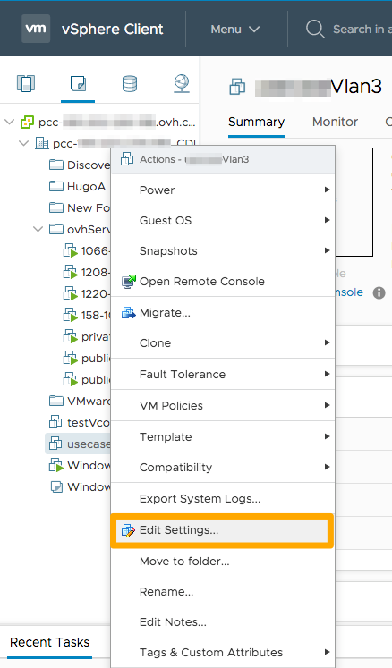
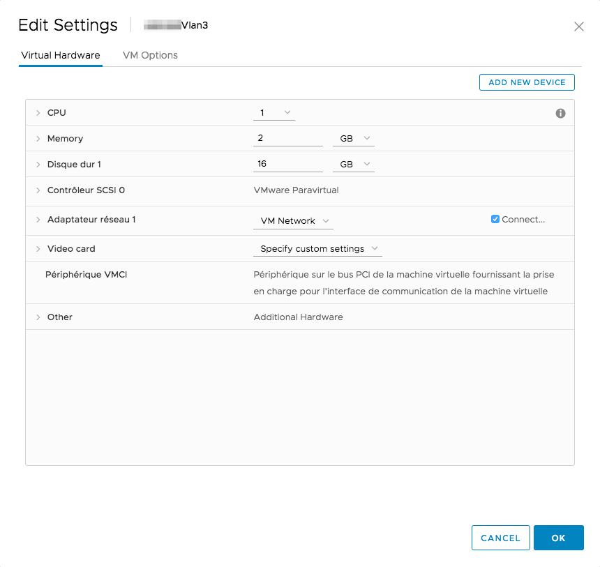
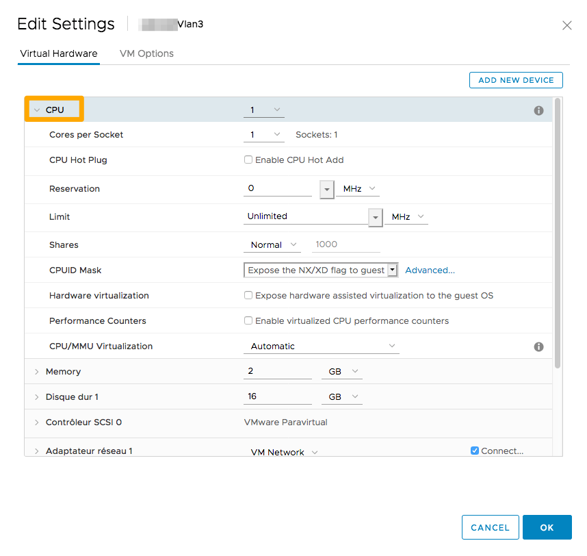
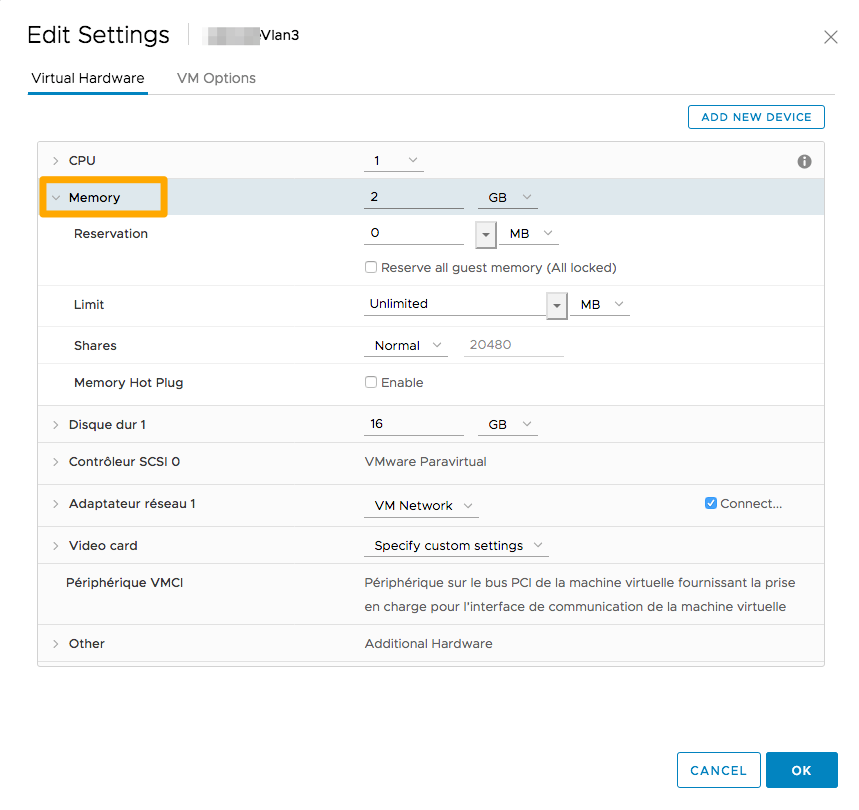
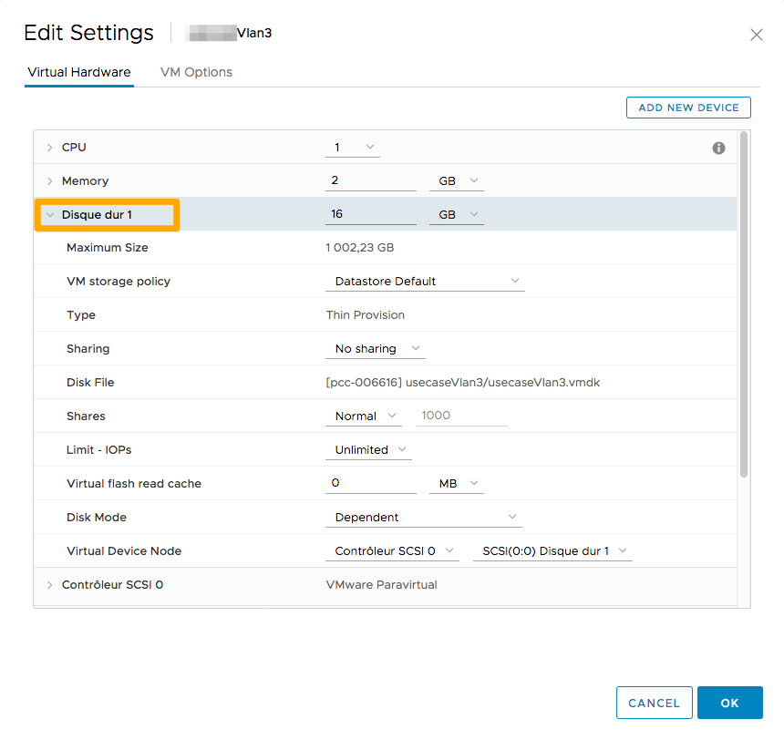
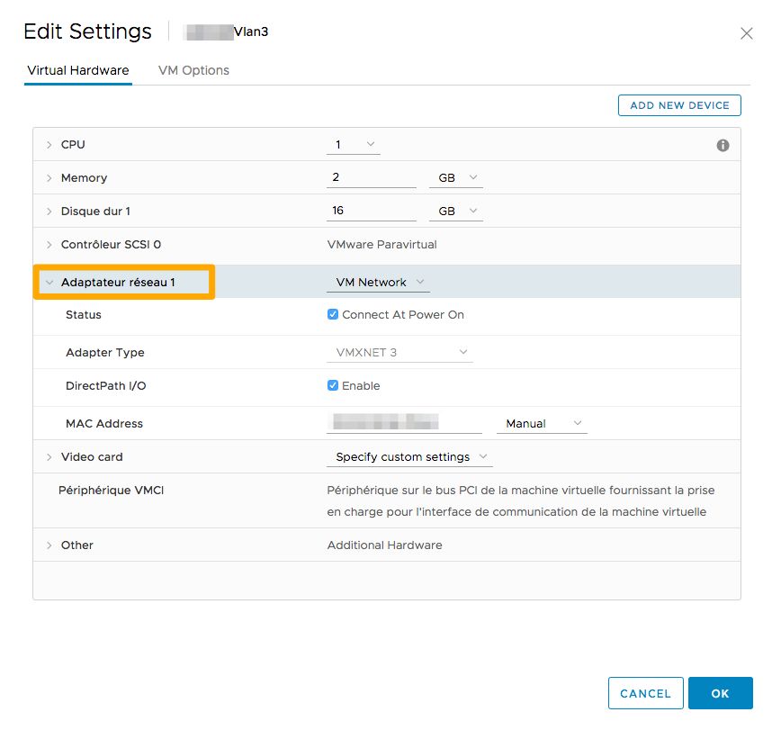
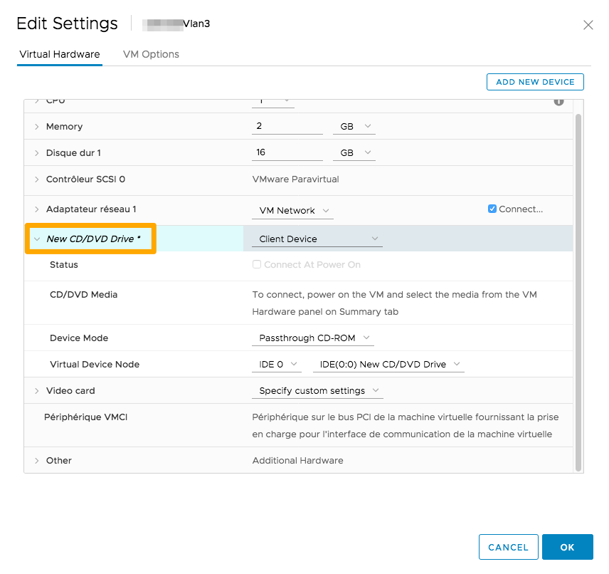

**Dernière mise à jour le 25/06/2020**

## Objectif

Une fois votre machine créée, ses ressources ne sont pas figées. Celles-ci sont réattribuables pour rendre votre infrastructure agile, avec quelques restrictions.

**Ce guide vous explique comment faire évoluer votre machine virtuelle.**

## Prérequis

- Avoir créé une machine virtuelle.
- Être connecté à votre client vSphere HTML.

## En pratique

Toutes les modifications décrites ci-dessous doivent être réalisées depuis votre Private Cloud sur vSphere en effectuant un clic droit sur une machine virtuelle, puis en cliquant sur `Modifier les paramètres`{.action}.

{.thumbnail}

Dans ce menu, vous avez la possibilité d’augmenter les ressources de votre machine virtuelle. 

{.thumbnail}

Vous remarquerez, en haut de cette image, la possibilité d’ajouter des périphériques, nous y reviendrons plus bas dans ce guide.

### Le processeur (CPU)

Le nombre de CPU sera limité aux emplacements disponibles sur l'hôte.

Si votre machine virtuelle migre vers un host avec moins de processeurs que ceux alloués à votre machine, elle fera du `CPU ready`, ce qui occasionnera une baisse des performances.

{.thumbnail}

Vous avez également la possibilité de réserver une certaine fréquence (minimum et maximum) et de choisir le nombre de cœurs par socket.

Si vous cochez la case `Connexion CPU à chaud`{.action}, vous pourrez modifier ces valeurs lorsque la machine virtuelle sera démarrée.

Selon le système d'exploitation utilisé, l'ajout à chaud peut être mal pris en charge et occasionner un dysfonctionnement sur l'hôte.

Vous pouvez faire de la réservation, c’est à dire que vous allez pouvoir attribuer un minimum de *MHz* (MégaHertz) à votre machine virtuelle.

La limitation, par défaut en illimité, permet de restreindre le processeur de votre machine virtuelle à une valeur en *MHz*. Vous pourrez, par exemple, limiter une machine virtuelle de développement.

### La mémoire (RAM)

Comme pour le CPU, la mémoire (RAM) est limitée aux ressources de l’hôte.

Vous avez également la possibilité de faire de la réservation afin que votre machine virtuelle ait toujours un minimum de RAM réservée.

{.thumbnail}

### Le disque dur

Concernant le disque dur, vous pouvez augmenter sa taille selon l’espace restant sur le datastore qu’utilise la machine virtuelle.

{.thumbnail}

Il est recommandé d'utiliser des contrôleurs disques SCSI plutôt que IDE. Le backup via Veeam n'est par exemple pas possible avec des contrôleurs IDE.

Il vous est également possible de sélectionner le mode du disque :

- `Dépendant`: inclut le disque lors de snapshot;

- `Indépendant - persistant` : permet la conservation des données lors du reboot d’une machine, mais n'est pas pris en compte lors d’un snapshot;

- `Indépendant - non persistant` : il a la particularité de ne pas conserver les données : si vous effectuez un reboot de la machine, toutes les données seront alors effacées.

### La carte réseau

Vous avez la possibilité de modifier la carte réseau de votre machine virtuelle, la connexion de la carte au démarrage de la machine virtuelle, modifier le type de carte, vérifier le port ID et votre adresse MAC.

{.thumbnail}

Cette interface est intéressante en cas de dysfonctionnement réseau. Vous pouvez vous assurer que le *port ID* correspond à celui renseigné dans l'onglet `Networking`{.action} et `Ports`{.action} dans la carte en question.

### Le lecteur CD/DVD

Le Lecteur CD/DVD permet par exemple le montage d’image ISO sur votre machine virtuelle.

{.thumbnail}

Il est recommandé de supprimer le lecteur CD/DVD après son utilisation. Celui-ci pourra en effet empêcher le déplacement de la machine virtuelle.

### Ajout de périphérique

En haut à droite de cette fenêtre, vous avez la possibilité d’ajouter des périphériques supplémentaires.

Vous pouvez ajouter des disques provenant d’un autre datastore ou des cartes réseaux si votre activité nécessite l'utilisation de plusieurs réseaux privés.

{.thumbnail}

## Aller plus loin

Échangez avec notre communauté d'utilisateurs sur <https://community.ovh.com>.
