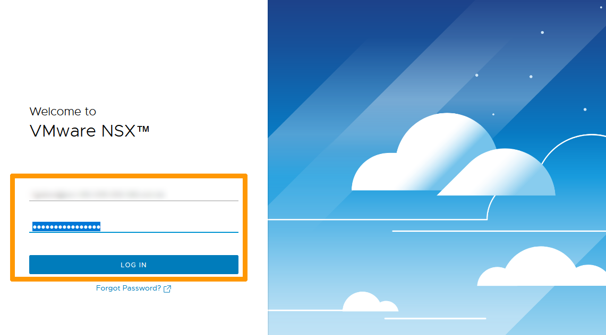
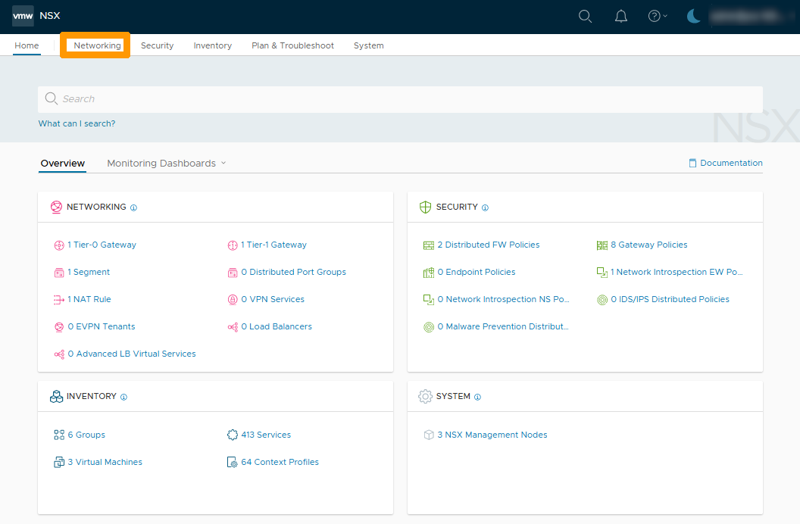
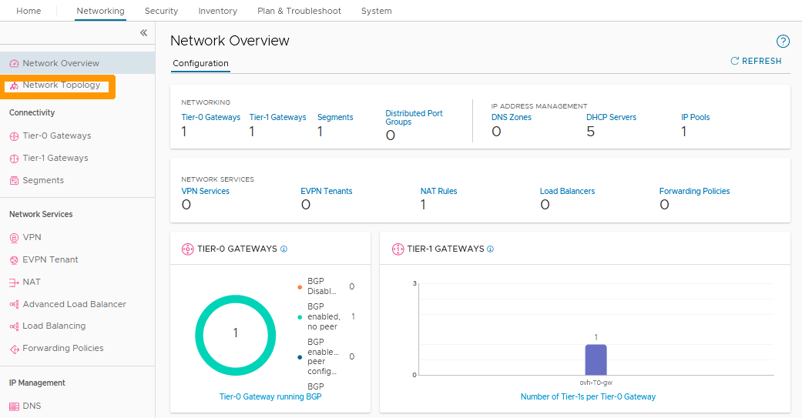
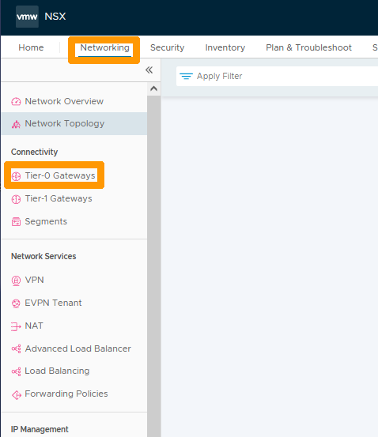
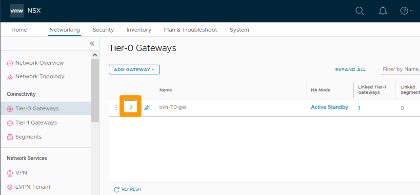
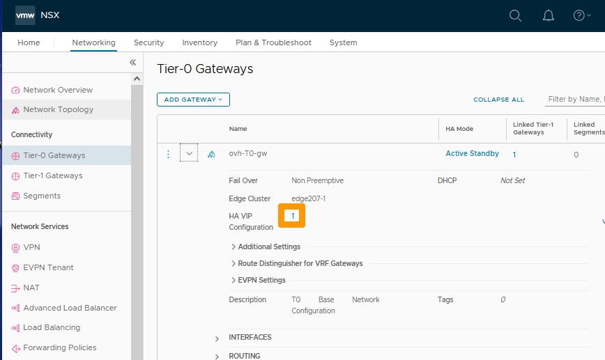
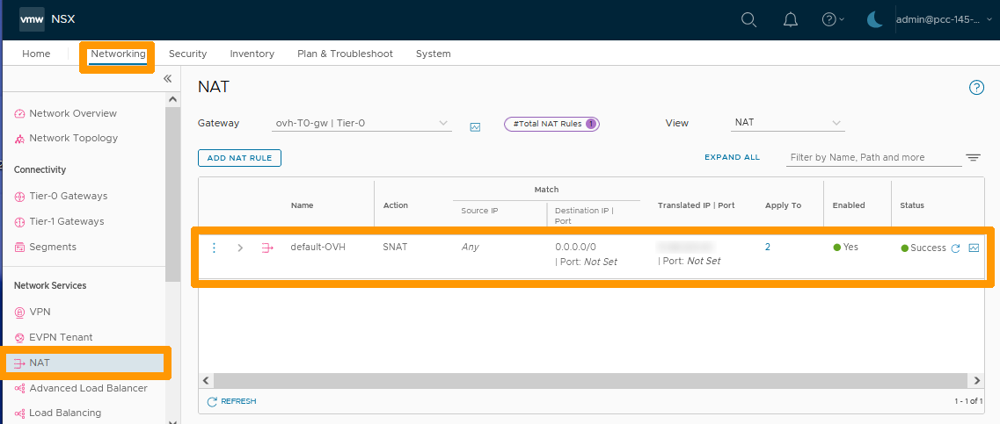

**Last updated 27th February 2023**

## Objective

NSX is a **Software-Defined Networking (SDN)** solution provided by VMware. OVHcloud is offering this service in place of NSX-V in its Hosted Private Cloud Powered by VMware solution. For the ALPHA version of NSX to work, two hosts are deployed with a dedicated virtual machine for NSX on each host, allowing redundancy in the event of one of the hosts failing.

When a customer subscribes to the NSX offer and enables it, a pre-configuration is applied with two gateways:

- **ovh-T0-gw** : This gateway is the network entry point for your cluster. It is preconfigured with two interfaces and a virtual IP address. It is of type **Tier-0 Gateways** (North-South).
- **ovh-T1-gw** : This gateway is in the **Tier-1 Gateways** (East-West) category. You can create segments (VLANs or Overlay) that will be connected to it. It is connected to **ovh-T0-gw** for connections outside the clusters (Physical and Internet).

New **Tier-1 gateways** can be created and linked to the **ovh-T0-gw** gateway.

OVHcloud provides a block of 8 public IP addresses, some of which are reserved. The **HA VIP** address is preconfigured, it is used for SNAT by default on future internal segments.

**This guide is an introduction to NSX.**

> [!warning]
> OVHcloud provides services for which you are responsible, with regard to their configuration and management. It is therefore your responsibility to ensure that they work properly.
>
> This guide is designed to assist you as much as possible with common tasks. However, we recommend contacting a [specialist provider](https://partner.ovhcloud.com/en-ca/directory/) if you experience any difficulties or doubts when it comes to managing, using or setting up a service on a server.
>

## Requirements

- Being an administrative contact of your [Hosted Private Cloud infrastructure](https://www.ovhcloud.com/en-ca/enterprise/products/hosted-private-cloud/) to receive login credentials.
- A user account with access to the [OVHcloud Control Panel](https://ca.ovh.com/auth/?action=gotomanager&from=https://www.ovh.com/ca/en/&ovhSubsidiary=ca).

## Instructions

### Logging in to the NSX administration interface

You can connect to NSX from the URL of your cluster, provided by OVHcloud, in the form `https://pcc-xxxxx.ovh.xx`.

From the homepage for your cluster, click the `NSX`{.action} icon.

{.thumbnail}

Enter your credentials and click `LOG IN`{.action}.

> [!warning]
> To authenticate on the NSX interface, you need to use an account provided by OVHcloud followed by your cluster’s FQDN, such as `admin@pcc-xxxxx.ovh.xx`.
>

{.thumbnail}

The NSX interface appears.

{.thumbnail}

### Displaying the default configuration

We will see the network topology configured by default when deploying the **NSX** service.

In the **NSX** interface, click on the `Networking`{.action} tab.

{.thumbnail}

A view of all network elements is displayed.

Click `Network Topology`{.action} to the left.

{.thumbnail}

The diagram below shows the network topology from top to bottom:

- The two physical interfaces that allow redundancy of Internet access in case of failure (both interfaces use public IP addresses that are not usable for client configuration).
- The North-South gateway (**ovh-T0-gw**) that provides the link between the physical network (Internet and VLAN on vRack) and the internal networks (Overlays) of your cluster.
- The connection between the **ovh-T0-gw** and **ovh-T1-gw** gateways is via IP addresses reserved for this purpose.
- The East-West gateway (**ovh-T1-gw**) that manages communications between the cluster’s internal networks (overlay segments). You can also make connections with VLANs on vRacks.
-  **ovh-segment-nsxpublic** which is a network segment connected to the OVHcloud public network on a VLAN, it contains the network of public addresses usable for customer configurations. Click the rectangular icon below to view this segment. You can find more information about segments in this guide: [Segment management in NSX](https://docs.ovh.com/ca/en/private-cloud/nsx-segment-management).

{.thumbnail}

This segment contains two pieces of information :

- The virtual public IP address **HA VIP**.
- The VLAN number used on your public network in your vSphere cluster.

Connections through VLANs on the **ovh-T0-gw** gateway do not appear in the NSX network topology, even if it exists.

{.thumbnail}

### Displaying the HA VIP virtual IP address

We will show you how to display the virtual IP addresses attached to the **ovh-T0-gw** gateway.

Only one virtual IP address is assigned when NSX is delivered. It is used for SNAT on the segments attached to the gateway **ovh-T0-gw**.

> [!primary]
> For now it is not possible to create new virtual IP addresses, but this feature should be available soon.
> 

Stay on the `Networking`{.action} tab and click on `Tier-0 Gateways`{.action} to the left in the **Connectivity** category.

{.thumbnail}

Click the `>`{.action} scroll button to the left of **Name** to view the configuration.

{.thumbnail}

Click on the `Number`{.action} to the right of **HA VIP Configuration**.

{.thumbnail}

You see the public virtual IP address that can be used in your **NSX** configurations, click `Close`{.action} to close this window.

{.thumbnail}

### NAT Default Configuration Information

A default SNAT configuration is applied, which allows Internet access from all networks connected to the gateway **ovh-T0-gw**, those connected through VLAN segment and those overlay.

From the `Networking`{.action} tab, click `NAT`{.action} to view the default configuration of NAT rules.

The default rule for **SNAT** shows that the virtual IP address is used to translate from internal networks to the Internet.

{.thumbnail}

### Route activation on all segments connected to your gateway ovh-T1-gw

By default, the segments behind the **ovh-T1-gw** gateway do not have routing enabled except with another segment connected to that gateway. We will see how to activate it if necessary.

From the **Networking** tab click on `Tier-1 Gateways`{.action} then click the `...`{.action} button to the left of the **ovh-T1-gw** gateway and choose `Edit`{.action} from the menu.

{.thumbnail}

Click the `arrow`{.action} button to the left of **Route Advertisement** and enable the **All Connected Segments & Service Ports** option. Then click `SAVE`{.action}.

{.thumbnail}

Click `CLOSE EDITING`{.action}.

{.thumbnail}

Now routing is enabled on the member segments of the **ovh-T1-gw** gateway.

You have just seen the default configuration. You can refer to the other OVHcloud guides for NSX to create segments, manage DHCP, perform DNAT port redirection, load balancing, VPN, etc...

## Go further 

[Managing segments in NSX](https://docs.ovh.com/ca/en/private-cloud/nsx-segment-management)

If you need training or technical assistance to implement our solutions, contact your sales representative or click on [this link](https://www.ovhcloud.com/en-ca/professional-services/) to get a quote and ask our Professional Services experts for a custom analysis of your project.

Join our community of users on <https://community.ovh.com/en/>.
