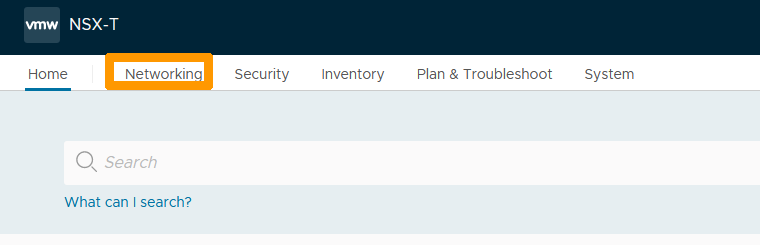
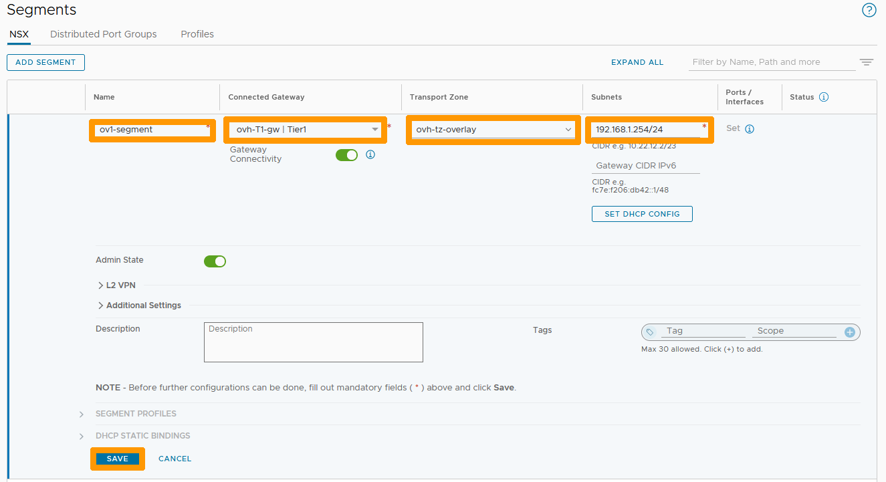
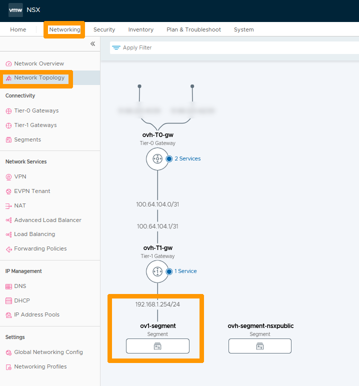
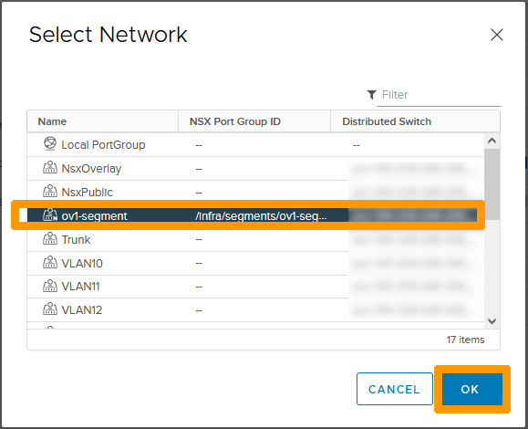
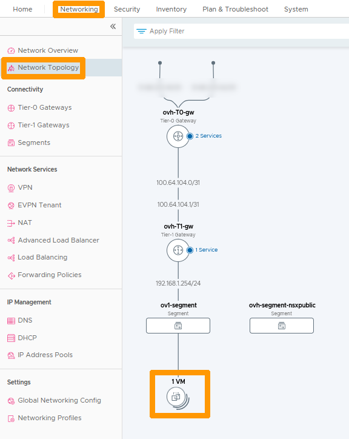
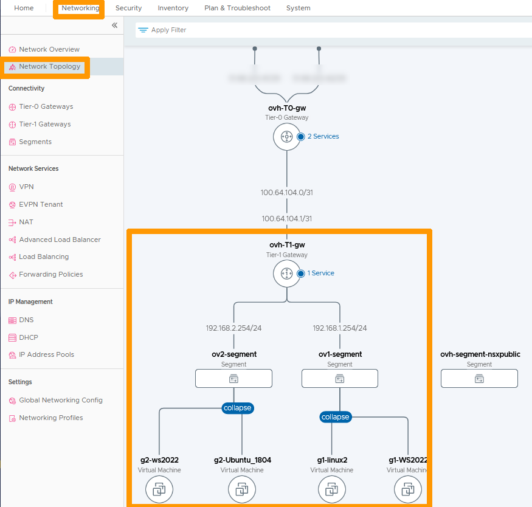
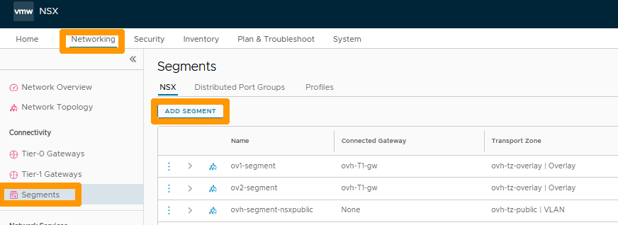
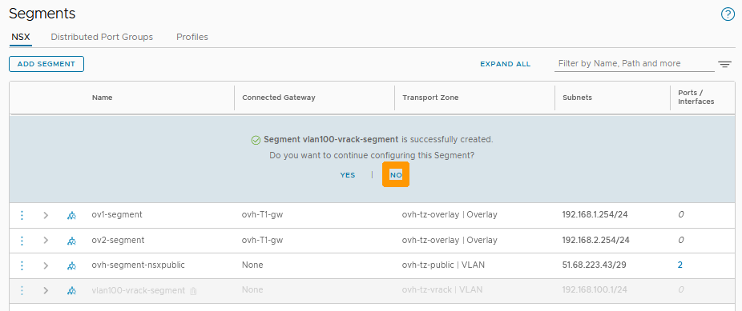
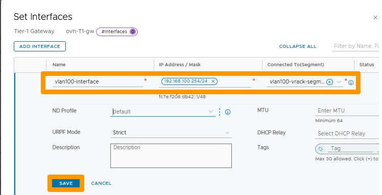

**Dernière mise à jour le 27/02/2023**

## Objectif

Dans une solution NSX, un segment est un domaine de niveau 2 virtuel. Il peut être de deux types :

- **VLAN-backed segments** : la communication entre les hôtes et les machines virtuelles se fait au travers de VLANs et d'un switch de couche 2 du modèle OSI. Pour que ces segments puissent communiquer avec les éléments de NSX (Internet et les autres segments), il faut rajouter une interface sur les passerelles **Tier-1 Gateways** ou **Tier-0 Gateways**.
- **Overlay-backed segments** : la connexion se fait à l'aide d'une surcouche logicielle qui établit des tunnels entre les hôtes. Il est obligatoire de rajouter une adresse dans un sous-réseau qui servira pour le routage en dehors de ce segment. Ils doivent être connectés à une passerelle de type **Tier-1 Gateways** comme **ovh-T1-gw**.

Les segments sont liés à des zones de transports qui sont prédéfinies par OVHcloud. 

- **system-owned-vlan-transport-zone-for-rtep | VLAN** : zone prévue pour les réseaux étendues RTEP.
- **system-owned-vlan-transport-zone-for-evpn | VLAN** : zone prévue pour les VPN.
- **ovh-tz-overlay | VLAN** : zone pour les segments de type Overlay derrière les passerelles de type **Tier-1 Gateways**, comme **ovh-T1-gw**.
- **ovh-tz-public | VLAN** : zone connectée au réseau public sur un VLAN unique fourni par OVHcloud.
- **ovh-tz-vrack | VLAN** : zone reliée au vRack OVHcloud sur lequel il est possible de créer des segments avec un VLAN particulier.

**Découvrez la création et l'utilisation des segments dans l'interfaces NSX et vCenter.**

> [!warning]
> OVHcloud vous met à disposition des services dont la configuration, la gestion et la responsabilité vous incombent. Il vous appartient donc de ce fait d’en assurer le bon fonctionnement.
>
> Ce guide a pour but de vous accompagner au mieux sur des tâches courantes. Néanmoins, nous vous recommandons de faire appel à un [prestataire spécialisé](https://partner.ovhcloud.com/fr/) si vous éprouvez des difficultés ou des doutes concernant l’administration, l’utilisation ou la mise en place d’un service sur un serveur.
>

## Prérequis

- Être contact administrateur de l'infrastructure [Hosted Private Cloud powered by VMware](https://www.ovhcloud.com/fr-ca/enterprise/products/hosted-private-cloud/), celui-ci recevant les identifiants de connexion.
- Avoir un identifiant utilisateur actif avec les droits spécifiques pour NSX (créé dans l'[espace client OVHcloud](https://ca.ovh.com/auth/?action=gotomanager&from=https://www.ovh.com/ca/fr/&ovhSubsidiary=qc))
- Avoir déployé **NSX**.

## En pratique

### Création d'un segment de type overlay dans l'interface NSX

Nous allons créer un segment *Overlay-backed segment* relié à **ovh-T1-gw** dans un sous réseau en 192.168.1.0/24 avec comme passerelle 192.168.1.254.

Dans l'interface NSX, allez dans l'onglet `Networking`{.action}.

{.thumbnail}

Cliquez à gauche sur `Segments`{.action}.

{.thumbnail}

Cliquez à droite sur `ADD SEGMENT`{.action}.

{.thumbnail}

Renseignez ces informations :

- **Name** : nom de votre segment.
- **Connected Gateway** : gateway prédefinie ovh-T1-gw | Tier1.
- **Transport Zone** : zone prédéfinie ovh-tz-overlay.
- **Subnet** : adresse de la passerelle du segment dans ce format 192.168.1.254/24.

Cliquez ensuite à droite sur `SAVE`{.action}.

{.thumbnail}

Cliquez sur `NO`{.action} à l'étape suivante.

{.thumbnail}

Le nouveau segment apparait dans la liste.

{.thumbnail}

Toujours dans l'onglet `Networking`, cliquez à gauche sur `Network Topology`{.action} pour voir le nouveau segment et son emplacement dans le réseau. 

{.thumbnail}

### Connexion d'une machine virtuelle à un segment de type overlay.

Allez dans l'interface vCenter de votre cluster Hosted Private Cloud.

Faites un clic-droit sur la machine virtuelle et cliquez sur `Modifier les paramètres`{.action}.

{.thumbnail}

Allez dans la barre de défilement à droite de votre adaptateur réseau et choisissez `Parcourir`{.action}.

{.thumbnail}

Sélectionnez le `réseau`{.action} qui porte le nom de votre segment. et cliquez sur `OK`{.action}.

{.thumbnail}

Cliquez sur `OK`{.action}.

{.thumbnail}

Maintenant que votre machine virtuelle est connectée au segment, revenez sur l'interface NSX.

Allez dans l'onglet `Networking`{.action} et choisissez `Network Topology`{.action}.

{.thumbnail}

La machine virtuelle associée au réseau apparait dans la topologie du réseau.

Aidez-vous de la première partie du guide pour créer un deuxième segment nommé `ov2-segment` avec le paramètre **192.168.2.254/24** afin d'avoir deux segments connectés à **ovh-T1-gw**.

{.thumbnail}

Par la suite, depuis la console **vCenter**, mettez deux machines virtuelles sur le premier segment et deux autres sur le deuxième segment.

Revenez sur l'interface NSX dans `Network Topology`{.action} pour faire apparaître la nouvelle configuration réseau.

{.thumbnail}

Les deux segments sont reliés à la passerelle **ovh-T1-gw**, le routage entre les deux sous-réseaux est activé sans aucune restriction réseau par défaut.

### Création d'un segment sur un VLAN 

Depuis l'interface de NSX, cliquez sur l'onglet `Networking`{.action} et cliquez sur `Segments`{.action} à gauche dans la rubrique **Connectivity**. Cliquez ensuite sur `ADD SEGMENT`{.action}.

{.thumbnail}

Remplissez ces informations :

- **Name** : saisissez `vlan100-vrack-segment`.
- **Transport Zone** : sélectionnez `ovh-tz-vrack`.
- **VLAN** : tapez le nombre `100`.
- **Subnets** : saisissez l'adresse et le range de la passerelle sur ce segment `192.168.100.254/24`.

Cliquez sur `SAVE`{.action}.

{.thumbnail}

Cliquez sur `NO`{.action} à l'étape suivante.

{.thumbnail}

### Connexion d'un segment de type VLAN à la passerelle ovh-T1-gw

Vous pouvez router le réseau venant d'un segment de type VLAN vers Internet et les autres segments en créant une interface sur la passerelle **ovh-T1-gw**. Lors de la création de l'interface, il faut utiliser la même adresse IP que celle indiquée dans le sous-réseau du segment.

Depuis l'interface NSX, allez dans l'onglet `Networking`{.action} et cliquez sur `Tier-1 Gateways`{.action} à gauche dans la rubrique **Connectivity**.

Cliquez ensuite sur les `trois points de suspensions verticaux`{.action} et choisissez `Edit`{.action} dans le menu.

{.thumbnail}

Cliquez sur la `Flèche vers le bas`{.action} à gauche de **SERVICE INTERFACES** et cliquez sur le bouton `Set`{.action} qui vient de s'afficher à droite de **Service Interfaces**.

{.thumbnail}

Cliquez sur `ADD INTERFACE`{.action}.

{.thumbnail}

Renseignez ces informations :

- **Name** : saisissez `vlan100-interface` comme nom de votre interface.
- **IP Address / Mask** : saisissez l'adresse IP de l'interface `192.168.100.254/24` qui doit correspondre à la passerelle.
- **Connected To(Segment)** : prenez le segment qui est sur le vlan 100 sur le vrack nommé `vlan100-vrack-segment`.

Cliquez ensuite sur `SAVE`{.action} pour valider la création de l'interface sur **ovh-T1-gw**.

{.thumbnail}

Cliquez sur `CLOSE`{.action}

{.thumbnail}

Le chiffre `1` à coté de **Service Interfaces** indique que l'interface est créée, cliquez sur `CLOSE EDITING`{.action} pour finaliser la création de l'interface.

{.thumbnail}

Vous pouvez maitenant vous connecter en dehors de ce segment par le biais de l'interface avec la passerelle 192.168.100.254/24.

### Affectation d'un segment de type VLAN à une machine virtuelle

Allez dans votre interface vSphere et faites un clic-droit sur votre machine virtuelle puis choisissez `Modifier les paramètres`{.action}.

{.thumbnail}

Positionnez-vous sur votre adapteur réseau et cliquez sur `Parcourir`{.action}.

{.thumbnail}

Cliquez sur le `segment`{.action} associé à votre VLAN et cliquez sur `OK`{.action}.

{.thumbnail}

Cliquez sur `OK`{.action} pour valider les changements.

{.thumbnail}

### Affichage d'une topologie réseau avec des segments en overlay et d'autres segments sur des VLAN

Revenez dans l'interface NSX, allez sur l'onglet `Networking`{.action} et cliquez à gauche sur `Network Topology`{.action} pour afficher une vue graphique du réseau. Vous verrez les réseaux de type Overlay et ceux de type VLAN connectées au travers d'une interface sur **ovh-t1-gw**.

{.thumbnail}

## Aller plus loin

[Premiers pas avec NSX](https://docs.ovh.com/ca/fr/private-cloud/nsx-first-steps/)

Échangez avec notre communauté d'utilisateurs sur <https://community.ovh.com>.
