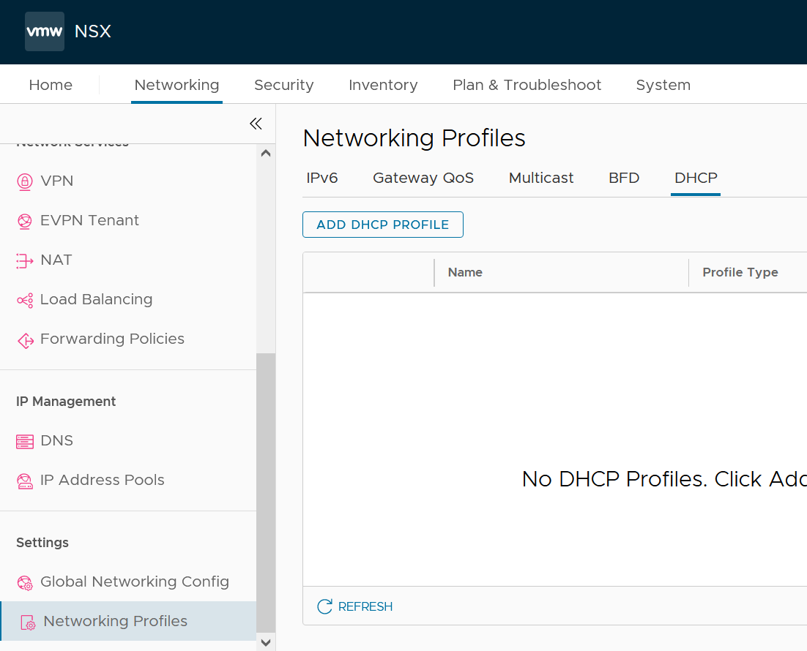
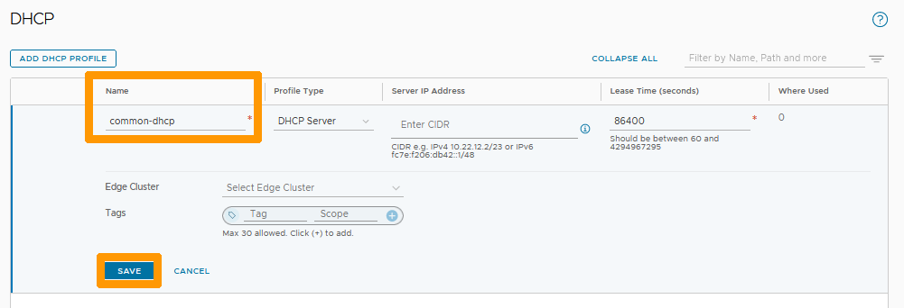
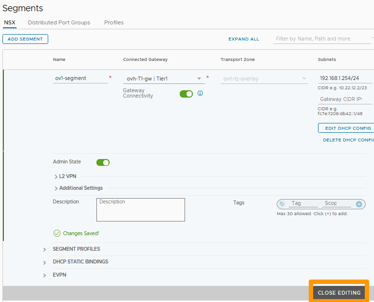
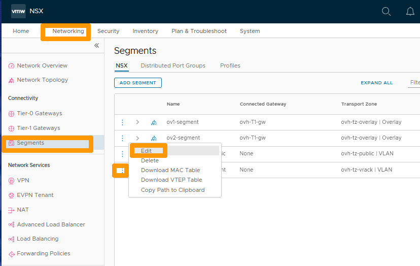

**Dernière mise à jour le 27/02/2023**

## Objectif

**Comment faire pour configurer un serveur DHCP dans un segment Overlay ou VLAN**

> [!warning]
> OVHcloud vous met à disposition des services dont la configuration, la gestion et la responsabilité vous incombent. Il vous appartient donc de ce fait d’en assurer le bon fonctionnement.
>
> Ce guide a pour but de vous accompagner au mieux sur des tâches courantes. Néanmoins, nous vous recommandons de faire appel à un [prestataire spécialisé](https://partner.ovhcloud.com/fr/) si vous éprouvez des difficultés ou des doutes concernant l’administration, l’utilisation ou la mise en place d’un service sur un serveur.
>

## Prérequis

- Être contact administrateur du [Hosted Private Cloud infrastructure](https://www.ovhcloud.com/fr/enterprise/products/hosted-private-cloud/), celui-ci recevant les identifiants de connexion.
- Avoir un identifiant utilisateur actif avec les droits spécifiques pour NSX-T (créé dans l'[espace client OVHcloud](https://www.ovh.com/auth/?action=gotomanager&from=https://www.ovh.com/fr/&ovhSubsidiary=fr))
- Avoir **NSX-T** déployé avec deux segments de type overlay et VLAN configurés dans votre configuration NSX-T, vous pouvez vous aider de ce guide [Gestion des segments dans NSX-T](https://docs.ovh.com/fr/private-cloud/nsx-t-segment-management).

## En pratique

Nous allons configurer le DHCP pour : 

- Un segment en Overlay derrière la passerelle **ovh-T1-gw** 
- Un segment sur un VLAN connecté à la passerelle **ovh-T1-gw**.

### Configuration commune du DHCP pour tous les segments de type overlay

Tout d'abord nous allons créer une serveur DCHP commun à tous les segments en Overlay.

Au travers de l'interface NSX-T allez dans l'onglet `Networking`{.action} et cliquez sur `DHCP`{.action} à gauche dans la rubrique **IP Management**. Ensuite cliquez sur `ADD DHCP PROFILE`{.action}.

{.thumbnail}

Saisissez un `Nom`{.action} dans **Name** et cliquez sur `SAVE`{.action}

{.thumbnail}

Le serveur DCHP est actif il utilise un réseau en 100.96.0.1/30, n'utilisez pas ce réseau dans un de vos segments.

{.thumbnail}

### Affectation du DHCP à passerelle **ovh-T1-gw**

Toujours dans l'onglet `Networking`{.action} cliquez sur `Tier-1-Gateways`{.action} à gauche dans la rubrique **Connectivity**.

{.thumbnail}

Cliquez sur les `points de suspensions verticaux`{.action} et choisissez `Edit`{.action} dans le menu.

{.thumbnail}

Cliquez sur `Set DHCP Configuration`{.action}.

{.thumbnail}

Choississez `DHCP Server`{.action} dans **Type**, et votre `profil DHCP`{.action} dans **DHCP Server Profile**. Ensuite cliquez sur `SAVE`{.action}.

{.thumbnail}

Cliquez sur `SAVE`{.action}.

{.thumbnail}

Cliquez sur `CLOSE EDITING`{.action}.

{.thumbnail}

### Mise en place du DHCP sur un segment de type Overlay

A partir de l'interface NSX-T allez dans l'onglet `Networking`{.action} et cliquez sur `Segments`{.action} à gauche dans la rubrique **Connectivity**.

Allez dans la rubrique `Segments`{.action}, cliquez sur l'icône de configuration indiqué avec `trois points verticaux`{.action} à gauche de votre segment et choisissez `Edit`{.action}.

{.thumbnail}

Cliquez sur `Set DHCP CONFIG`{.action}.

{.thumbnail}

Remplissez ces informations :

* **DHCP Type** : Laissez `Gateway DHCP Server`{.action}.
* **DHCP Ranges** : Saisissez votre étendue `192.168.1.10-192.168.1.200`{.action}.
* **DNS Servers** : Ajouter le serveur DNS OVHcloud `213.186.33.99`{.action}.

Et cliquez sur `APPLY`{.action}.

{.thumbnail}

Cliquez sur `SAVE`{.action}.

{.thumbnail}

Cliquez sur `CLOSE EDITING`{.action}.

{.thumbnail}

Les machines virtuelles sur ce segment peuvent maintenant être configurées en DHCP.

### Mise en place du DCHP sur un segment de type VLAN

Sur un segment de type VLAN il n'est pas possible d'utiliser le profil créé pour les segments Overlay. 

Pour pouvoir avoir un serveur DHCP sur ce segment nous allons créer une configuration DHCP avec un nouveau profil directement attaché au segment.

Si vous n'avez pas de segment de type de VLAN, aidez-vous du guide [Gestion des segments dans NSX-T](https://docs.ovh.com/fr/nsx-t-segment-management/) pour le crééer avec ces paramètres :

* **Sous-réseau du VLAN** : 192.168.100.0/24.
* **Adresse IP de la passerelle et de l'interface** : 192.168.100.254/24.

Allez sur l'onglet `Networking`{.action}, cliquez sur `Segments`{.action} à gauche dans la rubrique **Connectivity** ensuite cliquez sur les  `trois petits points`{.action} à gauche de votre segment de type VLAN et choisissez `Edit`{.action} dans le menu.

{.thumbnail} 

Cliquez sur `SET DHCP CONFIG`{.action}.

{.thumbnail} 

Laissez `Local DHCP Server`{.action} dans **DHCP Type**, cliquez sur les `trois petits points`{.action} à droite de **DHCP Profile** et choisissez dans le menu `Create New`{.action}.

{.thumbnail}

Saisissez ces informations :

* **Name** : Comme `DHCP-VLAN100`.
* **Server IP Address** : Adresse IP du serveur DHCP `192.168.100.253/24`.

Ensuite sélectionnez votre `Edge Cluster`{.action} et cliquez sur `SAVE`{.action}.

{.thumbnail}

Vérifiez dans **DHCP Profile** que le profil est bien présent et saisissez ces informations :

* **DHCP Server** : adresse IP du serveur DHCP `192.168.100.253/24`.
* **DHCP Range** : Etendue du serveur DHCP `192.168.100.10-192.168.100.200`.
* **DNS Servers** : Adresse IP du serveur DNS OVHcloud `213.186.33.99`.

Ensuite cliquez sur `APPLY`{.action}.

{.thumbnail}

Cliquez sur `SAVE`{.action}.

{.thumbnail}

Cliquez sur `CLOSE EDITING`{.action}.

{.thumbnail}

Le serveur DHCP est actif sur ce segment de type VLAN.

## Aller plus loin

[Premiers pas avec NSX-T](https://docs.ovh.com/fr/private-cloud/nsx-t-first-steps/)

[Gestion des segments dans NSX-T](https://docs.ovh.com/fr/nsx-t-segment-management/)

Échangez avec notre communauté d'utilisateurs sur <https://community.ovh.com>.

