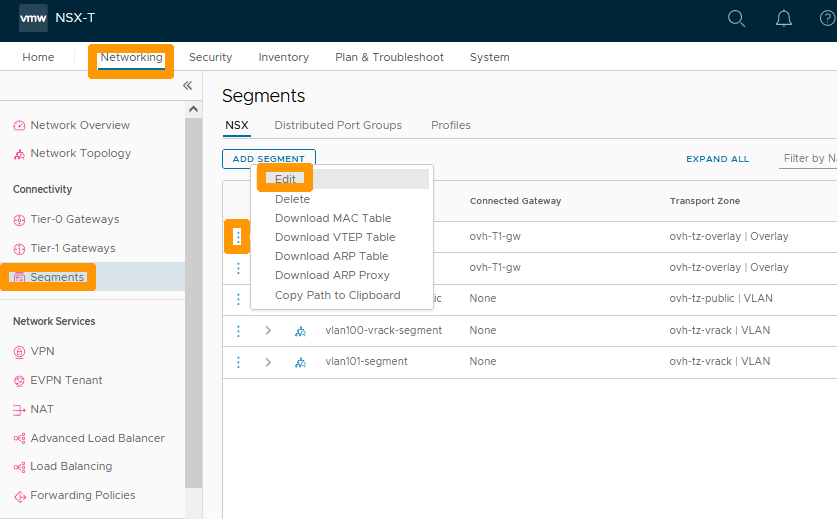
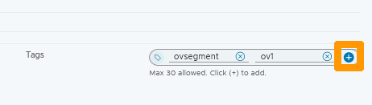
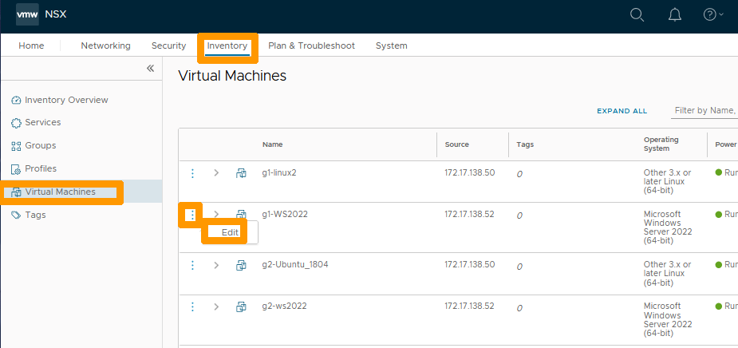
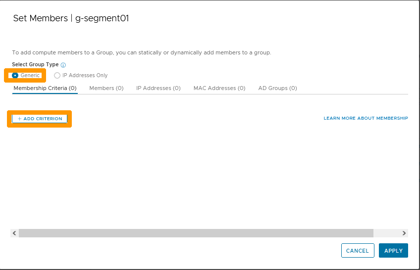
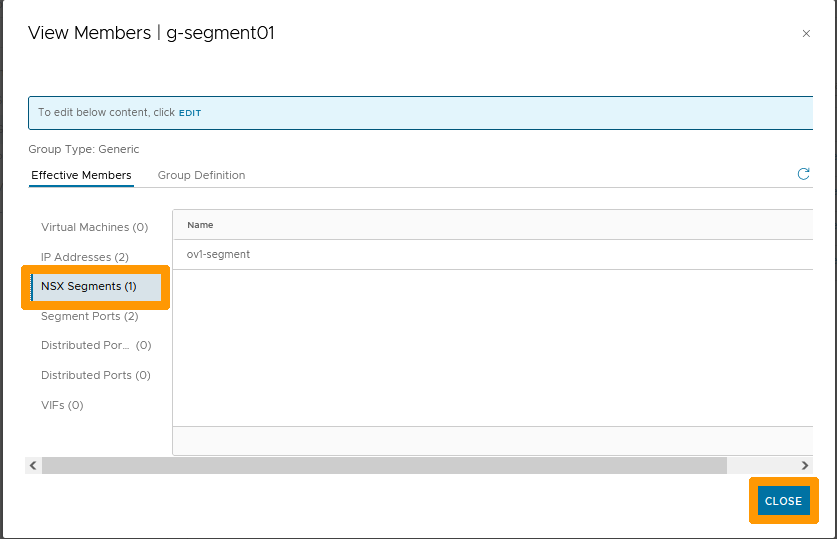
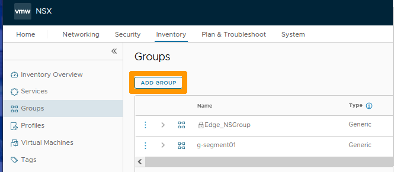
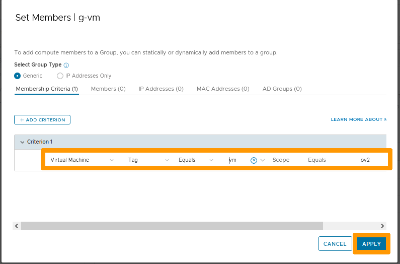
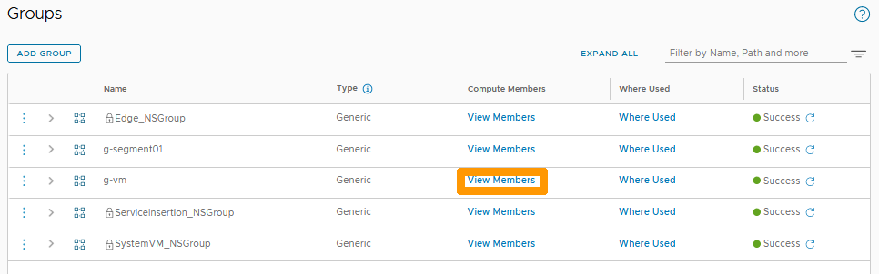
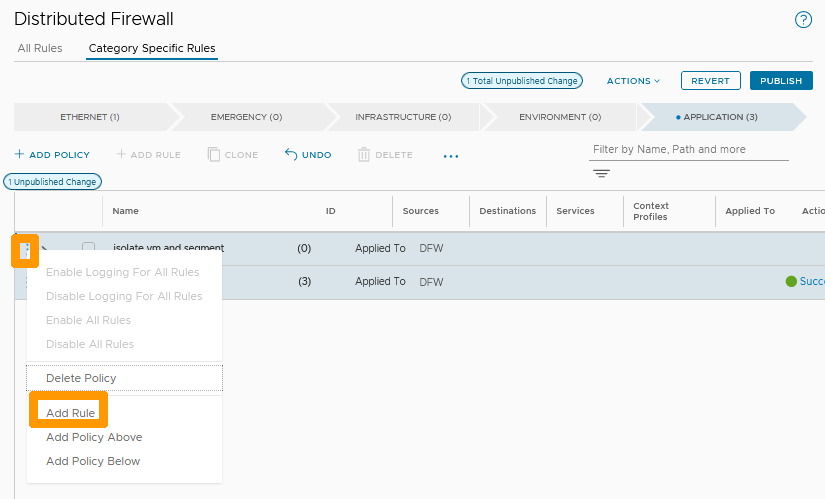
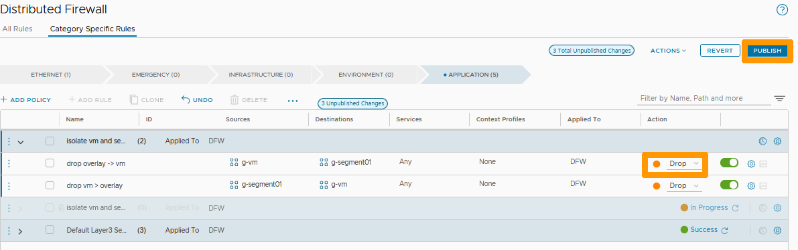

**Last updated 27th February 2023**

## Objective

The distributed firewall feature in NSX allows filtering with all elements in your VMware cluster that are on Overlay or VLAN segments. It should be used normally on east-west connections (ovh-T1-gw), but it also works with elements of the VMware cluster that are connected on the north-south gateway (ovh-T0-gw). Filtering applies from the source (VM, segment, network, etc.).

To simplify the administration of NSX, it is possible to place tags on your elements (segments, virtual machines, roles, etc..) and create groups that contain the objects associated with the tags or IP address ranges (this solution should not be preferred).

**Learn how to manage the distributed firewall by creating a rule that blocks traffic between a virtual machine and all virtual machines in another segment.**

> [!warning]
> OVHcloud provides services for which you are responsible, with regard to their configuration and management. It is therefore your responsibility to ensure that they work properly.
>
> This guide is designed to assist you as much as possible with common tasks. However, we recommend contacting a [specialist provider](https://partner.ovhcloud.com/en-au/directory/) if you experience any difficulties or doubts when it comes to managing, using or setting up a service on a server.
>

## Requirements

- Being an administrative contact of your [Hosted Private Cloud infrastructure](https://www.ovhcloud.com/en-au/enterprise/products/hosted-private-cloud/) to receive login credentials.
- A user account with access to the [OVHcloud Control Panel](https://ca.ovh.com/auth/?action=gotomanager&from=https://www.ovh.com.au/&ovhSubsidiary=au).
- Having **NSX** deployed with two segments configured in your NSX configuration, you can use our guide on [segment management in NSX](/pages/cloud/private-cloud/nsx-02-segment-management) for more information.

## Instructions

We will isolate communication between a virtual machine and all virtual machines in a segment bi-directionally by performing these operations :

- Create two tags, one on a virtual machine and one on a segment.
- Create two associated groups, one containing the first tag and the other the second.
- Create a policy in the distributed firewall that will contain two rules:
    - A rule that will forbid traffic from the first group to the second.
    - Another rule that will forbid traffic from the second group to the first.

### Creating tags

In the NSX interface, go to the `Networking`{.action} tab and click `Segments`{.action} to the left in **Connectivity**.

Then click on the `three vertical dots`{.action} to the left of the segment you want to tag and choose `Edit`{.action} from the menu.

{.thumbnail}

To the right of **Tags**, enter `ovsegment`{.action} instead of tag and click `Add Item(s) ovsegment`{.action} below the input box.

{.thumbnail}

Enter `ov1`{.action} instead of **Scope** and click `Add Item(s) ov1`{.action} below the input box.

{.thumbnail}

Click the `+`{.action} button to the left of your tag.

{.thumbnail}

The created tag is displayed in the bottom right of **Tags**, you can create more tags depending on your needs.

Click `SAVE`{.action}.

{.thumbnail}

Click `CLOSE EDITING`{.action} to complete the markup for your segment.

{.thumbnail}

Go to the `Inventory`{.action} tab and click `Virtual Machines`{.action} on the left in the inventory to view the list of virtual machines.

Then click on the `three vertical dots`{.action} to the left of the virtual machine that you want to tag and choose `Edit`{.action} from the menu.

{.thumbnail}

Enter `vm`{.action} instead of **Tag** and click `Add Item(s) vm`{.action} below the input box.

{.thumbnail}

Enter `ov2`{.action} instead of **Scope** and click `Add Item(s) ov2`{.action} below the input box.

{.thumbnail}

Click the `+`{.action} button to the left of your tag.

{.thumbnail}

The tag is created, click `SAVE`{.action} to save your changes.

{.thumbnail}

Stay in the inventory and click `Tags`{.action} on the left to see the list of tags.

{.thumbnail}

### Add groups that contain tags

In the inventory, go to `Groups`{.action} on the left and click `ADD GROUP`{.action} to create a group.

{.thumbnail}

Type `g-segment01`{.action} below the **Name** column and click `Set`{.action} under the **Compute Members** column.

{.thumbnail}

Leave `Generic`{.action} selected and click `+ ADD CRITERION`{.action}.

{.thumbnail}

Choose these settings :

- **Type** : `NSX Segment`.
- **Tags** : Equals `ovsegment`.
- **Scope**: Equals `ov1`.

Click `APPLY`{.action}.

{.thumbnail}

Click `SAVE`{.action}.

{.thumbnail}

The group is created. Click `View Members`{.action} in the row of your group to display the members list.

{.thumbnail}

Click `IP Addresses`{.action} to view the IP addresses that are used on your segment and which have been automatically added to your group.

{.thumbnail}

Click `NSX Segments`{.action} to display the member segment of this group which has been automatically added from the criteria. You can click on `CLOSE`{.action} to close this window.

{.thumbnail}

Click `ADD GROUP`{.action} to create a second group.

{.thumbnail}

Type `g-vm`{.action} below the **Name** column and click `Set`{.action} under the **Compute Members** column.

{.thumbnail}

Leave `Generic`{.action} selected and click `+ ADD CRITERION`{.action}.

{.thumbnail}

Choose these settings :

- **Type** : `Virtual Machine`.
- **Tags** : Equals `vm`.
- **Scope**: Equals `ov2`.

Click on `APPLY`{.action}.

{.thumbnail}

Click `SAVE`{.action}.

{.thumbnail}

Click `View Members`{.action} in the row of your group to view the members.

{.thumbnail}

In the **Virtual Machines** section, you can see the tagged virtual machine that has been automatically added.

Click `CLOSE`{.action} to close this window.

{.thumbnail}

### Setting up a distributed firewall rule

We will now create a two-way blocking rule, on the distributed firewall, between the two created groups.

Go to the `Security`{.action} tab, select `Distributed Firewall`{.action} and click `+ ADD POLICY`{.action}.

{.thumbnail}

Name your strategy `Isolate vm and segment`{.action}.

{.thumbnail}

Click the `three vertical dots`{.action} to the left of your policy and choose `Add Rule`{.action} from the menu.

{.thumbnail}

Click the `Pen`{.action} icon to the right of **Any** in the **Sources** column.

{.thumbnail}

Stay on the `groups`{.action} tab, check the `g-segment01`{.action} group and click `APPLY`{.action}.

{.thumbnail}

Click the `Pen`{.action} icon to the right of **Any** in the **Destinations** column.

{.thumbnail}

Select the `g-vm`{.action} group and click `APPLY`{.action}.

{.thumbnail}

Choose `Drop`{.action} to remove packages on this rule and click the `three vertical dots`{.action} to the left of your policy.

{.thumbnail}

Click `Add Rule`{.action} in the menu.

{.thumbnail}

Click the `Pen`{.action} icon to the right of **Any** in the **Sources** column.

{.thumbnail}

Select the `g-vm`{.action} group and click `APPLY`{.action}.

{.thumbnail}

Click the `Pen`{.action} icon to the right of **Any** in the **Destinations** column.

{.thumbnail}

Select the `g-segment01`{.action} group and click `APPLY`{.action}.

{.thumbnail}

Choose `Drop`{.action} to remove packages from this rule and click `publish`{.action} to validate the creation of the policy and its two associated rules.

{.thumbnail}

Your rule is active, the traffic between the virtual machine member of the g-vm group and the segment member of the g-segment group is no longer possible.

{.thumbnail}

## Go further 

[Getting started with NSX](/pages/cloud/private-cloud/nsx-01-first-steps)

[Segment management in NSX](/pages/cloud/private-cloud/nsx-02-segment-management)

[VMware Distributed Firewall in NSX documentation](https://docs.vmware.com/en/VMware-NSX-T-Data-Center/3.2/administration/GUID-6AB240DB-949C-4E95-A9A7-4AC6EF5E3036.html)

Join our community of users on <https://community.ovh.com/en/>.
