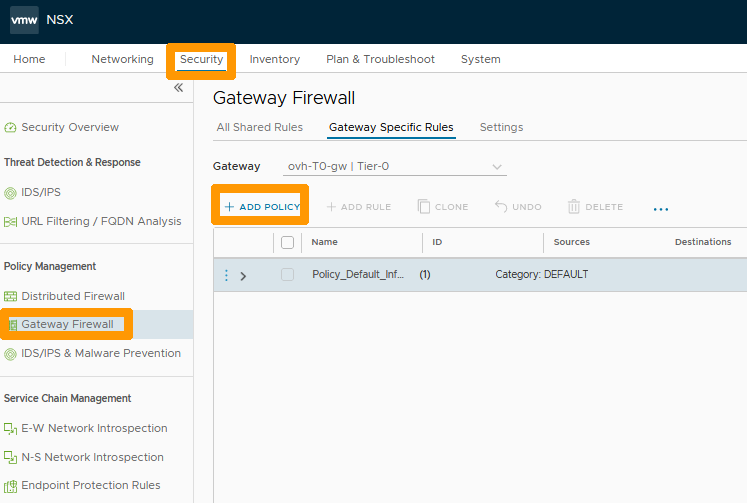
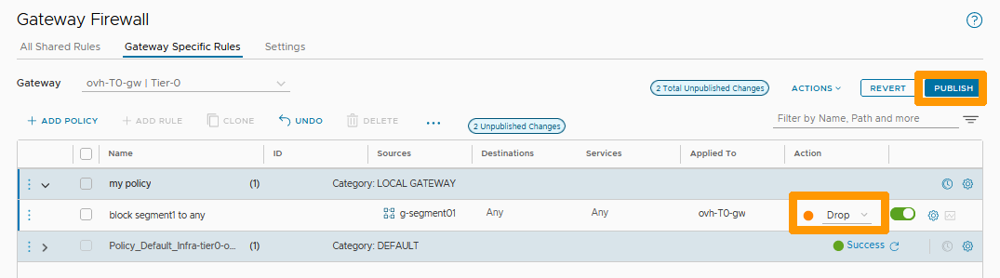

**Last updated 27th February 2023**

## Objective

Gateway Firewall allows filtering between internal segments and the network outside the incoming or outgoing cluster.

It works on the North-South (Tier-0 Gateways) and East-West (Tier-1 Gateways) gateways if the source or destination is not inside the cluster.

If you want to create filtering rules between internal segments, you will need to use distributed firewall using our guide on [distributed firewall management](/pages/cloud/private-cloud/nsx-05-manage-distributed-firewall).

**Learn how to manage gateway firewalls.**

> [!warning]
> OVHcloud provides services for which you are responsible, with regard to their configuration and management. It is therefore your responsibility to ensure that they work properly.
>
> This guide is designed to assist you as much as possible with common tasks. However, we recommend contacting a [specialist provider](https://partner.ovhcloud.com/en-gb/directory/) if you experience any difficulties or doubts when it comes to managing, using or setting up a service on a server.
>

## Requirements

- Being an administrative contact of your [Hosted Private Cloud infrastructure](https://www.ovhcloud.com/en-gb/enterprise/products/hosted-private-cloud/) to receive login credentials.
- A user account with access to the [OVHcloud Control Panel](https://www.ovh.com/auth/?action=gotomanager&from=https://www.ovh.co.uk/&ovhSubsidiary=GB).
- Having **NSX** deployed with one segment configured in your NSX configuration. You can use our guide on [segment management in NSX](/pages/cloud/private-cloud/nsx-02-segment-management) for more information.

## Instructions

We will create a strategy to improve the visibility and administration of rules based on their usefulness.

Next, we will add a rule within our strategy that blocks access to the entire external network of a cluster from a group that contains a segment (you can use our [Distributed Firewall Management](/pages/cloud/private-cloud/nsx-05-manage-distributed-firewall) guide to create groups) and **any** for the destination.

Go to the `Security`{.action} tab, select `Gateway Firewall`{.action} and click `+ ADD POLICY`{.action}.

{.thumbnail}

Select `ovh-T0-gw`{.action} to the right of **Gateway**, name your policy `my policy`{.action} below the **Name** column and click the `three vertical dots`{.action} to the left of your policy.

{.thumbnail}

Click `Add Rule`{.action} in the menu.

{.thumbnail}

Name your rule `block segment1 to any`{.action} below the **Name** column.

{.thumbnail}

Click on the `pen`{.action} to the right of "Any" in the **Source** column.

{.thumbnail}

Stay in the `Group`{.action} tab, select the `g-segment1`{.action} group and click `APPLY`{.action}.

{.thumbnail}

Choose `Drop`{.action} under the **Action** column and click `PUBLISH`{.action}.

{.thumbnail}

Your rule is active on the **ovh-T0-gw** gateway, it blocks all outgoing traffic from members of the **g-segment01** group.

## Go further 

[Getting started with NSX](/pages/cloud/private-cloud/nsx-01-first-steps)

[Segment management in NSX](/pages/cloud/private-cloud/nsx-02-segment-management)

[Distributed Firewall management](https://docs.ovh.com/en/gb/private-cloud/nsx-manage-distributed-firewall/).

[VMware Gateway Firewall in NSX Documentation](https://docs.vmware.com/en/VMware-NSX-T-Data-Center/3.2/administration/GUID-A52E1A6F-F27D-41D9-9493-E3A75EC35481.html)

If you need training or technical assistance to implement our solutions, contact your sales representative or click on [this link](https://www.ovhcloud.com/en-gb/professional-services/) to get a quote and ask our Professional Services experts for a custom analysis of your project.

Join our community of users on <https://community.ovh.com/en/>.

