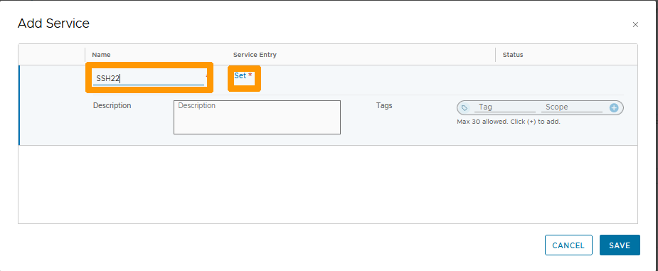

**Dernière mise à jour le 27/02/2023**

## Objectif

**Comment configurer le NAT pour créer une redirection de port avec NSX-T**

> [!warning]
> OVHcloud vous met à disposition des services dont la configuration, la gestion et la responsabilité vous incombent. Il vous appartient donc de ce fait d’en assurer le bon fonctionnement.
>
> Ce guide a pour but de vous accompagner au mieux sur des tâches courantes. Néanmoins, nous vous recommandons de faire appel à un [prestataire spécialisé](https://partner.ovhcloud.com/fr/) si vous éprouvez des difficultés ou des doutes concernant l’administration, l’utilisation ou la mise en place d’un service sur un serveur.
>

## Prérequis

- Être contact administrateur du [Hosted Private Cloud infrastructure](https://www.ovhcloud.com/fr/enterprise/products/hosted-private-cloud/), celui-ci recevant les identifiants de connexion.
- Avoir un identifiant utilisateur actif avec les droits spécifiques pour NSX-T (créé dans l'[espace client OVHcloud](https://www.ovh.com/auth/?action=gotomanager&from=https://www.ovh.com/fr/&ovhSubsidiary=fr))
- Avoir **NSX-T** déployé avec deux segment configurés dans votre configuration NSX-T, vous pouvez vous aider de ce guide [Gestion des segments dans NSX-T](https://docs.ovh.com/fr/private-cloud/nsx-t-segment-management).
- Avoir une machine virtuelle sous linux avec OpenSSH activé sur le port 22

## En pratique

Lors du déploiement de votre solution NSX-T une règle de SNAT est automatiquement créée par OVHcloud pour pouvoir sortir sur internet depuis vos segments.

Nous allons rajouter une règle de redirection (DNAT) depuis l'adresse IP virtuelle publique sur le port 2222 en TCP vers une machine virtuelle sous LINUX sur le port 22 en TCP. Dans notre exemple nous allons utiliser des adresses IP fictives.

Depuis l'interface NSX-T allez sur l'onglet `Networking`{.action}, Sélectionnez `NAT`{.action} dans la rubrique **Network Services** sélectionnez `ovh-T0-gw | Tier-0`{.action} à droite de **Gateway** et cliquez sur `ADD NAT RULE`{.action}.

{.thumbnail}

Choisissez ces informations :

* **Action** : Sélectionnez `DNAT`{.action}.
* **Source IP** : Saisissez l'adresse IP ou l'étendue des adresses qui pourront utiliser cette redirection.
* **Destination IP** : Adresse IP virtuelle publique de NSX-T.
* **Destination PORT** : Port d'écoute sur l'adresse publique comme `2222`{.action}.
* **Translated IP** : Adresse IP de la machine virtuelle sur lequel la redirection est faites.

Ensuite cliquez sur les `points de suspensions verticaux`{.action} à droite de **Select Services**.

{.thumbnail}

Saisissez `SSH22`{.action} sous la colonne **Name** et cliquez sur `Set`{.action} sous la colonne **Service Entry**.

{.thumbnail}

Cliquez sur `ADD SERVICE ENTRY`{.action}.

{.thumbnail}

Remplissez ces valeurs :

* **Name** : Saisissez `SSH22`{.action}.
* **Service Type** : Prenez `TCP`{.action}.
* **Source Ports** : Ecrivez le nombre `22`{.action}.

Ensuite cliquez sur `APPLY`{.action}.

{.thumbnail}

Cliquez sur `SAVE`{.action}.

{.thumbnail}

Cliquez sur `SAVE`{.action} pour valider la création de la règle de redirection.

{.thumbnail}

La règle est créée et est active. 

{.thumbnail}

## Aller plus loin

[Premiers pas avec NSX-T](https://docs.ovh.com/fr/private-cloud/nsx-t-first-steps/)

[Gestion des segment dans NSX-T](https://docs.ovh.com/fr/nsx-t-segment-management/)

[Documentation VMware sur le NAT dans NSX-T](https://docs.vmware.com/en/VMware-NSX-T-Data-Center/3.2/administration/GUID-A52E1A6F-F27D-41D9-9493-E3A75EC35481.html)

Échangez avec notre communauté d'utilisateurs sur <https://community.ovh.com>.

