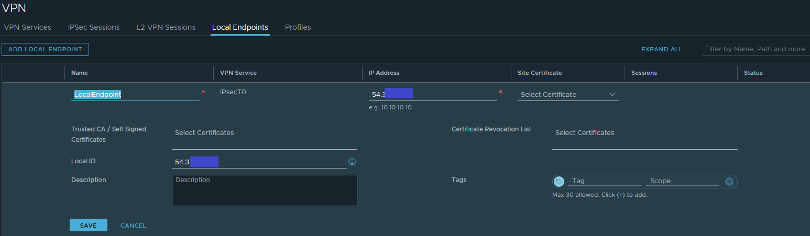
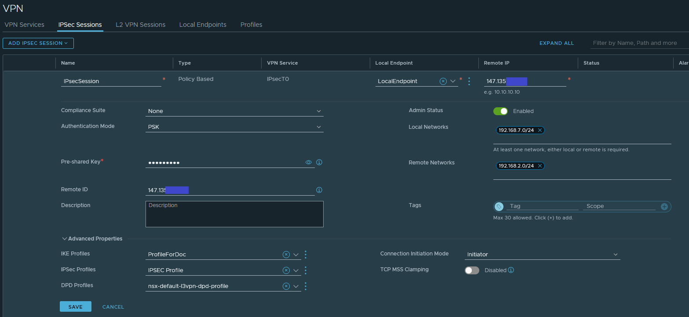

## Objectif

**Découvrez comment configurer un tunnel IPsec avec NSX.**

> [!warning]
> OVHcloud vous met à disposition des services dont la configuration, la gestion et la responsabilité vous incombent. Il vous appartient donc de ce fait d’en assurer le bon fonctionnement.
>
> Ce guide a pour but de vous accompagner au mieux sur des tâches courantes. Néanmoins, nous vous recommandons de faire appel à un [prestataire spécialisé](https://partner.ovhcloud.com/fr-ca/directory/) si vous éprouvez des difficultés ou des doutes concernant l’administration, l’utilisation ou la mise en place d’un service sur un serveur.
>

## Prérequis

- Être contact administrateur de l'infrastructure [Hosted Private Cloud powered by VMware](https://www.ovhcloud.com/fr-ca/enterprise/products/hosted-private-cloud/), celui-ci recevant les identifiants de connexion.
- Avoir un identifiant utilisateur actif avec les droits spécifiques pour NSX (créé dans l'[espace client OVHcloud](https://ca.ovh.com/auth/?action=gotomanager&from=https://www.ovh.com/ca/fr/&ovhSubsidiary=qc))
- Avoir **NSX** déployé avec deux segments configurés dans votre configuration NSX. Consultez notre guide sur la [gestion des segments dans NSX](/pages/cloud/private-cloud/nsx-02-segment-management) pour plus d'informations.

## En pratique

Voici le tunnel que nous voulons monter entre deux infrastructures :

{.thumbnail}

Depuis l'interface NSX, allez sur l'onglet `Networking`{.action}, sélectionnez `VPN`{.action} dans la rubrique **VPN Services**. Cliquez sur `ADD SERVICE`{.action} et sélectionnez `IPSec`{.action} 

Renseignez ces informations :

- **Name** : saisissez un nom 
- **Tier-0/Tier-1 Gateway** : saisissez `ovh-T0-gw | Tier-0`

{.thumbnail}

Vous devez ensuite spécifier le type des paramètres des différentes étapes IPSec. Pour cela, il vous faut renseigner les profils IKE, IPSec et DPD si besoin (des profiles par défaut sont déjà fournis):

Depuis l'interface NSX, rendez-vous sur l'onglet `Networking`{.action}, sélectionnez `VPN`{.action} dans la rubrique **Profiles**. Sélectionnez `IKE PROFILES`{.action} puis `ADD IKE PROFILE`{.action}

Complétez ces informations avec vos paramètres :

- **Name** : saisissez un nom
- **IKE Version** : saisissez la version IKE
- **Encryption Algorithm** : choissisez l'algorithme
- **Digest Algorithm** : choissisez l'algorithme
- **Diffie-Hellman** : choisissez le groupe

{.thumbnail}

Par la suite, depuis l'interface NSX, rendez-vous sur l'onglet `Networking`{.action}, sélectionnez `VPN`{.action} dans la rubrique **Profiles**. Sélectionnez `IPSec PROFILES`{.action} puis `ADD IPSEC PROFILE`{.action} et complétez les informations avec vos paramètres IPSec.

Enfin, depuis l'interface NSX, allez sur l'onglet `Networking`{.action}, sélectionnez `VPN`{.action} dans la rubrique **Profiles**. Sélectionnez `DPD PROFILES`{.action} puis `ADD DPD PROFILE`{.action} et complétez les informations avec vos paramètres DPD.

Vous devez ensuite créer un « Local Endpoint ».

Depuis l'interface NSX, allez sur l'onglet `Networking`{.action}, sélectionnez `VPN`{.action} dans la rubrique **Local Endpoint**. Sélectionnez `ADD LOCAL ENDPOINT`{.action} 

Complétez ces informations avec vos paramètres :

- **Name** : saisissez un nom
- **IPSec Service** : sélectionnez le VPN service précédemment créé
- **IP Address** :  sélectionnez une IP disponible de votre range d'IP publiques associées au PCC
- **Local ID** : saisissez l'ID local du tunnel IPSec

{.thumbnail}

Enfin, il faut terminer avec la configuration de la session IPSec.

Pour cela, depuis l'interface NSX, allez sur l'onglet `Networking`{.action}, sélectionnez `VPN`{.action} dans la rubrique **IPSec Sessions**. Sélectionnez `ADD IPSEC SESSION`{.action}

Complétez ces informations avec vos paramètres :

- **Name** : saisissez un nom
- **Type** : Policy Based
- **VPN Service** : sélectionnez le VPN Service créé précédemment
- **Local Endpoint**: sélectionnez le Local Endpoint créé précédemment
- **Remote IP**: sélectionnez l'IP du tunnel IPSec en face
- **Authentication Mode**: choisissez le mode d'authentification (ici PSK)
- **Pre-shared Key**: saisissez la clé partagée pour le tunnel IPSec
- **Local Networks**: saisissez les réseaux locaux à annoncer
- **Remote  Networks**: saisissez les réseaux distants à connaitre
- **Remote  ID**: saisissez ID distant du tunnel

Dans `Advanced Properties`{.action}, complétez les informations avec vos paramètres :

- **IKE Profiles** : le profil IKE créé précédemment ou ceux par défaut
- **IPSec Profiles** : le profil IPSec créé précédemment ou ceux par défaut
- **DPD Profiles** : Le profil DPD créé précédemment ou ceux par défaut

{.thumbnail}

Si tout est bien configuré de l'autre côté, vous devriez avoir le statut vers « Success ».

## Aller plus loin

[Premiers pas avec NSX](/pages/cloud/private-cloud/nsx-01-first-steps)

[Gestion des segments dans NSX](/pages/cloud/private-cloud/nsx-02-segment-management)

[Documentation VMware sur le NAT dans NSX](https://docs.vmware.com/fr/VMware-NSX-T-Data-Center/3.2/administration/GUID-7AD2C384-4303-4D6C-A44A-DEF45AA18A92.html)

Si vous avez besoin d'une formation ou d'une assistance technique pour la mise en oeuvre de nos solutions, contactez votre commercial ou cliquez sur [ce lien](https://www.ovhcloud.com/fr-ca/professional-services/) pour obtenir un devis et demander une analyse personnalisée de votre projet à nos experts de l’équipe Professional Services.

Échangez avec notre communauté d'utilisateurs sur <https://community.ovh.com>.
