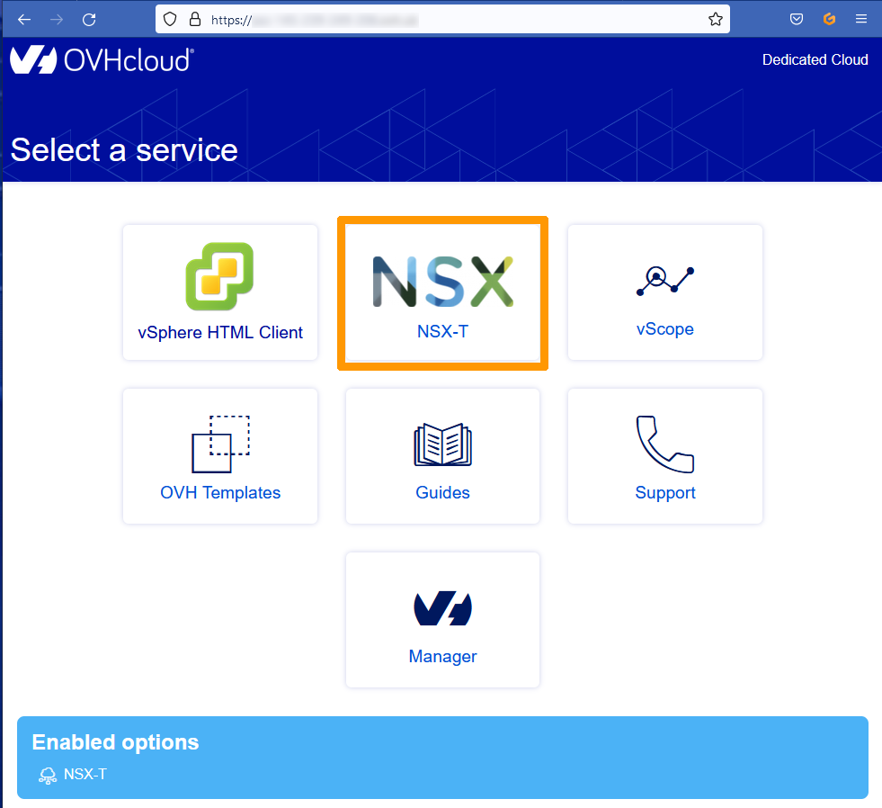
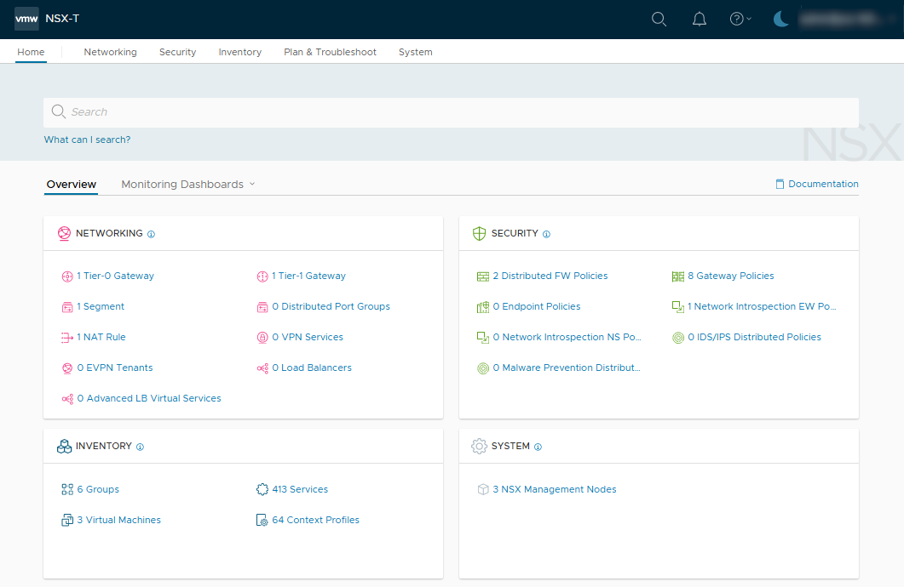
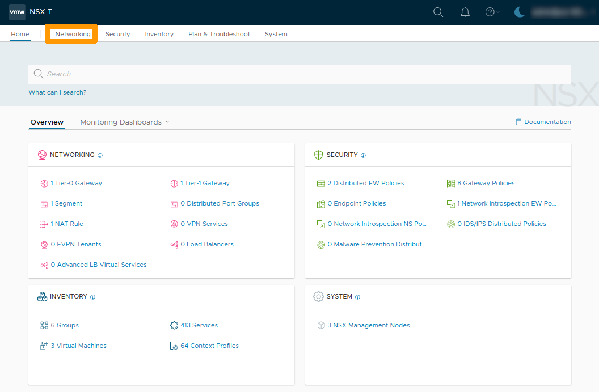
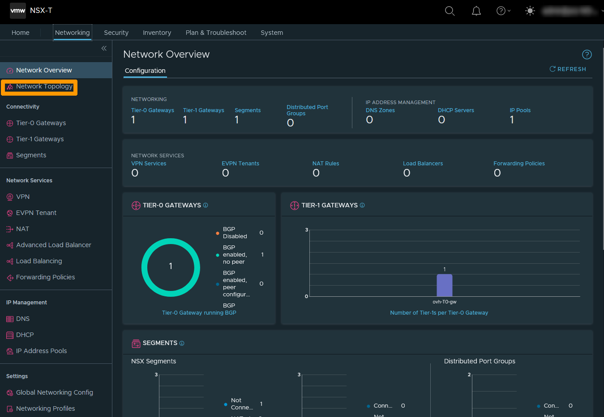

**Last updated 07th December 2022**

> [!warning]
> Guides for **NSX-T** in the VMware solution are not final, they will be modified when the BETA version is released and finalised when the final version is ready.
>

## Objectif

> [!warning]
> OVHcloud provides services for which you are responsible, with regard to their configuration and management. It is therefore your responsibility to ensure that they work properly.
>
> This guide is designed to assist you as much as possible with common tasks. Nevertheless, we recommend contacting a specialist provider if you experience any difficulties or doubts when it comes to managing, using or setting up a service on a server.
>

**This guide is an introduction to the NSX-T**

NSX-T is a Software-Defined Networking (SDN)** solution provided by VMware. OVHcloud is offering this service to replace NSX-V in its Hosted Private Cloud Powerer by VMware solution.

When a customer subscribes to the NSX-T offer and is enabled, a preset is applied with two gateways :

- **Tier-0 Gateway** : For connections between the VMware cluster and the Internet.
- **Tier-1 Gateway**: For intra-cluster connections (segments) that in this case is east-west traffic.

The two gateways are interconnected to allow internal networks to communicate outside the cluster.

## Requirements

- Being an administrative contact of your [Hosted Private Cloud infrastructure](https://www.ovhcloud.com/en/enterprise/products/hosted-private-cloud/) to receive login credentials.
- Having a user account with access to vSphere as well as the specific rights for NSX-T (created in the [OVHcloud Control Panel](https://ca.ovh.com/auth/?action=gotomanager&from=https://www.ovh.com/world/&ovhSubsidiary=we))

## Instructions

### Logging in to the NSX-T administration interface

You can connect to NSX-T from the URL of your cluster, provided by OVHcloud, in the form **https://pcc-xxxxx.ovh.xx**.

From the homepage for your cluster, click the `NSX NSX-T`{.action} icon.

Enter your credentials and click `LOG IN`{.action}.

> [!warning]
> The user account is for your VMware cluster, followed by **@your-pcc-fqdn-name**
>

The NSX-T interface appears.

### Display the default configuration

We will see the network topology configured by default when deploying the **NSX-T** service.

In the **NSX-T** interface, click on the `Networking`{.action} tab.

A view of all network elements is displayed.

Left-click on `Network Topology`{.action}.

A network topology diagram is available with two public IP addresses connected to the **ovh-T0-gateway** and the connection to the **ovh-T1-gateway**.

Inside initial configuration, there is no link between your VMware infrastructure and the internet.

## Go further 

[First time with NSX-T](https://docs.ovh.com/gb/en/private-cloud/nsx-t-first-steps/)

Join our community of users on <https://community.ovh.com/en/>.

