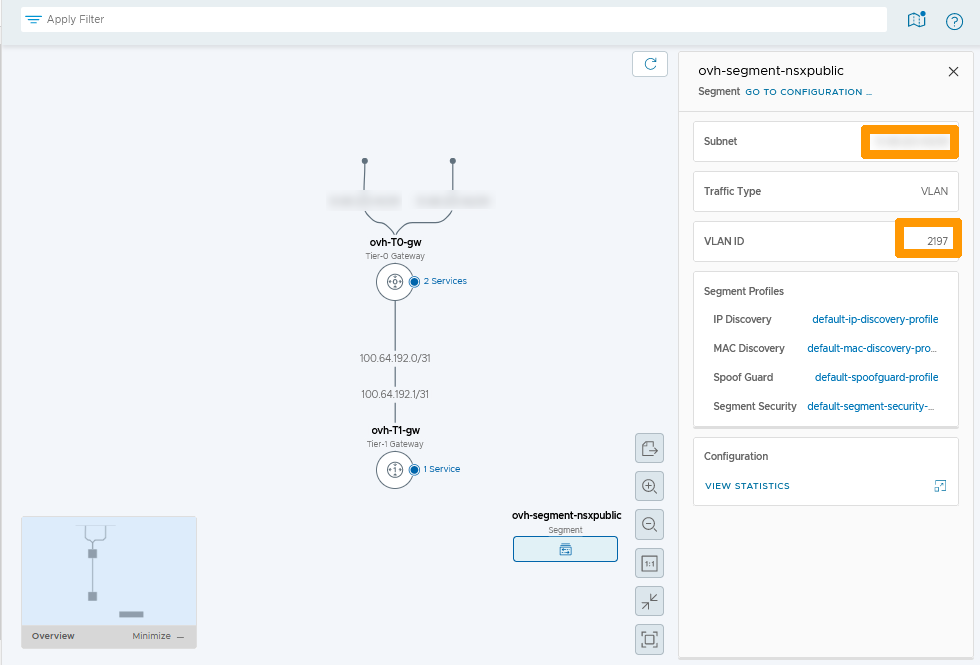
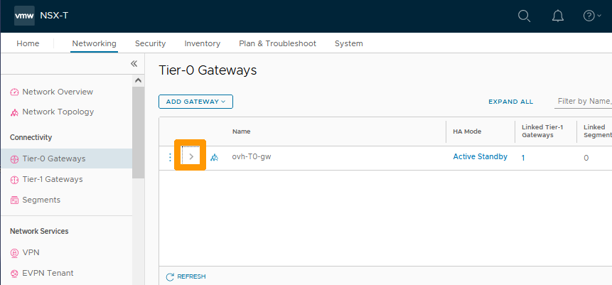

**Last updated 10th February 2023**

> [!warning]
> Guides for **NSX-T** in the VMware solution are not final, they will be modified when the BETA version is released and finalised when the final version is ready.
>

## Objective

**This guide is an introduction to the NSX-T**

> [!warning]
> OVHcloud provides services for which you are responsible, with regard to their configuration and management. It is therefore your responsibility to ensure that they work properly.
>
> This guide is designed to assist you as much as possible with common tasks. However, we recommend contacting a [specialist provider](https://partner.ovhcloud.com/en-gb/) if you experience any difficulties or doubts when it comes to managing, using or setting up a service on a server.
>

## Overview

NSX-T is a Software-Defined Networking (SDN)** solution provided by VMware. OVHcloud is offering this service in place of NSX-V in its Hosted Private Cloud Powered by VMware solution. For the ALPHA version of NSX-T to work, two hosts are deployed with a dedicated virtual machine for NSX-T on each host, allowing redundancy in the event of one of the hosts failing.

When a customer subscribes to the NSX-T offer and is enabled, a pre-configuration is applied with two gateways:

* **Tier-0 Gateway** : For connections between the cluster and the public INTERNET network, known as north-south traffic.
* **Tier-1 Gateway**: For communication between cluster virtual segments. This type of connection is called east-west traffic.

The two gateways are interconnected to allow internal networks to communicate outside the cluster.

OVHcloud provides a block of 8 public IP addresses, some of which are reserved. The **HA VIP** address is preconfigured, it is used for SNAT by default on future internal segments.

## Requirements

- Being an administrative contact of your [Hosted Private Cloud infrastructure](https://www.ovhcloud.com/en-gb/enterprise/products/hosted-private-cloud/) to receive login credentials
- A user account with access to the [OVHcloud Control Panel](https://www.ovh.com/auth/?action=gotomanager&from=https://www.ovh.co.uk/&ovhSubsidiary=GB)

## Instructions

### Logging in to the NSX-T administration interface

You can connect to NSX-T from the URL of your cluster, provided by OVHcloud, in the form **https://pcc-xxxxx.ovh.xx**.

From the homepage for your cluster, click the `NSX NSX-T`{.action} icon.

{.thumbnail}

Enter your credentials and click `LOG IN`{.action}.

> [!warning]
> To authenticate on the NSX-T interface, you need to use an account provided by OVHcloud followed by your cluster’s FQDN, such as **admin@pcc-xxxxx.ovh.xx**.
>

{.thumbnail}

The NSX-T interface appears.

{.thumbnail}

### Display the default configuration

We will see the network topology configured by default when deploying the **NSX-T** service.

In the **NSX-T** interface, click on the `Networking`{.action} tab.

{.thumbnail}

A view of all network elements is displayed.

Left-click on `Network Topology`{.action}.

{.thumbnail}

The diagram below shows the network topology from top to bottom:

- The two physical interfaces that allow redundancy of internet access in case of failure (Both interfaces use public IP addresses that are not usable for client configuration).
- The North-South gateway (**ovh-t0-gw**) that provides the link between The physical network (Internet and VLAN on vRack) and the internal networks (Overlays) of your cluster.
- The connection between the **ovh-t0-gw** and **ovh-t1-gw** gateways is via IP addresses reserved for this purpose.
- The East-West gateway (**ovh-t1-gw**) that manages communications between the cluster’s internal networks (overlay segments). You can also make connections with VLANs on vRacks.
-  **ovh-segment-nsxpublic** which is a network segment connected to the OVHcloud public network on a VLAN, it contains the network of public addresses usable for customer configurations. Click the `Rectangle`{.action} below to view this segment. You can find more information about segments in this guide [Segment management in NSX-T](https://docs.ovh.com/gb/en/private-cloud/nsx-t-segment-management).

{.thumbnail}

This segment contains two pieces of information :

* The virtual public IP address **HA VIP**.
* The VLAN number used on your public network in your vSphere cluster.

Connections through VLANs on the **ovh-t0-gw** gateway do not appear in the NSX-T network topology, even if it exists.

{.thumbnail}

### Display of virtual IP address **HA VIP**

We will show you how to display the virtual IP addresses attached to the **ovh-t0-gw** gateway.

Only one virtual IP address is assigned when NSX-T is delivered. It is used for SNAT on the segments attached to the gateway **ovh-t0-gw**.

> ![Primary]
> For now it is not possible to create new virtual IP addresses, but this feature should be available soon.
> 

Stay on the `Networking`{.action} tab and click on `Tier-0 Gateways`{.action} on the left in the **Connectivity** category.

){.thumbnail}

Click the scroll button `>`{.action} to the left of **Name** to view the configuration.

){.thumbnail}

Click on the `Number`{.action} to the right of **HA VIP Configuration**.

){.thumbnail}

You see the public virtual IP address that can be used in your **NSX-T** configurations, click `Close`{.action} to close this window.

){.thumbnail}

### NAT Default Configuration Information

A default SNAT configuration is applied, which allows Internet access from all networks connected to the gateway **ovh-T0-gw**, those connected through VLAN segment and those overlay.

From the `Networking`{.action} tab, click `NAT`{.action} to view the default configuration of NAT rules.

The default rule for the **SNAT** shows that the virtual IP address is used to translate from the networks within the cluster.

{.thumbnail}

You have just seen the default configuration. You can refer to the other OVHcloud guides for NSX-T to create segments, manage DHCP, perform DNAT port redirection, load balancing, VPN, etc...

## Go further 

Join our community of users on <https://community.ovh.com/en/>.

