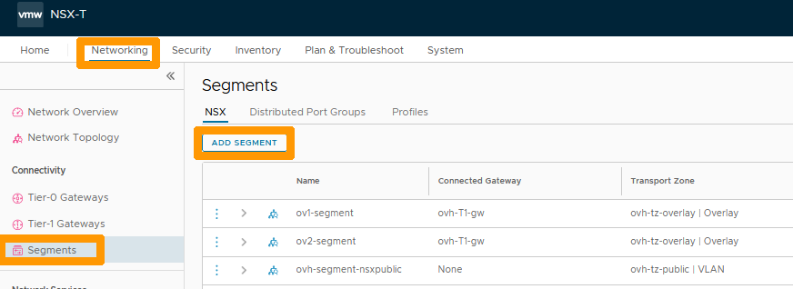
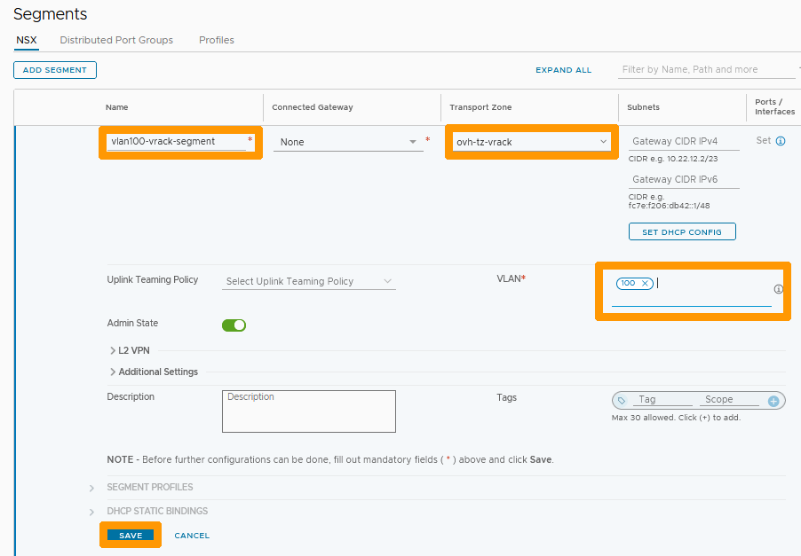

**Dernière mise à jour le 02/02/2023**

> [!warning]
> Les guides concernant NSX-T dans la solution Hosted Private Cloud Powered by VMware ne sont pas définitifs, ils seront modifiés lors de la sortie en version BETA et finalisés quand la version définitive sera prête. 
>

## Objectif

**Découvrir la création et l'utilisation des segment dans l'interface NSX-T et vCenter**

> [!warning]
> OVHcloud vous met à disposition des services dont la configuration, la gestion et la responsabilité vous incombent. Il vous appartient donc de ce fait d’en assurer le bon fonctionnement.
>
> Ce guide a pour but de vous accompagner au mieux sur des tâches courantes. Néanmoins, nous vous recommandons de faire appel à un prestataire spécialisé si vous éprouvez des difficultés ou des doutes concernant l’administration, l’utilisation ou la mise en place d’un service sur un serveur.
>

## Prérequis

- Être contact administrateur du [Hosted Private Cloud infrastructure](https://www.ovhcloud.com/fr/enterprise/products/hosted-private-cloud/), celui-ci recevant les identifiants de connexion.
- Avoir un identifiant utilisateur actif avec les droits spécifiques pour NSX-T (créé dans l'[espace client OVHcloud](https://www.ovh.com/auth/?action=gotomanager&from=https://www.ovh.com/fr/&ovhSubsidiary=fr))
- Avoir **NSX-T** déployé.

## Présentation

Dans une solution NSX-T un segment est un domaine de niveau 2 virtuel (nommé précédemment logical switch) il peut être de deux types :

* **VLAN-backed segments** : la communication entre les hôtes et les VM doit se faire au travers de VLANs et d'un switch de niveau 2. Ce type de segment est totalement isolé à l'intérieur du VLAN, il n'est pas possible de les connecter à une passerelle.
* **Overlay-backed segments** : la connexion se fait à l'aide d'une surcouche logicielle qui établit des tunnels entre les hôtes et les machines virtuelles. Lors de la configuration d'un segment de ce type il est obligatoire de rajouter une adresse dans un sous-réseau pour permettre la communication en dehors de ce segment. Ils doivent être connectés à la passerelle **ovh-T1-gw**.

Les segments sont liés à des zones de transports qui sont prédéfinies par OVHcloud. 

## En pratique

### Création d'un segment de type overlay dans l'interface NSX-T

Nous allons créer un segment *Overlay-backed segment* relié à **ovh-T1-gw** dans un sous réseau en 192.168.1.0/24 avec comme passerelle 192.168.1.254.

A partir de l'interface NSX-T allez dans l'onglet `Networking`{.action}.

{.thumbnail}

Cliquez à gauche sur `Segments`{.action}.

{.thumbnail}

Cliquez à droite sur `ADD SEGMENT`{.action}.

{.thumbnail}

Choisissez ces informations :

* **Name** : Nom de votre segment.
* **Connected Gateway** : gateway prédefinie ovh-T1-gw | Tier1.
* **Transport Zone** : zone prédéfinie ovh-tz-overlay.
* **Subnet** : Adresse de la passerelle du segment dans ce format 192.168.1.254/24.

Ensuite cliquez à droite sur `SAVE`{.action}.

{.thumbnail}

Cliquez sur `NO`{.action}.

{.thumbnail}

Le nouveau segment apparait dans la liste.

{.thumbnail}

Toujours dans l'onglet `Networking` cliquez à gauche sur `Network Topology`{.action} pour voir le nouveau segment et son emplacement dans le réseau. 

{.thumbnail}

### Connexion d'une machine virtuelle à un segment de type overlay.

Allez dans l'interface vCenter de votre cluster Hosted Private Cloud.

Faites un clic droit sur la `machine virtuelle`{.action} et cliquez sur `Modifier les paramètres`{.action}.

{.thumbnail}

Allez dans la barre de défilement à droite de votre adaptateur réseau et choisissez `Parcourir`{.action}.

{.thumbnail}

Sélectionnez le `réseau`{.action} qui porte le nom de votre segment. et cliquez sur `OK`{.action}.

{.thumbnail}

Cliquez sur `OK`{.action}.

{.thumbnail}

Maintenant que votre machine virtuelle est connectée au segment revenez sur l'interface NSX-T.

Allez dans l'onglet `Networking`{.action} choisissez `Network Topology`{.action}.

{.thumbnail}

La machine virtuelle associée au réseau apparait dans la topologie du réseau.

Aidez-vous de la première partie du guide pour créer un deuxième segment nommé ov2-segment avec ces paramètres **192.168.2.254/24** afin d'avoir deux segments connectés à **ovh-T1-gw**.

{.thumbnail}

Ensuite à partir de la console **vCenter**, mettez deux machines virtuelles sur le premier segment et deux autres sur le deuxième segment.

Revenez sur l'interface NSX-T dans `Network Topology`{.action} pour faire apparaitre la nouvelle configuration réseau.

{.thumbnail}

Les deux segments sont reliés à la passerelle **ovh-T1-gw**, le routage entre les deux sous-réseaux est activé sans aucunes restrictions réseaux par défaut.

### Création d'un segment sur un VLAN 

Au travers de l'interface de NSX-T cliquez allez sur l'onglet `Networking`{.action} et cliquez sur `Segments`{.action} à gauche dans la rubrique **Connectivity**.

{.thumbnail}

Remplissez ces informations :

* **Name** : Saisissez `vlan100-vrack-segment`.
* **Transport Zone** : Sélectionnez `vlan100-vrack-segment`.
* **VLAN** : Tapez le nombre `100`.

Ensuite cliquez sur `SAVE`{.action}.

{.thumbnail}

Cliquez sur `NO`{.action}.

{.thumbnail}

### Affectation d'un segment de type VLAN à une machine virtuelle

Allez dans votre interface vSphere et faites un `clic droit`{.action} sur votre machine virtuelle et choisissez `Modifier les paramètres`{.action}.

{.thumbnail}

Positionnez-vous sur votre adapteur réseau et cliquez sur `Parcourir`{.action}.

{.thumbnail}

Cliquez sur le `segment`{.action} associé à votre VLAN et cliquez sur `OK`{.action}.

{.thumbnail}

Cliquez sur `OK`{.action} pour valider les changements.

{.thumbnail}

### Affichage d'une topologie réseau avec des segments en overlay et d'autres segments sur des VLAN

Revenez dans l'interface NSX-T, allez sur l'onglet `Networking`{.action}, et cliquez à gauche sur `Network Topology`{.action} pour afficher un vue graphique du réseau dans lequel nous ne voyons pas de  connexion entre le segment de type VLAN et la passerelle **ov-T1-gw**.

{.thumbnail}

## Aller plus loin

[Premiers pas avec NSX-T](https://docs.ovh.com/fr/private-cloud/nsx-t-first-steps/)

Échangez avec notre communauté d'utilisateurs sur <https://community.ovh.com>.

