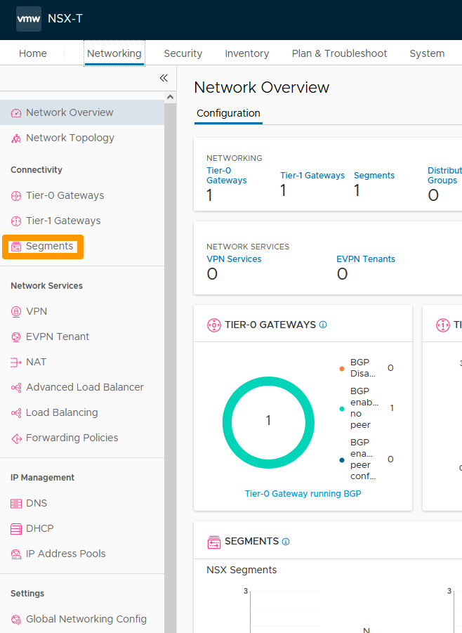
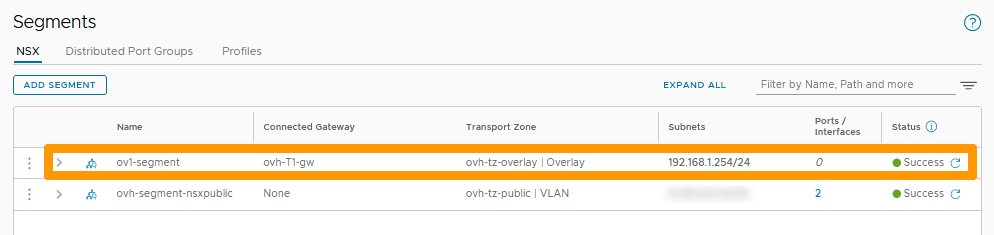

**Dernière mise à jour le 07/12/2022**

> [!warning]
> Les guides concernant NSX-T dans la solution VMware ne sont pas définitifs, il seront modifiés lors de la sortie en version BETA et finalisés quand la version définitive sera prête. 
>

## Objectif

**Découvrir la création et l'utilisation des segment dans l'interface NSX-T et vCenter**

> [!warning]
> OVHcloud vous met à disposition des services dont la configuration, la gestion et la responsabilité vous incombent. Il vous appartient donc de ce fait d’en assurer le bon fonctionnement.
>
> Ce guide a pour but de vous accompagner au mieux sur des tâches courantes. Néanmoins, nous vous recommandons de faire appel à un prestataire spécialisé si vous éprouvez des difficultés ou des doutes concernant l’administration, l’utilisation ou la mise en place d’un service sur un serveur.
>

## Prérequis

- Être contact administrateur du [Hosted Private Cloud infrastructure](https://www.ovhcloud.com/fr/enterprise/products/hosted-private-cloud/), celui-ci recevant les identifiants de connexion.
- Avoir un identifiant utilisateur actif avec les droits spécifiques pour NSX-T (créé dans l'[espace client OVHcloud](https://www.ovh.com/auth/?action=gotomanager&from=https://www.ovh.com/fr/&ovhSubsidiary=fr))
- Etre connecté à votre interface vCenter.
- Avoir **NSX-T** déployé.

## Présentation

Dans une solution NSX-T un segment est un domaine de niveau 2 virtuel (nommé précemment logical switch) il peut être de deux types :

- Gérés à l'aide de VLAN (VLAN-backed segments). la communication entre les hotes et les VM doit se faire au travers d'un switch de niveau 2.
- Géré à l'aide du surcouche logicielle sans avoir la necessité d'avoir des VLAN (Overlay-backed segments). la communication se fait au travers de tunnel sans besoin matériel spécifique.

Les segments sont liés à des zones de transports qui sont prédéfinies par OVHcloud. 

Les segments peuvent être reliés à une passerelle dans ce cas il faut créer une réseau avec une passerelle afin de permettre un trafic sortant au dela de ce segment, soit avec un autre segment soit avec l'extérieur du cluster.

## En pratique

### Création d'un segment dans l'interface NSX-T.

Nous allons créer un segment rélié à la passerelle **Tier-1 Gateway** avec un sous réseau en 192.168.1.0/24 et une passerelle en 192.168.1.254 au travers d'un Overlay-backed segment.

A partir de l'interface NSX-T allez dans l'onglet `Networking`{.action}.

Cliquez à gauche sur `Segments`{.action}.

Cliquez à droite sur `ADD SEGMENT`{.action}.

Choisissez ces informations :

* **Name** : Nom de votre segment
* **Connected Gateway** : gateway prédefinie ovh-T1-gw | Tier1
* **Transport Zone** : zone prédéfinie ovh-tz-overlay
* **Subnet** : Adresse la passerelle sur segment dans son sous réseau comme par exemple 192.168.1.254/24

Ensuite cliquez à droite sur `SAVE`{.action}.

Cliquez sur `NO`{.action}.

Le nouveau segment apparait dans la liste

Toujours dans l'onglet `Networking` cliquez à gauche sur `Network Topology`{.action}. pour voir le nouveau segment et son emplacement dans le réseau.

### Connexion d'une machine virtuelle à ce segment.

Allez dans l'interface vCenter de votre cluster Hosted Private Cloud 

## Aller plus loin

Échangez avec notre communauté d'utilisateurs sur <https://community.ovh.com>.
