**Last updated 03rd February 2023**

> [!warning]
> Guides for **NSX-T** in the VMware solution are not final, they will be modified when the BETA version is released and finalised when the final version is ready.
>

## Objectif

**How to Configure a DHCP Server in a Segment**

> [!warning]
> OVHcloud provides services for which you are responsible, with regard to their configuration and management. It is therefore your responsibility to ensure that they work properly.
>
> This guide is designed to assist you as much as possible with common tasks. However, we recommend contacting a [specialist provider](https://partner.ovhcloud.com/en-gb/) if you experience any difficulties or doubts when it comes to managing, using or setting up a service on a server.
>

## Prérequis

- Being an administrative contact of your [Hosted Private Cloud infrastructure](https://www.ovhcloud.com/en-gb/enterprise/products/hosted-private-cloud/) to receive login credentials
- A user account with access to the [OVHcloud Control Panel](https://www.ovh.com/auth/?action=gotomanager&from=https://www.ovh.co.uk/&ovhSubsidiary=GB)
- Having **NSX-T** deployed with two overlay and vlan segments configured in your NSX-T configuration, you can use this guide [Segment management in NSX-T](https://docs.ovh.com/gb/en/private-cloud/nsx-t-segment-management).

## Instructions

Nous allons configurer le DHCP pour un segment en Overlay derrière la passerelle **ovh-t1-gw** et pour un segment sur un VLAN sur la passerelle **ovh-t0-gw**. 

### Configuration commune du DHCP pour tous les segments de type overlay

Tout d'abord nous allons créer une serveur DCHP commun à tous les segments en Overlay.

Au travers de l'interface NSX-T allez dans l'onglet `Networking`{.action} et cliquez sur `DHCP`{.action} à gauche dans la rubrique **IP Management**. Ensuite cliquez sur `ADD DHCP PROFILE`{.action}.

{.thumbnail}

Saisissez un `Nom`{.action} dans **Name** et cliquez sur `SAVE`{.action}

{.thumbnail}

Le serveur DCHP est actif il utilise une réseau en 100.96.0.1/30, n'utilisez pas ce réseau dans un de vos segments.

{.thumbnail}

### Affectation du DHCP à passerelle **ovh-t1-gateway**

Toujours dans l'onglet `Networking`{.action} cliquez sur `Tier-1-Gateways`{.action} à gauche dans la rubrique **Connectivity**.

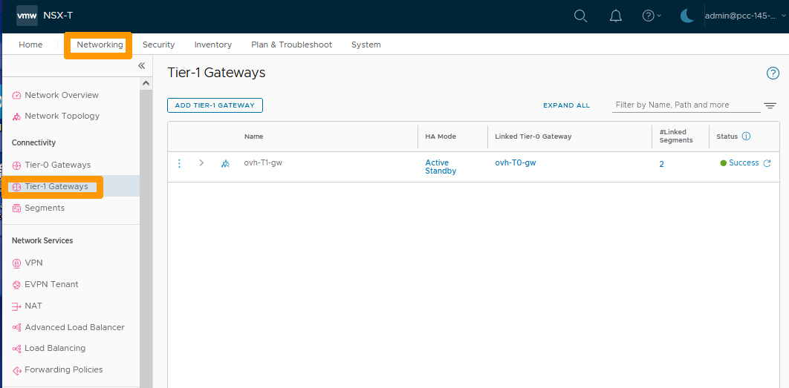{.thumbnail}

Cliquez sur les `trois petits points`{.action} et choisissez `Edit`{.action} dans le menu.

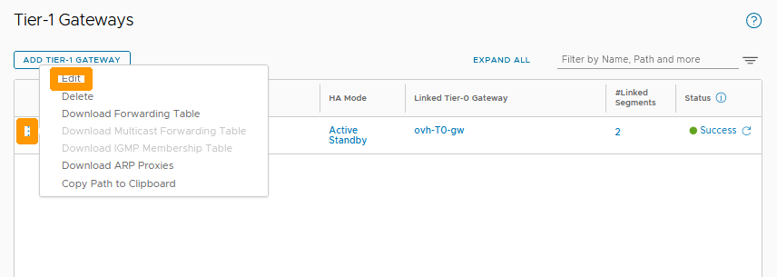{.thumbnail}

Cliquez sur `Set DHCP Configuration`{.action}.

{.thumbnail}

Choississez `DHCP Server`{.action} dans **Type**, et votre `profil DHCP`{.action} dans **DHCP Server Profile**. Ensuite cliquez sur `SAVE`{.action}.

{.thumbnail}

Cliquez sur `SAVE`{.action}.

{.thumbnail}

Cliquez sur `CLOSE EDITING`{.action}.

{.thumbnail}

### Mise en place du DHCP sur un segment de type Overlay

A partir de l'interface NSX-T allez dans l'onglet `Networking`{.action} et cliquez sur `Segments`{.action} à gauche dans la rubrique **Connectivity**

Allez dans la rubrique `Segments`{.action}, cliquez sur l'icône de configuration indiqué avec `trois points verticaux`{.action} à gauche de votre segment et choisissez `Edit`{.action}.

{.thumbnail}

Cliquez sur `Set DHCP CONFIG`{.action}.

{.thumbnail}

Remplissez ces informations :

* **DHCP Type** : Laissez `Gateway DHCP Server`{.action}.
* **DHCP Ranges** : Saisissez votre étendue `192.168.1.10-192.168.1.200`{.action}.
* **DNS Servers** : Ajouter le serveur DNS OVHcloud `2&3.186.33.99`{.action}.

Et cliquez sur `APPLY`{.action}.

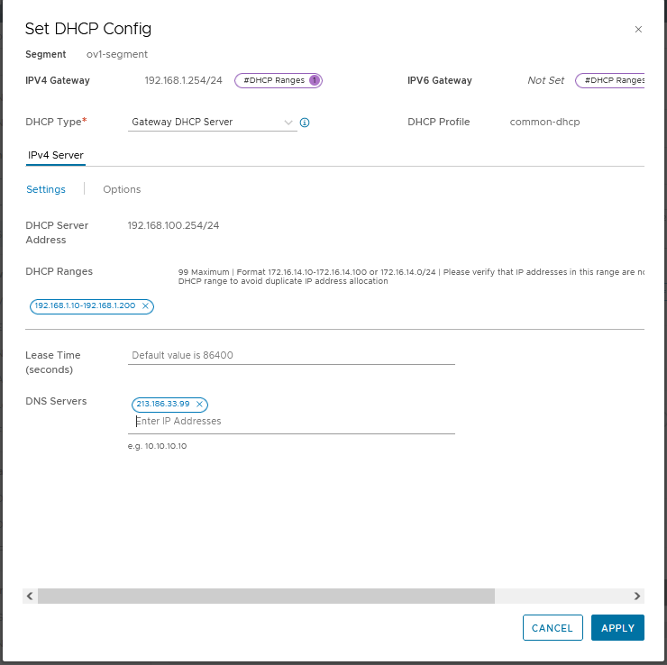{.thumbnail}

Cliquez sur `SAVE`{.action}.

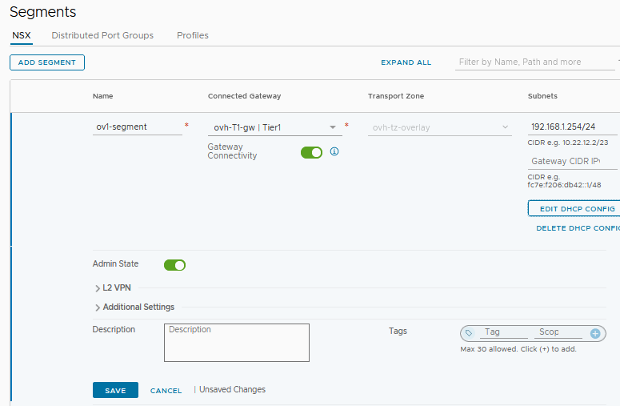{.thumbnail}

Cliquez sur `CLOSE EDITING`{.action}.

{.thumbnail}

Les machines virtuelles sur ce segment peuvent maintenant être configurées en DHCP.

### Mise en place du DCHP sur un segment de type VLAN

Sur un segment de type VLAN connecté au travers d'interfaces sur la passerelle **ovh-t0-gw** il n'est pas possible d'utiliser le profil créé pour les segments Overlay. IL est aussi interdit de connecter un nouveau profil sur la passerelle **ovh-t0-gw**.

Pour pouvoir avoir un serveur DHCP sur ce segment nous allons créer une configuration DHCP avec un nouveau profil directement attaché au segment.

Si vous n'avez pas de segment de type de VLAN, aidez-vous du guide [Gestion des segments dans NSX-T](https://docs.ovh.com/fr/nsx-t-segment-management/) pour le crééer avec ces paramètres :

* **Sous réseau du VLAN** : 192.168.100.0/24.
* **Adresse IP privée de l'interface pour le premier Edge Node** : 192.168.100.252.
* **Adresse IP privée de l'interface pour le deuxième Edge Node** : 192.168.100.253.
* **Future adresse IP virtuelle** : 192.168.100.254.

Allez sur l'onglet `Networking`{.action}, cliquez sur `Segments`{.action} à gauche dans la rubrique **Connectivity** ensuite cliquez sur les  `trois petits points`{.action} à gauche de votre segment de type VLAN et choisissez `Edit`{.action} dans le menu.

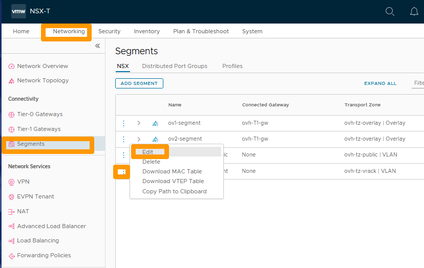{.thumbnail} 

Saisissez dans la colonne **Subnets** l'`adresse IP et du masque`{.action} de l'interface active sur votre passerelle **ovh-t0-gw** et cliquez sur `SET DHCP CONFIG`{.action}.

> ![warning]
> Pour l'instant il faut utiliser l'adresse IP de l'interface active, dans les futures évolutions de NSX-T il sera possible d'utiliser la future adresse IP virtuelle.
>

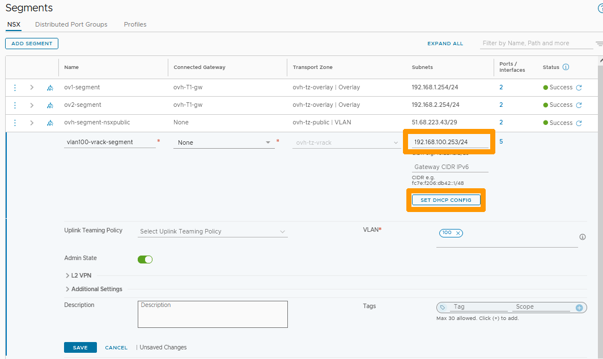{.thumbnail} 

Laissez `Local DHCP Server`{.action} dans **DHCP Type**, cliquez sur les `trois petits points`{.action} à droite de **DHCP Profile et choisissez dans le menu `Create New`{.action}.

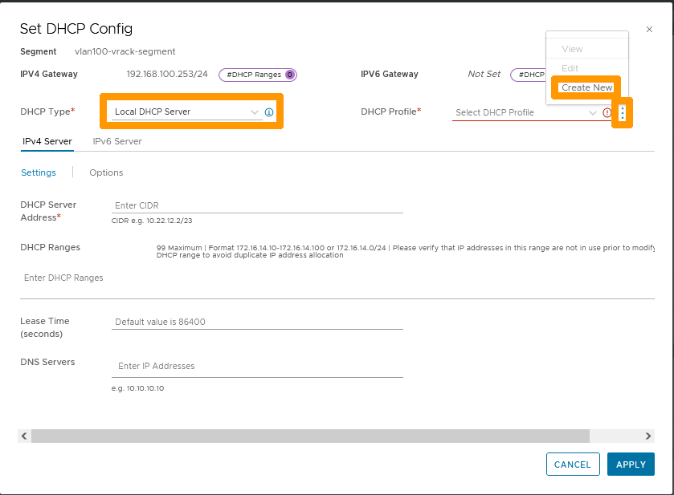{.thumbnail}

Saisissez ces informations :

* **Name** : comme `DHCP-VLAN100`.
* **Server IP Address** : adresse IP du serveur DHCP `192.168.100.251/24`.

Ensuite sélectionnez votre `Edge Cluster`{.action} et cliquez sur `SAVE`{.action}.

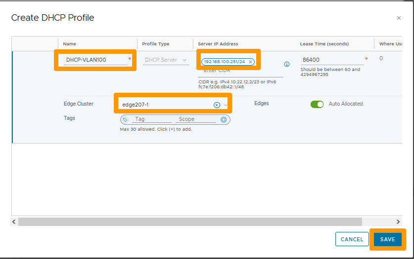{.thumbnail}

Vérifiez que dans **DHCP Profile** le profil est bien présent et saisissez ces informations :

* **DHCP Server** : Adresse du serveur DHCP `192.168.100.251/24`.
* **Etendue** : Etendue du serveur DHCP `192.168.100.10-192.168.100.200`.
* **DNS Servers** : Adresse IP du serveur DNS OVHcloud `213.186.33.99`.

Ensuite cliquez sur `APPLY`{.action}.

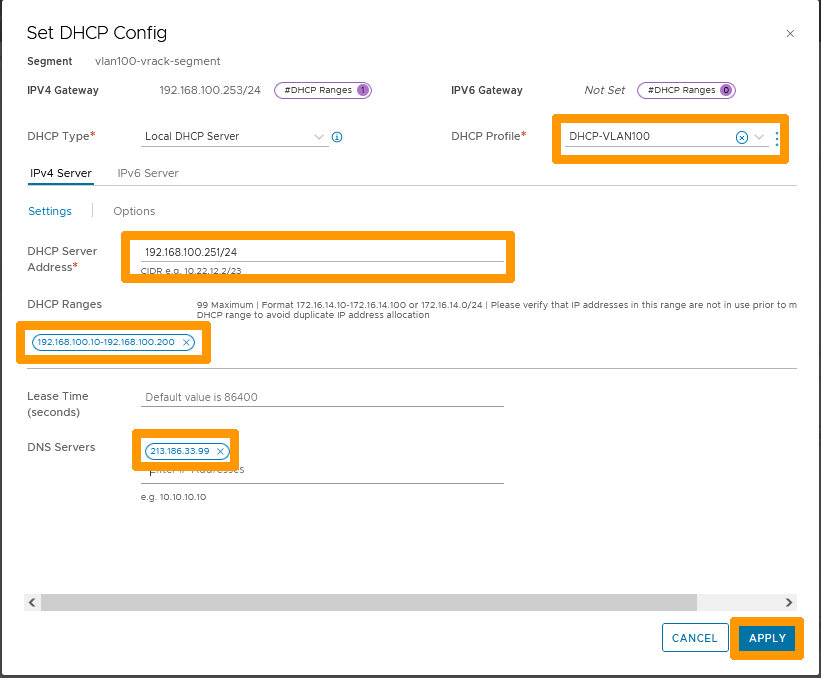{.thumbnail}

Cliquez sur `SAVE`{.action}.

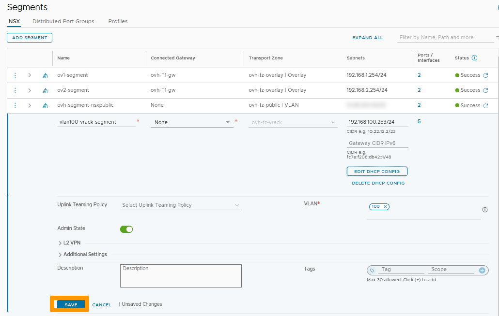{.thumbnail}

Cliquez sur `CLOSE EDITING`{.action}.

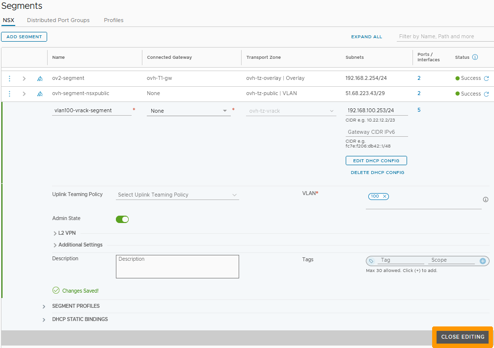{.thumbnail}

Le serveur DHCP est actif sur ce segment de type VLAN.

## Go further 

[Getting started with NSX-T](https://docs.ovh.com/us/en/private-cloud/nsx-t-first-steps/)

[Segment management in NSX-T](https://docs.ovh.com/us/en/nsx-t-segment-management/)

Join our community of users on <https://community.ovh.com/en/>.

