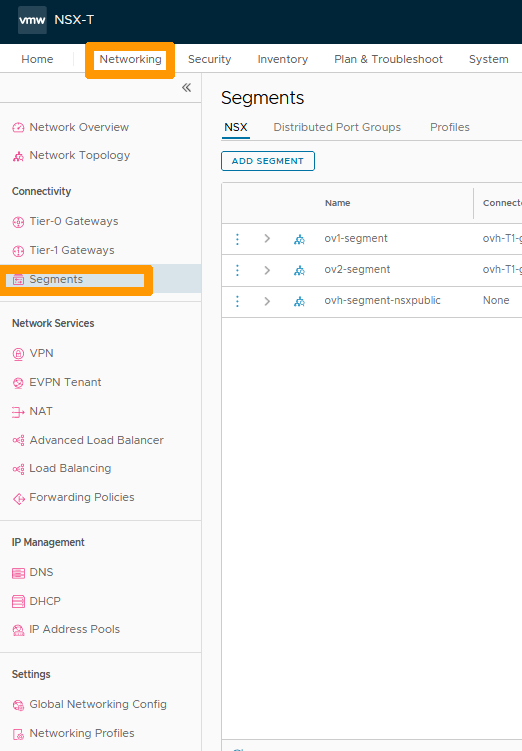
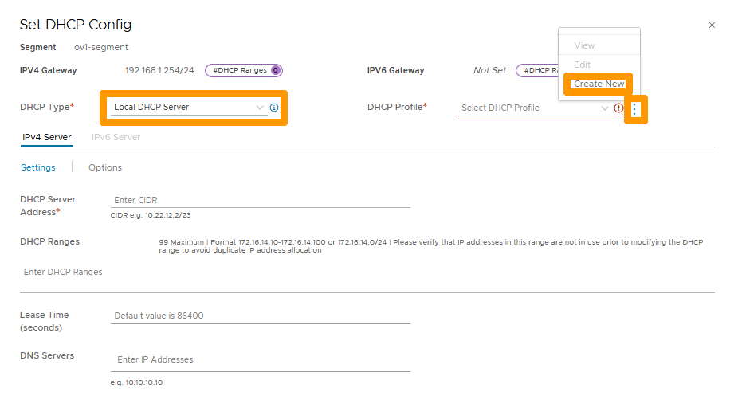
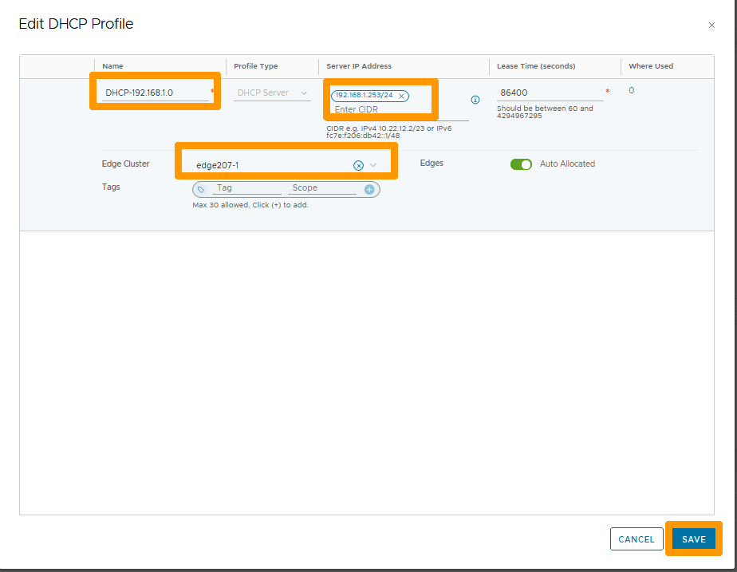
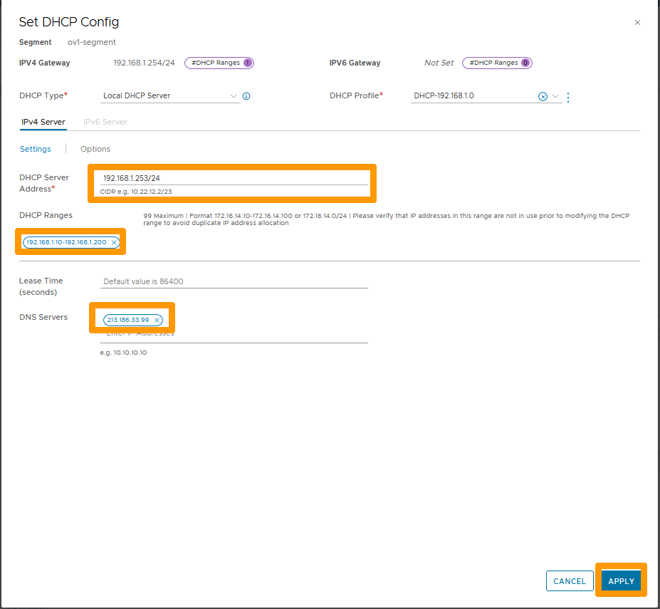

**Dernière mise à jour le 14/12/2022**

> [!warning]
> Les guides concernant NSX-T dans la solution Hosted Private Cloud Powered by VMware ne sont pas définitifs, ils seront modifiés lors de la sortie en version BETA et finalisés quand la version définitive sera prête. 
>

## Objectif

**Découvrir la création et l'utilisation des segment dans l'interface NSX-T et vCenter**

> [!warning]
> OVHcloud vous met à disposition des services dont la configuration, la gestion et la responsabilité vous incombent. Il vous appartient donc de ce fait d’en assurer le bon fonctionnement.
>
> Ce guide a pour but de vous accompagner au mieux sur des tâches courantes. Néanmoins, nous vous recommandons de faire appel à un prestataire spécialisé si vous éprouvez des difficultés ou des doutes concernant l’administration, l’utilisation ou la mise en place d’un service sur un serveur.
>

## Prérequis

- Être contact administrateur du [Hosted Private Cloud infrastructure](https://www.ovhcloud.com/fr/enterprise/products/hosted-private-cloud/), celui-ci recevant les identifiants de connexion.
- Avoir un identifiant utilisateur actif avec les droits spécifiques pour NSX-T (créé dans l'[espace client OVHcloud](https://www.ovh.com/auth/?action=gotomanager&from=https://www.ovh.com/fr/&ovhSubsidiary=fr))
- Avoir **NSX-T** déployé.

## En pratique

Nous allons configurer un serveur DHCP sur un segment connecté à **OVH-gw-t1**. Ce segment est configuré avec une passerelle en **192.168.1.254/24**

A partir de l'interface NSX-T allez dans l'onglet `Networking`{.action} et cliquez sur `Segments`{.action} à gauche.

Cliquez sur le signe avec `trois points verticaux`{.action} à gauche de votre segment et cliquez sur `Edit`{.action}.

Cliquez sur `Set DHCP CONFIG`{.action}

Choisissez à gauche `Local DHCP Server`{.action} dans **DHCP Type**

Ensuite cliquez à droite de **DHCP Profile** sur les `trois points verticaux`{.action}. et cliquez sur `Create New`{.action}.

Choisissez ces informations 

* **Name** : Nom de votre serveur DHCP.
* **Server IP Address** : adresse IP de votre serveur DHCP qui ne doit pas être la même que celle de votre passerelle, comme 192.168.1.253/24.
* **Edge Cluster** : Sélectionnez votre Edge cluster.

Et cliquez sur `Save`{.action}.

Saisissez ces informations :

* **DHCP Server Address** :  Adresse du serveur DHCP comme 192.168.1.253/24
* **DHCP Range** : Etendue de votre serveur DHCP avec l'adresse du début et de fin séparées un tirêt comme 192.168.1.10-192.168.1.200
* **DNS Server** : Serveurs DNS comme 213.186.33.99 qui est le serveur DHCP OVHcloud.

Ensuite cliquez sur `APPLY`{.action}.

## Aller plus loin

[Premiers pas avec NSX-T](https://docs.ovh.com/fr/private-cloud/nsx-t-first-steps/)

[Gestion des segment dans NSX-T](https://docs.ovh.com/fr/nsx-t-segment-management/)

Échangez avec notre communauté d'utilisateurs sur <https://community.ovh.com>.

