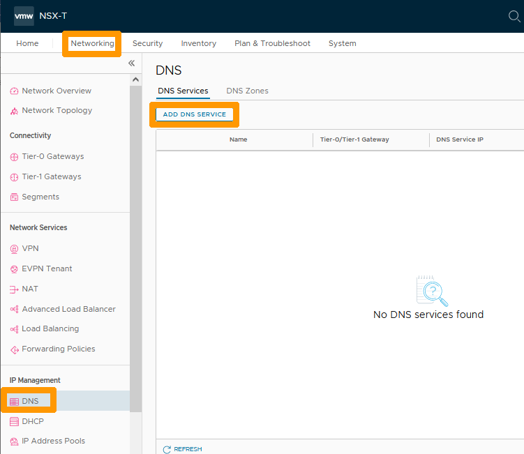

**Dernière mise à jour le 08/02/2023**

> [!warning]
> Les guides concernant NSX-T dans la solution Hosted Private Cloud Powered by VMware ne sont pas définitifs, ils seront modifiés lors de la sortie en version BETA et finalisés quand la version définitive sera prête. 
>

## Objectif

**Comment faire pour configurer un redirecteur DNS**

> [!warning]
> OVHcloud vous met à disposition des services dont la configuration, la gestion et la responsabilité vous incombent. Il vous appartient donc de ce fait d’en assurer le bon fonctionnement.
>
> Ce guide a pour but de vous accompagner au mieux sur des tâches courantes. Néanmoins, nous vous recommandons de faire appel à un [prestataire spécialisé](https://partner.ovhcloud.com/fr/) si vous éprouvez des difficultés ou des doutes concernant l’administration, l’utilisation ou la mise en place d’un service sur un serveur.
>

## Prérequis

- Être contact administrateur du [Hosted Private Cloud infrastructure](https://www.ovhcloud.com/fr/enterprise/products/hosted-private-cloud/), celui-ci recevant les identifiants de connexion.
- Avoir un identifiant utilisateur actif avec les droits spécifiques pour NSX-T (créé dans l'[espace client OVHcloud](https://www.ovh.com/auth/?action=gotomanager&from=https://www.ovh.com/fr/&ovhSubsidiary=fr))
- Avoir **NSX-T** déployé avec un segment configuré dans votre configuration NSX-T, vous pouvez vous aider de ce guide [Gestion des segments dans NSX-T](https://docs.ovh.com/fr/private-cloud/nsx-t-segment-management).

# Présentation

Il est possible d'utiliser un redirecteur DNS dans NSX-T qui centralise toutes les requêtes DNS et les redirigent vers des serveurs DNS externes, ce qui permet de réduire le flux réseau. Il est possible d'attacher le redirecteur DNS sur la passerelle nord-sud (ovh-t0-gw) ou la passerelle est-ouest (ovh-t1-gw) en fonction de vos besoins.

## En pratique

Nous allons créer un redirecteur DNS et l'attacher à la passerelle nord-sud (ovh-t0-gw), il sera utilisable sur l'ensemble des segments de NSX-T.

### Configuration du redirecteur DNS

Au travers de l'interface NSX-T allez dans l'onglet `Networking`{.action} et cliquez sur `DNS`{.action} à gauche dans la rubrique **IP Management**. Ensuite cliquez sur `ADD DNS SERVICE`{.action}.

{.thumbnail}

Renseignez ces informations :

* **Name** : Nom de votre service comme `dns-forwarder`.
* **Tier-0/Tier-1 Gateway** : Votre passerelle Nord-Sud `ovh-T0-gw`.
* **DNS Service IP** : Adresse IP privée non utilisé dans vos segments comme `192.168.200.1`.

Ensuite cliquez sur les `Points de suspensions verticaux`{.action} en dessous de **Default DNS Zone**.

{.thumbnail}

Cliquez sur `Add New Default Zone`{.action}.

{.thumbnail}

Remplissez ces valeurs :

* **Name** : Nom de la zone comme `cdns.ovh.net`.
* **DNS Servers** : Serveur DNS OVHcloud `213.186.33.99`.

Ensuite cliquez sur `SAVE`{.action}.

{.thumbnail}

Cliquez sur `SAVE`{.action}.

{.thumbnail}

Votre redirecteur DNS est actif et utilisable sur tous vos segments en Overlay ou VLAN connectés à votre passerelle nord-sud (ovh-t0-gw).

{.thumbnail}

### Modification du serveur DHCP pour utiliser un redirecteur DNS

Si vous avez configuré des serveurs DHCP dans NSX-T comme indiqué dans ce guide [Configuration du DHCP](https://docs.ovh.com/fr/nsx-t-dhcp-configuration), vous avez la possibilité de modifier la configuration pour utiliser le redirecteur DNS dans vos configuration DHCP.

Nous allons voir comment modifier le serveur DNS sur la configuration DHCP d'un de vos segments.

Restez sur l'onglet `Networking`{.action} et cliquez sur `Segments`{.action} à gauche dans la rubrique **Connectivity**. 

Ensuite cliquez sur les `points de suspensions verticaux`{.action} à coté de votre segment et choisissez dans le menu `Edit`{.action}.

{.thumbnail}

Cliquez sur `EDIT DHCP CONFIG`{.action}.

{.thumbnail}

Cliquez sur la `croix`{.action} à droite du DNS existant dans l'option **DNS Servers** pour l'enlever de la configuration.

{.thumbnail}

Ajouter dans **DNS Servers** l'adresse IP de votre redirecteur DNS comme `192.168.200.1`{.action} et cliquez sur `APPLY`{.action}.

{.thumbnail}

Cliquez sur `SAVE`{.action}.

{.thumbnail}

Cliquez sur `CLOSE EDITING`{.action}.

{.thumbnail}

Le paramétrage DHCP de votre segment utilise maintenant le redirecteur DNS créé précédemment.

## Aller plus loin

[Premiers pas avec NSX-T](https://docs.ovh.com/fr/private-cloud/nsx-t-first-steps/)

[Gestion des segments dans NSX-T](https://docs.ovh.com/fr/nsx-t-segment-management/)

[Configuration du DHCP](https://docs.ovh.com/fr/nsx-t-dhcp-configuration)

[Informations VMware sur NSX-T 3.2 et le service DNS](https://docs.vmware.com/en/VMware-NSX-T-Data-Center/3.2/administration/GUID-A0172881-BB25-4992-A499-14F9BE3BE7F2.html)

Échangez avec notre communauté d'utilisateurs sur <https://community.ovh.com>.

