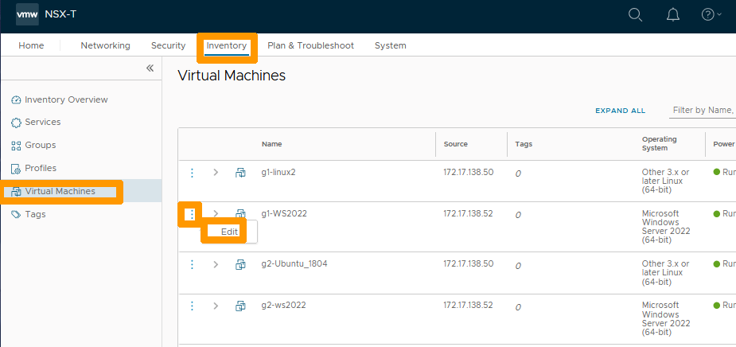
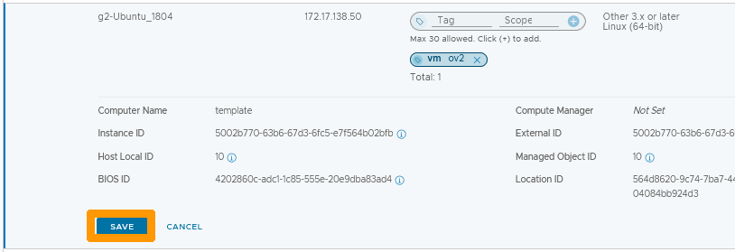
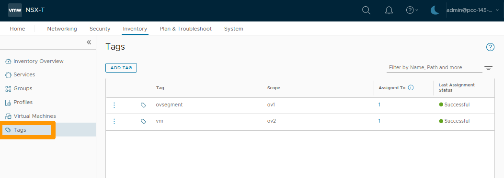
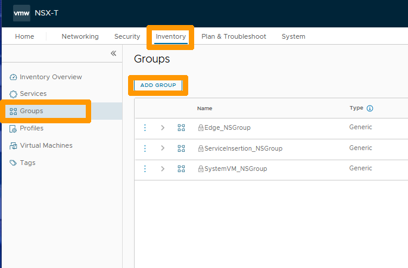
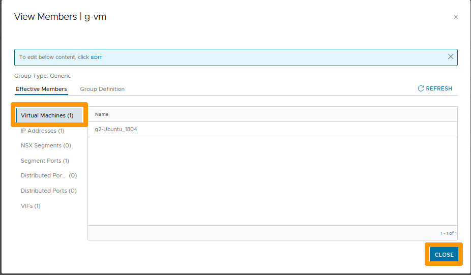
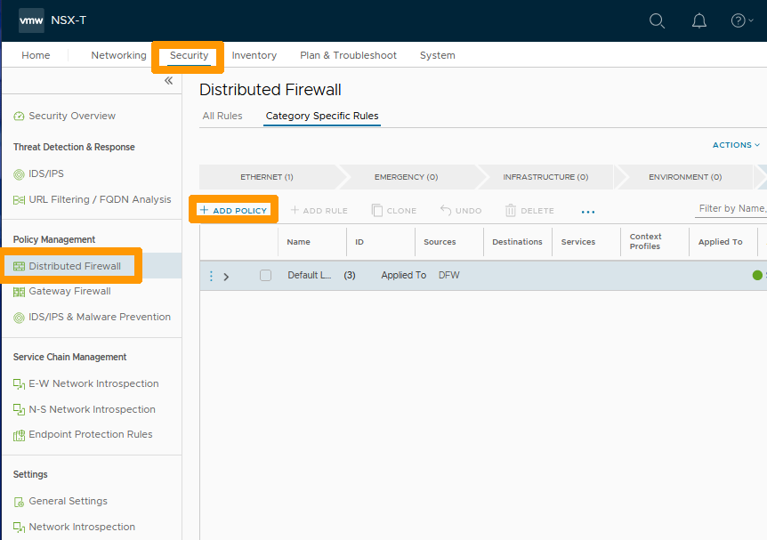

**Dernière mise à jour le 08/02/2023**

> [!warning]
> Les guides concernant NSX-T dans la solution Hosted Private Cloud Powered by VMware ne sont pas définitifs, ils seront modifiés lors de la sortie en version BETA et finalisés quand la version définitive sera prête. 
>

## Objectif

**Comment administrer le pare-feu distribué**

> [!warning]
> OVHcloud vous met à disposition des services dont la configuration, la gestion et la responsabilité vous incombent. Il vous appartient donc de ce fait d’en assurer le bon fonctionnement.
>
> Ce guide a pour but de vous accompagner au mieux sur des tâches courantes. Néanmoins, nous vous recommandons de faire appel à un [prestataire spécialisé](https://partner.ovhcloud.com/fr/) si vous éprouvez des difficultés ou des doutes concernant l’administration, l’utilisation ou la mise en place d’un service sur un serveur.
>

## Prérequis

- Être contact administrateur du [Hosted Private Cloud infrastructure](https://www.ovhcloud.com/fr/enterprise/products/hosted-private-cloud/), celui-ci recevant les identifiants de connexion.
- Avoir un identifiant utilisateur actif avec les droits spécifiques pour NSX-T (créé dans l'[espace client OVHcloud](https://www.ovh.com/auth/?action=gotomanager&from=https://www.ovh.com/fr/&ovhSubsidiary=fr))
- Avoir **NSX-T** déployé avec deux segment configurés dans votre configuration NSX-T, vous pouvez vous aider de ce guide [Gestion des segments dans NSX-T](https://docs.ovh.com/fr/private-cloud/nsx-t-segment-management).

## Présentation

La fonctionnalité du pare-feu distribué dans NSX-T permet de faire du filtrage avec tous les éléments de votre cluster VMware qui sont sur des segments Overlay ou VLAN. IL doit être utilisé normalement sur les connexions est-ouest mais il fonctionne aussi avec des éléments du cluster VMware qui se trouvent connectés sur la passerelle nord-sud (ovh-t0-gateway). Le type de filtrage est disponible entre :

- Tous les membres d'un segment et tous les autres membres d'un autre segment.
- Certaines machines virtuelles d'un segment et d'autres machines virtuelles du même segment ou d'un autre segment.
- Certains segments vers des machines virtuelles et vice-versa.

Pour simplifier l'administration de NSX-T il est possible de positionnez des balises sur vos éléments (segments, machines virtuelles, rôles, etc..) et de créer des groupes qui contiennent les objets associés aux balises ou des plages d'adresses IP (Cette solution n'est pas à privilégier).

## En pratique

Nous allons créer et des balises à l'intérieur d'une machine virtuelle et d'un segment, ajouter des groupes qui contiendront ces balises et mettre en place une stratégie de blocage entre deux groupes au travers du pare-feu distribué.

### Création des balises

Dans l'interface NSX-T allez dans l'onglet `Networking`{.action} et cliquez sur. `Segments`{.action} à gauche dans la rubrique **Connectivity**. 
Ensuite cliquez sur les `points de suspensions verticaux`{.action} à gauche du segment que vous voulez baliser et choisissez `Edit`{.action} dans le menu.

{.thumbnail}

à droite de **Tags** saisissez `ovsegment`{.action} à la place de tag et cliquez sur `Add Item(s) ovsegment`{.action} en dessous de la zone de saisie.

{.thumbnail}

Saisissez `ov1`{.action} à la place de **Scope** et cliquez sur `Add Item(s) ov1`{.action} en dessous de la zone de saisie.

{.thumbnail}

Cliquez sur le signe `+`{.action} à gauche de votre balise.

{.thumbnail}

La balise créée est affichée en bas à droite de **Tags**, vous pouvez en créer d'autres en fonction de vos besoins.

Cliquez sur `SAVE`{.action}.

{.thumbnail}

Cliquez sur `CLOSE EDITING`{.action} pour finaliser le balisage de votre segment.

{.thumbnail}

Allez sur l'onglet `Inventory`{.action} et cliquez sur `Virtual Machines`{.action} à gauche dans l'inventaire pour afficher la liste des machines virtuelles. 

Ensuite cliquez sur les `points de suspensions verticaux`{.action} à gauche de votre machine virtuelle que vous voulez baliser et choisissez `Edit`{.action} à l'intérieur du menu.

{.thumbnail}

Saisissez `vm`{.action} à la place de **Tag** et cliquez sur `Add Item(s) vm`{.action} en dessous de la zone de saisie.

{.thumbnail}

Saisissez `ov2`{.action} à la place de **Scope** et cliquez sur `Add Item(s) ov2`{.action} en dessous de la zone de saisie.

{.thumbnail}

Cliquez sur le signe `+`{.action} à gauche de votre balise.

{.thumbnail}

La balise est créée, cliquez sur `SAVE`{.action} pour enregistrer vos modifications.

{.thumbnail}

Restez dans l'inventaire et cliquez sur `Tags`{.action} à gauche pour afficher la liste des balises.

{.thumbnail}

### Ajout de groupes qui contiennent les balises

Toujours dans l'inventaire allez dans `Groups`{.action} à gauche et cliquez sur `ADD GROUP`{.action} pour créer un groupe.

{.thumbnail}

Saisissez `g-segment01`{.action} en dessous de la colonne **Name** et cliquez sur `Set`{.action} sous la colonne **Compute Members**.

{.thumbnail}

Laissez sélectionné `Generic`{.action} et cliquez sur `+ ADD CRITERION`{.action}.

{.thumbnail}

Choisissez ces paramètres :

* **Type** : `NSX Segment`.
* **Tags** : Equals `ovsegment`.
* **Scope**: Equals `ov1`.

Et cliquez sur `APPLY`{.action}.

{.thumbnail}

Cliquez sur `SAVE`{.action}.

{.thumbnail}

Le groupe est créé cliquez sur `View Members`{.action} qui se trouve sur la ligne de votre groupe pour afficher la liste des membres.

{.thumbnail}

Cliquez sur `IP Addresses`{.action} pour afficher les adresses IP qui sont utilisées sur votre segment et qui ont été automatiquement ajouté à votre groupe.

{.thumbnail}

Cliquez sur `NSX Segments`{.action} pour afficher le segment membre de ce groupe automatiquement rajouté à partir des critères. Vous pouvez cliquez sur `CLOSE`{.action} pour fermer cette fenêtre.

{.thumbnail}

Cliquez sur `ADD GROUP`{.action} pour créer un deuxième groupe.

{.thumbnail}

Saisissez `g-vm`{.action} en dessous de la colonne **Name** et cliquez sur `Set`{.action} sous la colonne **Compute Members**.

{.thumbnail}

Laissez sélectionné `Generic`{.action} et cliquez sur `+ ADD CRITERION`{.action}.

{.thumbnail}

Choisissez ces paramètres :

* **Type** : `Virtual Machine`.
* **Tags** : Equals `vm`.
* **Scope**: Equals `ov2`.

Et cliquez sur `APPLY`{.action}.

{.thumbnail}

Cliquez sur `SAVE`{.action}.

{.thumbnail}

Cliquez sur `View Members`{.action} dans la ligne de votre groupe pour afficher les membres.

{.thumbnail}

Dans la rubrique **Virtual Machines** vous voyez la machine virtuelle balisée qui a été automatiquement ajoutée.

Cliquez sur `CLOSE`{.action} pour fermer cette fenêtre.

{.thumbnail}

### Mise en place d'une règle de pare-feu distribué

Nous allons maintenant créer une règle sur le pare-feu distribué de blocage entre les deux groupes créés.

Allez sur l'onglet `Security`{.action}, Sélectionnez `Distributed Firewall`{.action} et cliquez sur `+ ADD POLICY`{.action}

{.thumbnail}

Nommez votre stratégie `Isolate vm and segments`{.action}.

{.thumbnail}

Cliquez sur les `points de suspensions verticaux`{.action} à gauche de votre stratégie et choisissez `Add Rule`{.action} dans le menu.

{.thumbnail}

Cliquez sur l'icône en forme de `stylo`{.action} à droite de **Any** dans la colonne **Sources**.

{.thumbnail}

Cochez le groupe `g-segment01`{.action} et cliquez sur `APPLY`{.action}

{.thumbnail}

Cliquez sur l'icône en forme de `stylo`{.action} à droite de **Any** dans la colonne **Destinations**.

{.thumbnail}

Cochez le groupe `g-vm`{.action} et cliquez sur `APPLY`{.action}.

{.thumbnail}

Choisissez `Drop`{.action} pour supprimer les paquets sur cette règle et cliquez sur les `points de suspensions verticaux`{.action} à gauche de votre stratégie.

{.thumbnail}

Cliquez sur `Add Rule`{.action} dans le menu.

{.thumbnail}

Cliquez sur l'icône en forme de `stylo`{.action} à droite de **Any** dans la colonne **Sources**.

{.thumbnail}

Cochez le groupe `g-vm`{.action} et cliquez sur `APPLY`{.action}

{.thumbnail}

Cliquez sur l'icône en forme de `stylo`{.action} à droite de **Any** dans la colonne **Destinations**.

{.thumbnail}

Cochez le groupe `g-segment01`{.action} et cliquez sur `APPLY`{.action}.

{.thumbnail}

Choisissez `Drop`{.action} pour supprimer les paquets sur cette règle et cliquez sur `publish`{.action} pour valider la création de la stratégie et de ces deux règles associées.

{.thumbnail}

Votre règle est active, le trafic entre la machine virtuelle membre du groupe g-vm et le segment membre du group g-segment n'est plus possible.

{.thumbnail}

## Aller plus loin

[Premiers pas avec NSX-T](https://docs.ovh.com/fr/private-cloud/nsx-t-first-steps/)

[Gestion des segment dans NSX-T](https://docs.ovh.com/fr/nsx-t-segment-management/)

[Documentation VMware sur le pare-feu distribué dans NSX-T](https://docs.vmware.com/en/VMware-NSX-T-Data-Center/3.2/administration/GUID-41CC06DF-1CD4-4233-B43E-492A9A3AD5F6.html)

Échangez avec notre communauté d'utilisateurs sur <https://community.ovh.com>.

