**Dernière mise à jour le 01/02/2023**

> [!warning]
> Les guides concernant NSX-T dans la solution Hosted Private Cloud Powered by VMware ne sont pas définitifs, ils seront modifiés lors de la sortie en version BETA et finalisés quand la version définitive sera prête. 
>

## Objectif

**Montrer comment rediriger un port entrant depuis une adresse publique vers une machine virtuelle.**

> [!warning]
> OVHcloud vous met à disposition des services dont la configuration, la gestion et la responsabilité vous incombent. Il vous appartient donc de ce fait d’en assurer le bon fonctionnement.
>
> Ce guide a pour but de vous accompagner au mieux sur des tâches courantes. Néanmoins, nous vous recommandons de faire appel à un prestataire spécialisé si vous éprouvez des difficultés ou des doutes concernant l’administration, l’utilisation ou la mise en place d’un service sur un serveur.
>

## Prérequis

- Être contact administrateur du [Hosted Private Cloud infrastructure](https://www.ovhcloud.com/fr/enterprise/products/hosted-private-cloud/), celui-ci recevant les identifiants de connexion.
- Avoir un identifiant utilisateur actif avec les droits spécifiques pour NSX-T (créé dans l'[espace client OVHcloud](https://www.ovh.com/auth/?action=gotomanager&from=https://www.ovh.com/fr/&ovhSubsidiary=fr))
- Avoir **NSX-T** déployé avec un segment configuré dans votre configuration NSX-T, vous pouvez vous aider de ce guide [Gestion des segments dans NSX-T](https://docs.ovh.com/fr/private-cloud/nsx-t-segment-management).
- Avoir une machine virtuelle sous Linux avec l'accès en SSH fonctionnel sur le réseau privé


## En pratique

Nous allons voir comment rediriger une demande d'accès à un port depuis l'adresse publique utilisée pour le SNAT (Source Network Address Translation) vers une machine virtuelle connectée à INTERNET via un segment avec du DNAT (Destination Network Address Translation).

Dans notre exemple nous allons rediriger les requêtes vers l'adresse publique sur le port 2222 à destination du port 22 d'une machine virtuelle linux connectée au segment **ov1-segment** qui possède l'adresse IP 192.168.1.1 comme indiquée ci-dessous dans l'interface vSphere. L'accès ne sera autorisé que depuis une seule adresse ip publique distante.

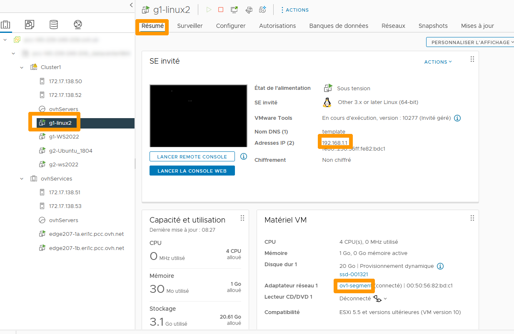{.thumbnail}

> [Primary]
>  Dans la  version ALPHA de NSX-T les adresses publiques fournies utilisent un masque à /29 ce qui permet l'utilisation de 6 adresses publiques, certaines sont utilisées pour le fonctionnement de NSX-T. Il ne reste plus qu'une adresse utilisable pour des redirections des ports. Dans les futures versions le masque sera à /28 qui contiendra 14 adresses au total.

Depuis l'interface NSX-T cliquez sur `Networking`{.action} en haut à gauche.

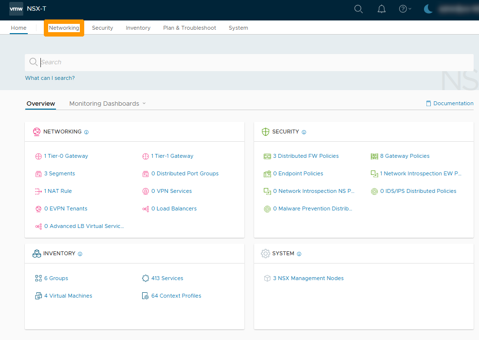{.thumbnail}

Cliquez dans la barre de menu verticale sur `NAT`{.action} en haut à gauche.

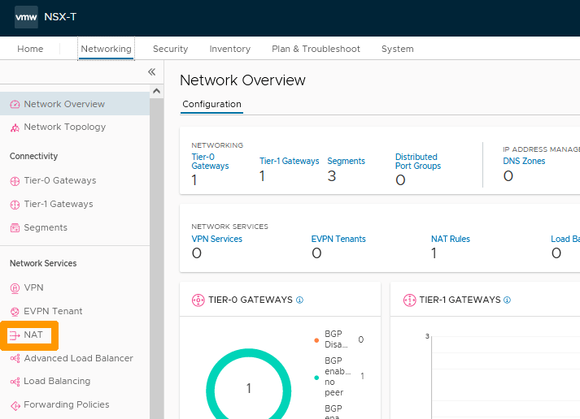{.thumbnail}

Notez l'adresse IP de la règle de SNAT par défaut dans la colonne **Translated IP Port**, nous allons la réutiliser dans notre règle de redirection. Ensuite cliquez sur `ADD NAT RULE`{.action} à gauche. 

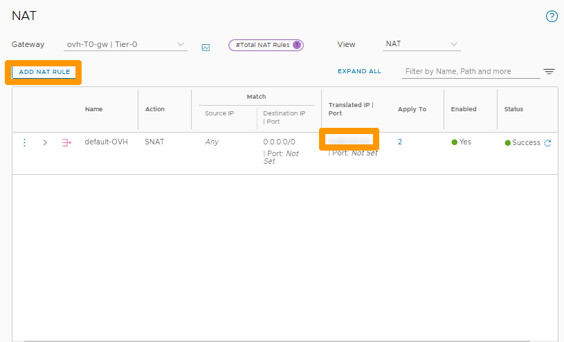{.thumbnail}

Completez ces informations : 

* **Name** : Saisissez `to-ssh-linux`.
* **Action** : Choisissez `DNAT`.
* **Source IP** : Saisissez l'adresse IP distante qui aura accès à ce port sur l'adresse publique.
* **Destination IP** : Saisissez l'adresse `IP publique` que vous avez noté depuis la règle existante.
* **Destination Port** : Port utilisé lors de l'accès à l'adresse publique , ici `2222`.
* **Firewall** : Sélectionnez `Match internal Address`.
* **Translated IP** : Saisissez l'adresse IP privée de la machine virtuelle LINUX `192.168.1.1`.

Ensuite cliquez sur `Set`{.action} sous la colonne **Apply To**.

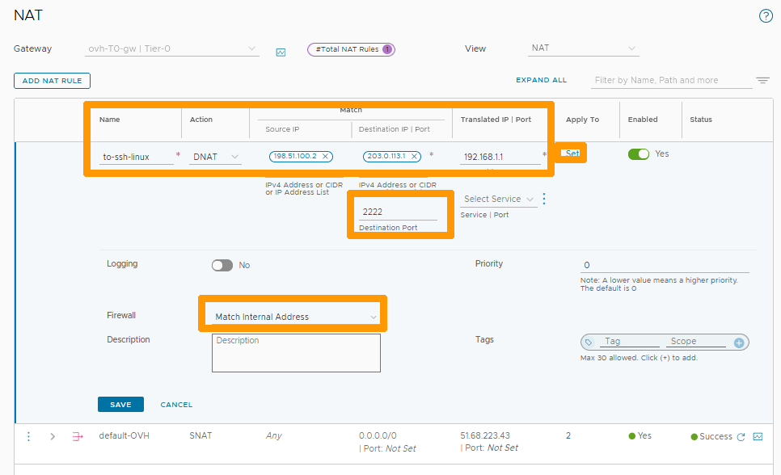{.thumbnail}

Sélectionnez les deux `T0-interface`{.action} et cliquez sur `APPLY`{.action}.

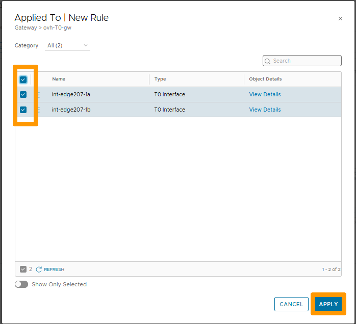{.thumbnail}

Cliquez sur `les trois petits points verticaux`{.action} à droite de **Select Service** et choisissez `Create New`{.action}

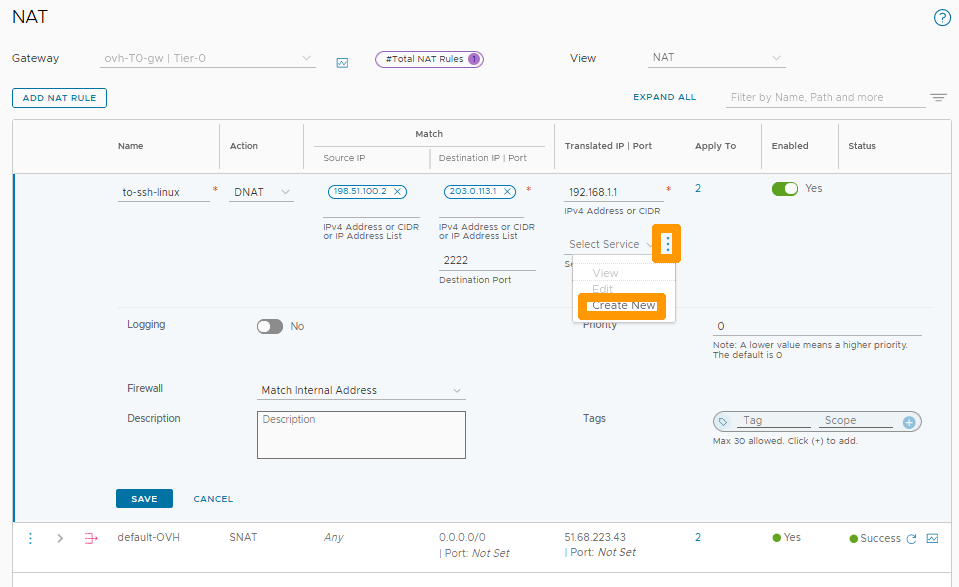{.thumbnail}

Saisissez `NAT22`{.action} sous la colonne **Name** ensuite cliquez sur `Set`{.action}.

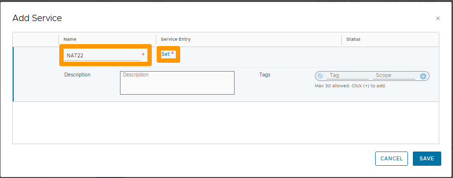{.thumbnail}

Cliquez sur `ADD SERVICE ENTRY`{.action}.

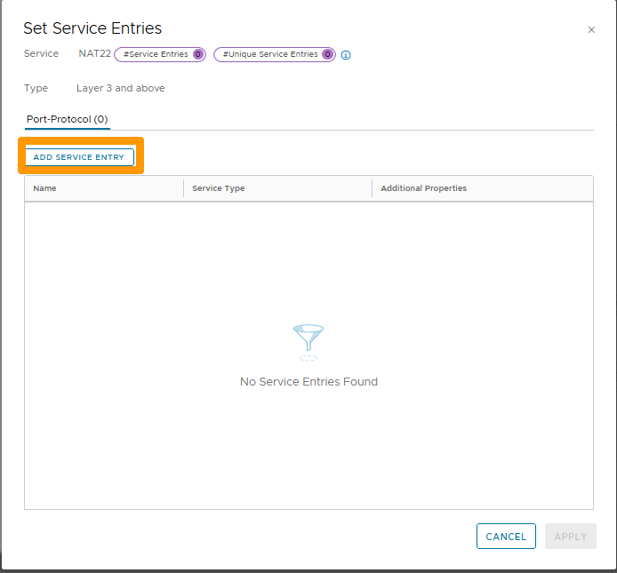{.thumbnail}

Remplissez ces valeurs :

 **Name** : saisissez `SSH22`.
* **Action** : choisissez `TCP`.
* **Destination Ports** : Saisissez `22`.

Ensuite cliquez sur `APPLY`{.action}.

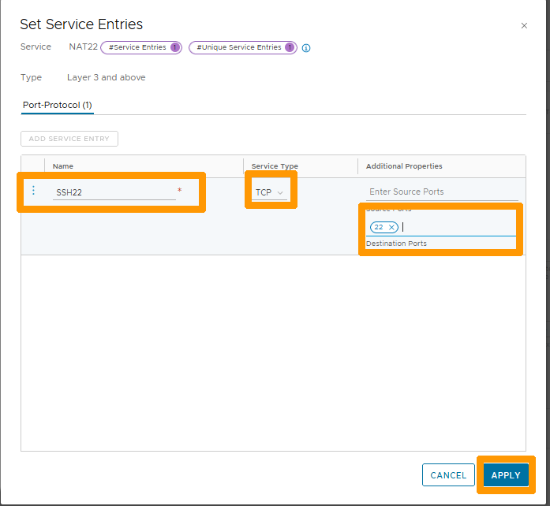{.thumbnail}

Cliquez sur `SAVE`{.action}.

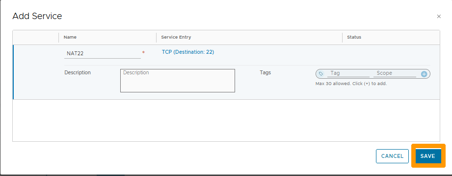{.thumbnail}

Cliquez sur `SAVE`{.action} pour activer la règle.

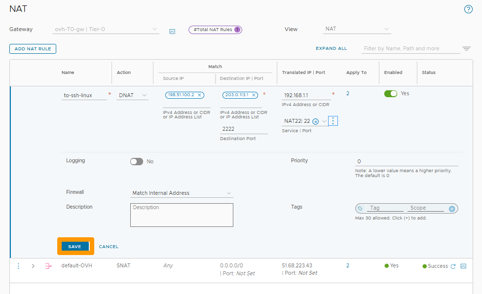{.thumbnail}

La redirection est active.

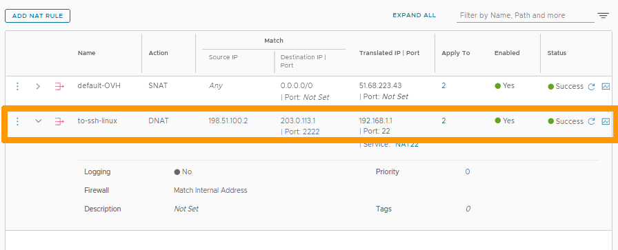{.thumbnail}

Exécutez cette commande à partir d'un site distant pour tester la redirection :

```bash
ssh root@nsxt-publicaddress -p 2222
```

## Aller plus loin

[Premiers pas avec NSX-T](https://docs.ovh.com/fr/private-cloud/nsx-t-first-steps/)

[Gestion des segments dans NSX-T](https://docs.ovh.com/fr/nsx-t-segment-management/)

Échangez avec notre communauté d'utilisateurs sur <https://community.ovh.com>.

