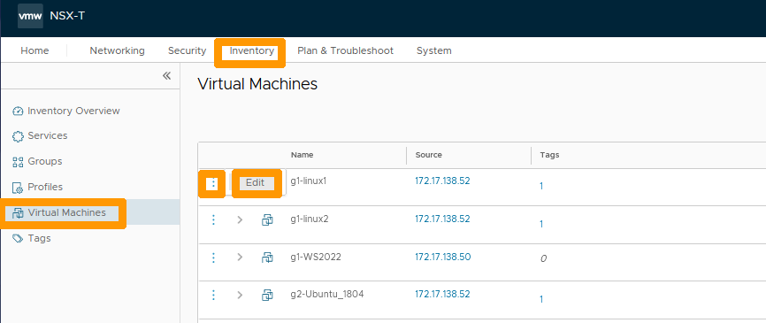
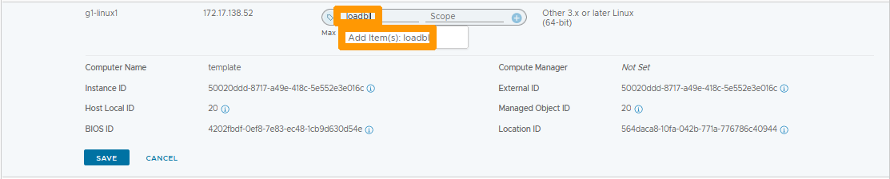
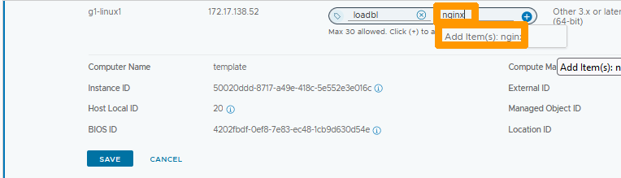
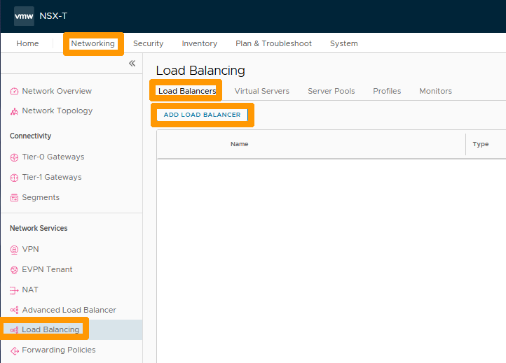
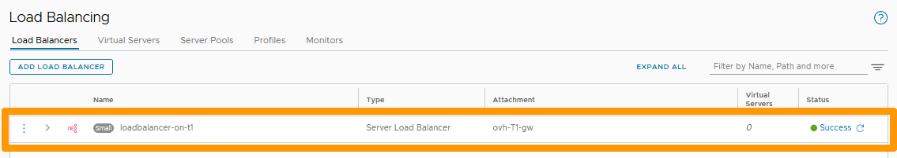
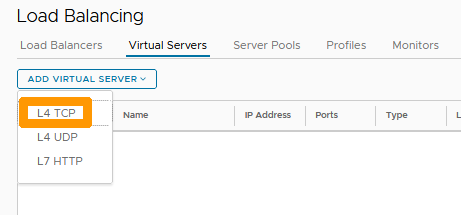
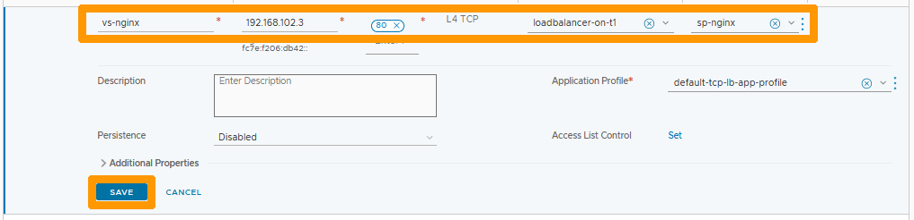
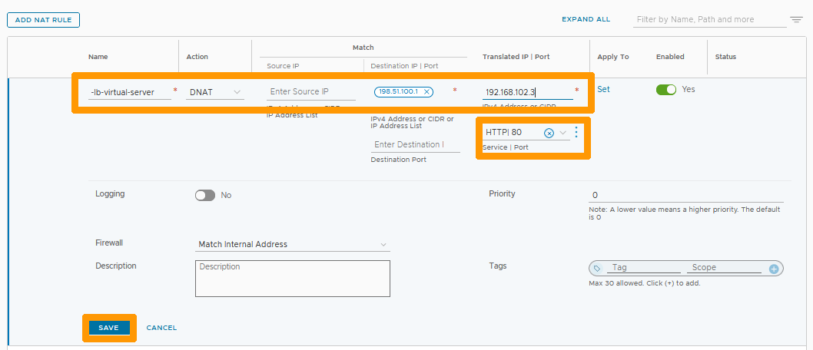
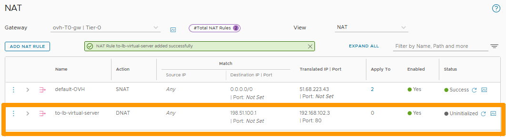

**Dernière mise à jour le 17/02/2023**

> [!warning]
> Les guides concernant NSX-T dans la solution Hosted Private Cloud Powered by VMware ne sont pas définitifs, ils seront modifiés lors de la sortie en version BETA et finalisés quand la version définitive sera prête. 
>

## Objectif

**Comment mettre en place l'équilibrage de charge dans NSX-T avec des serveurs WEB NGINX**

> [!warning]
> OVHcloud vous met à disposition des services dont la configuration, la gestion et la responsabilité vous incombent. Il vous appartient donc de ce fait d’en assurer le bon fonctionnement.
>
> Ce guide a pour but de vous accompagner au mieux sur des tâches courantes. Néanmoins, nous vous recommandons de faire appel à un [prestataire spécialisé](https://partner.ovhcloud.com/fr/) si vous éprouvez des difficultés ou des doutes concernant l’administration, l’utilisation ou la mise en place d’un service sur un serveur.
>

## Prérequis

- Être contact administrateur du [Hosted Private Cloud infrastructure](https://www.ovhcloud.com/fr/enterprise/products/hosted-private-cloud/), celui-ci recevant les identifiants de connexion.
- Avoir un identifiant utilisateur actif avec les droits spécifiques pour NSX-T (créé dans l'[espace client OVHcloud](https://www.ovh.com/auth/?action=gotomanager&from=https://www.ovh.com/fr/&ovhSubsidiary=fr))
- Avoir **NSX-T** déployé avec deux segment configurés dans votre configuration NSX-T, vous pouvez vous aider de ce guide [Gestion des segments dans NSX-T](https://docs.ovh.com/fr/private-cloud/nsx-t-segment-management).

## Présentation

IL est possible d'utiliser la fonction de Load-Balancing de NSX-T pour mettre en place de l'équilibre de charge sur une couche de niveau 4 (TCP ou UDP ) ou de Niveau 7 (HTTP ou HTTPS).

## En pratique

Nous allons mettre en place de l'équilibrage de charge (Load Balancing) sur la passerelle **ovh-T1-gw** et créer un serveur virtuel qui s'appuiera sur deux machines virtuelle avec le serveur WEB NGINX activé. Nous allons nous aider des marqueurs (tags) pour simplifier l'administration.

Ensuite nous allons créer une règle de redirection (DNAT) vers ce serveur virtuel pour qu'il soit disponible à l'extérieur de ce cluster.

### Création du marqueur (tag) sur les deux machines virtuelles NGINX.

Dans l'interface NSX-T allez dans l'onglet `Inventory`{.action} et cliquez sur. `Virtual Machines`{.action} à gauche.  

Ensuite cliquez sur les `points de suspensions verticaux`{.action} à gauche de la première machine virtuelle que nous allons marquer et choisissez `Edit`{.action} dans le menu.

{.thumbnail}

Remplacer **Tag** par `loadbl`{.action}, ensuite cliquez sur `Add Item(s) loabl`{.action} en dessous.

{.thumbnail}

Changer **Scope** par `nginx`{.action}, ensuite cliquez sur `Add Item(s) nginx`{.action} en dessous.

{.thumbnail}

Cliquez sur le signe `+`{.action} à coté de votre marqueur pour le rajouter à votre première machine virtuelle.

{.thumbnail}

Le marqueur apparait , cliquez sur `SAVE`{.action}.

{.thumbnail}

cliquez sur les `points de suspensions verticaux`{.action} à gauche de la deuxième machine virtuelle que nous allons marquer et choisissez `Edit`{.action} dans le menu.

{.thumbnail}

Remplacer **Tag** par `load`{.action}, ensuite sélectionnez le Marqueur `Tag: loadlb Scope: nginx`{.action} en dessous.

{.thumbnail}

Cliquez sur le signe `+`{.action} à coté de votre marqueur pour le rajouter à votre deuxième machine virtuelle.

{.thumbnail}

Le marqueur est affiché, cliquez sur `SAVE`{.action}.

{.thumbnail}

Restez sur **Inventory**, cliquez sur `Tags`{.action} et cliquez sur le `numéro`{.action} à coté du marqueur créé.

{.thumbnail}

Vous pouvez voir vos deux machines virtuelles qui utilisent le même marqueur.

{.thumbnail}

### Ajout du groupe avec le marqueur créé

Choisissez à gauche `Groups`{.action} et cliquez sur `ADD GROUP`{.action}.

{.thumbnail}

Saisissez `nginx-server`{.action} en dessous de **Name** et cliquez sur `SET`{.action} sous **Compute Members**.

{.thumbnail}

Cliquez sur `+ ADD CRITERION`{.action}.

{.thumbnail}

Gardez **Virtuals Machine Tag Equals** et sélectionnez votre marqueur `loadbl`{.action} accompagné de son etendue `nginx`{.action} et cliquez sur `APPLY`{.action}.

{.thumbnail}

Cliquez sur `SAVE`{.action}.

{.thumbnail}

Cliquez sur `View Members`{.action} à droite du groupe.

{.thumbnail}

La liste des machines virtuelles a été automatiquement rajoutée au groupe grace au critère sur votre marqueur.

{.thumbnail}

### Activation du Load Balancer

Allez dans l'onglet `Networking`{.action} et cliquez sur `Load Balancing`{.action} dans la rubrique **Network Services** à gauche.  

Ensuite positionnez vous sur l'onglet `Load Balancers`{.action} et cliquez sur `ADD LOAD BALANCER`{.action}.

{.thumbnail}

Saisissez `loadbalancer-on-t1`{.action} en dessous de **Name**, sélectionnez sur `ovh-T1-gw`{.action} sous **Attachment**
et cliquez sur `SAVE`{.action}.

{.thumbnail}

Cliquez sur `NO`{.action}.

{.thumbnail}

Le Load balancer est créé et actif sur la passerelle **ovh-T1-gw**.

{.thumbnail}

### Création du pool de serveurs

Positionnez vous sur l'onglet `Server Pools`{.action} et cliquez sur `ADD SERVER POOL`{.action}.

{.thumbnail}

Saisissez `sp-nginx`{.action} en dessous de **Name** et cliquez sur `Select Members`{.action} sous **Members/Group**.

{.thumbnail}

Cliquez `Select a group`{.action} et choisissez le groupe que vous avez créé `nginx-servers`{.action} ensuite cliquez sur `APPLY`{.action}.

{.thumbnail}

Cliquez sur `SAVE`{.action} pour appliquez vos changements.

{.thumbnail}

Votre pool de serveur est créé avec vos deux machines virtuelles membre du groupe.

{.thumbnail}

### Création du serveur virtuel

Alez sur l'onglet `Virtual Servers`{.action} et cliquez sur `ADD VIRTUAL SERVER`{.action}.

{.thumbnail}

Choisissez `L4 TCP`{.action}.

{.thumbnail}

Choisissez ces options :

* **Name** : Nom de votre virtual server `vs-nginx`{.action}.
* **IP Address**: Adresse IP en frontal de votre serveur virtuel sur le même réseau que vos machines virtuelles NGINX `192.168.102.3`{.action}.
* **Port** : Port `80`{.action}.
* **Load Balancer**: Votre load balancer `loadbalancer-on-t1`{.action}.
* **Server Pool**: Votre pool de serveur `sp-nginx`{.action}.

Ensuite cliquez sur `SAVE`{.action}.

{.thumbnail}

Votre serveur virtuel est actif si vous vous connecter depuis une machine qui utilise un segment sur une passerelle de type **Tier-1 Gateways** avec cette URL http://192.168.102.3 , le Load Balancer se connectera à l'une des deux machines virtuelles configurées dans votre groupe.

### Ajout de la règle de NAT

Allez sur `NAT`{.action} dans la rubrique **Network Services** à gauche et cliquez sur `ADD NAT RULE`{.action}.

{.thumbnail}

Saisissez `to-lb-virtual-server`{.action} dans **Name** de votre règle avec ces options :

* **Action** : `DNAT`{.action}.
* **Destination IP** : Addresse IP virtuelle de votre T0 comme `198.51.100.1`{.action}.
* **Translated IP** : Adresse Ip de votre serveur virtuel `192.168.102.103`{.action}.
* **Service  PORT** : Choisir le port prédéfini `HTTP| 80`{.action}.

Ensuite cliquez sur `SAVE`{.action}.

{.thumbnail}

Votre règle est active si vous cliquez sur http://adresse-ip-virtuelle-t0 vous serez connecté à votre serveur virtuel qui  redirigera le flux sur l'un des serveurs membre de votre groupe.

{.thumbnail}

## Aller plus loin

[Premiers pas avec NSX-T](https://docs.ovh.com/fr/private-cloud/nsx-t-first-steps/)

[Gestion des segments dans NSX-T](https://docs.ovh.com/fr/nsx-t-segment-management/)

[Mise en place du NAT pour des redirections de ports dans NSX-T](https://docs.ovh.com/fr/nsx-t-configure-nat-redirection)

[Documentation VMware sur les Load Balancers NSX-T](https://docs.vmware.com/en/VMware-NSX-T-Data-Center/3.2/administration/GUID-D39660D9-278B-4D08-89DF-B42C5400FEB2.html)

Échangez avec notre communauté d'utilisateurs sur <https://community.ovh.com>.

