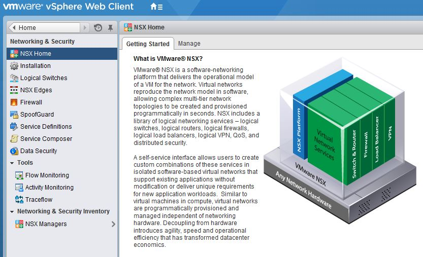

**Last updated 27th December 2017**

## Objective

NSX is a Software-Defined Network (SDN) solution developed by VMware, which is activated from the vCenter and managed directly from the vSphere interface. With NSX, you can configure rules to access your networks, create your security policy and quickly deploy the network services you need to build your solution.

**This guide will provide you with an introduction to this interface.**

## Requirements

- You must have an active username with specific rights for NSX.

## Instructions

VMWare NSX is only available from the vSphere web client. You cannot access it from the thick client. Please refer to the following guide: [Logging in to the vSphere interface](https://docs.ovh.com/gb/en/private-cloud/login-vsphere-interface/){.external}.

{.thumbnail}

From the web client homepage, click on `Networking & Security`{.action} in the left-hand menu or on the central icon:

{.thumbnail}

You will now be able to access the NSX homepage with all the related menus.

## Go further

Join our community of users on <https://community.ovh.com/en/>.

