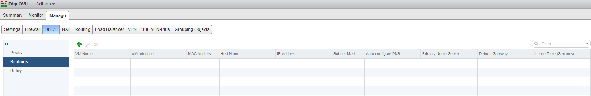
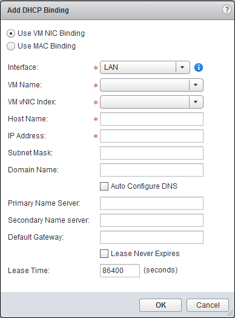
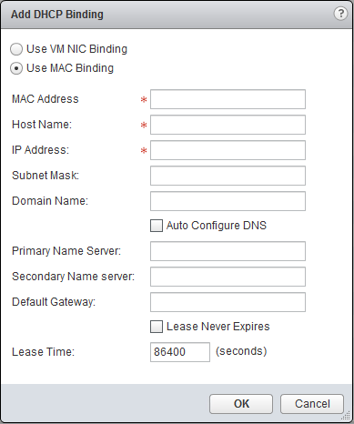

**Last Updated on 11/22/2021**

## Objective

DHCP allows automatic assignment of private IPs to VMs behind your NSX Edge Services Gateway.

**This guide explains how to setup the DHCP service**

## Requirements

- Be an administrative contact of your [Hosted Private Cloud infrastructure](https://www.ovhcloud.com/en-gb/enterprise/products/hosted-private-cloud/) to receive login credentials
- Have a user account with access to vSphere as well as the specific rights for NSX (created in the [OVHcloud Control Panel](https://www.ovh.com/auth/?action=gotomanager&from=https://www.ovh.co.uk/&ovhSubsidiary=GB))
- Have an [NSX Edge Services Gateway](https://docs.ovh.com/en/private-cloud/how-to-deploy-an-nsx-edge-gateway/) deployed

## Instructions

### Interface access

First, in the vSphere interface menu, go to the `Networking and Security`{.action} dashboard.

{.thumbnail}

On the left side, navigate to the `NSX Edges`{.action} section then click on the appliance you're setting up.

{.thumbnail}

In the `DHCP`{.action} tab,  you'll see 3 options:

- Pools
- Bindings
- Relay

We'll set up the first two (Pools & Bindings) in this guide.    
Relay is a more unusual setup that will be treated seperately.

Let's start with `Pools`{.action}. Click on it.

{.thumbnail}

### Menu "Pools"

The `Pools`{.action} menu allows the traditional setup of the DHCP service.    
We'll set up a scope for it and will start the service.

Click on `+ Add`{.action}    
In the New DHCP Pool window, fill in the informations you need:
- Start IP is the first usable IP for the DHCP service
- End IP is the first usable IP for the DHCP service
- Domain Name is optional but can be useful for your DNS
- Primary and Secondary Name Server are your personalized dns settings (can be auto configured if the slider above is turned on)
- Default Gateway is optional
- Subnet Maskis self explanatory
- You can set never ending leases or mofify lease times if that's a requirement
- You have more advanced options in the `DHCP Options`{.action} tab but those are outside of the scope of this guide

{.thumbnail}

Click on `Add`{.action} when done.    
The DHCP pool is ready but you need to click `Start`{.action} and then `Publish`{.action} to start the service and register the changes.

{.thumbnail}

The DHCP is now operational.     
You can see the service status and the basic information on the pool.

{.thumbnail}

### Menu "Bindings"

Now on the left side, click on `Bindings`{.action}

{.thumbnail}

VM NIC Binding :

- "Interface" : interface de la Edge concernée ;
- "VM Name" : nom de la machine virtuelle ;
- "VM vNIC Index" : adaptateur réseau de la Edge ;
- "Host Name" : nom de la machine virtuelle ;
- "IP Address" : adresse IP attribuée à la carte réseau ;
- "Subnet Mask" : masque de sous-réseau attribué à la carte réseau ;
- "Domain name" : nom de domaine attribué à la carte réseau ;
- "Primary Name Server" : DNS primaire attribué à la carte réseau si la case "Auto Configure DNS" est décochée ;
- "Secondary Name Server" : DNS secondaire attribué à la carte réseau si la case "Auto Configure DNS" est décochée ;
- "Default Gateway" : passerelle par défaut attribuée à la carte réseau ;
- "Lease Time" : durée du bail DHCP en seconde (par défaut 86400) si la case "Lease Never Expires" n'est pas cochée.

{.thumbnail}

MAC Binding :

- "MAC Address" : adresse MAC de la carte réseau de la machine virtuelle ;
- "Host Name" : nom de la machine virtuelle ;
- "IP Address" : adresse IP attribuée à la carte réseau ;
- "Subnet Mask" : masque de sous-réseau attribué à la carte réseau ;
- "Domain name" : nom de domaine attribué à la carte réseau ;
- "Primary Name Server" : DNS primaire attribué à la carte réseau si la case "Auto Configure DNS" est décochée ;
- "Secondary Name Server" : DNS secondaire attribué à la carte réseau si la case "Auto Configure DNS" est décochée ;
- "Default Gateway" : passerelle par défaut attribuée à la carte réseau ;
- "Lease Time" : durée du bail DHCP en secondes (par défaut 86400) si la case "Lease Never Expires" n'est pas cochée.

{.thumbnail}

Si nous prenons un exemple de chaque règles nous obtenons :

{.thumbnail}
