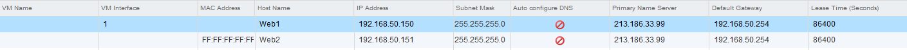

**Last Updated on 11/22/2021**

## Objective

DHCP allows automatic assignment of private IPs to VMs behind your NSX Edge Services Gateway.

**This guide explains how to setup the DHCP service**

## Requirements

- Be an administrative contact of your [Hosted Private Cloud infrastructure](https://www.ovhcloud.com/en-gb/enterprise/products/hosted-private-cloud/) to receive login credentials
- Have a user account with access to vSphere as well as the specific rights for NSX (created in the [OVHcloud Control Panel](https://www.ovh.com/auth/?action=gotomanager&from=https://www.ovh.co.uk/&ovhSubsidiary=GB))
- Have an [NSX Edge Services Gateway](https://docs.ovh.com/en/private-cloud/how-to-deploy-an-nsx-edge-gateway/) deployed

## Instructions

### Interface access

First, in the vSphere interface menu, go to the `Networking and Security`{.action} dashboard.

{.thumbnail}

On the left side, navigate to the `NSX Edges`{.action} section then click on the appliance you're setting up.

{.thumbnail}

In the `DHCP`{.action} tab,  you'll see 3 options:

- Pools
- Bindings
- Relay

We'll set up the first two (Pools & Bindings) in this guide.    
Relay is a more unusual setup that will be treated seperately.

Let's start with `Pools`{.action}. Click on it.

{.thumbnail}

### Menu Pools

The `Pools`{.action} menu allows the traditional setup of the DHCP service.    
We'll set up a scope for it and will start the service.

Click on `+ Add`{.action}    
In the New DHCP Pool window, fill in the informations you need:
- Start IP is the first usable IP for the DHCP service
- End IP is the first usable IP for the DHCP service
- Domain Name is optional but can be useful for your DNS
- Primary and Secondary Name Server are your personalized dns settings (can be auto configured if the slider above is turned on)
- Default Gateway is optional
- Subnet Maskis self explanatory
- You can set never ending leases or mofify lease times if that's a requirement
- You have more advanced options in the `DHCP Options`{.action} tab but those are outside of the scope of this guide

{.thumbnail}

Click on `Add`{.action} when done.    
The DHCP pool is ready but you need to click `Start`{.action} and then `Publish`{.action} to start the service and register the changes.

{.thumbnail}

The DHCP is now operational.     
You can see the service status and the basic information on the pool.

{.thumbnail}

### Menu Bindings

Now on the left side, click on `Bindings`{.action}.    
Bindings will always assign the same dhcp address to a specific network interface, depending on a specific information.    
Click on `+ Add`{.action} when ready.

{.thumbnail}

There are 2 ways to create bindings:
- VM NIC Binding: the IP address will be set for a specific VM network interface
- MAC Binding: the IP address will be set for a specific MAC address

For VM NIC Binding, type in the information as follow

- Interface: Edge Services Gateway interface that will be distributing the address
- VM Name: VM that will receive the address
- VM vNIC Index: Which network adapter on the VM will be assigned the address
- Host Name: DNS name of the VM (optional)
- IP Address: Address reserved for the NIC
- Subnet Mask: Subnet mask
- Domain Name: Domain name (optional)
- Default Gateway: Default Gateway
- You can set never ending leases or mofify lease times if that's a requirement

{.thumbnail}

Don't forget your `DNS Settings`{.action}.    
They can be put manually or configured automatically.     
Click on `Save`{.action} when done.

{.thumbnail}

Now we'll click on `+ Add`{.action} again but will chose Use MAC Binding.

- MAC Address: Target NIC MAC address 
- Host Name: DNS name of the VM (optional)
- IP Address: Address reserved for the NIC
- Subnet Mask: Subnet mask
- Domain Name: Domain name (optional)
- Default Gateway: Default Gateway
- You can set never ending leases or mofify lease times if that's a requirement

{.thumbnail}

Again, do not forget your `DNS Settings`{.action}.    
Click on `Save`{.action} when done.

{.thumbnail}

Si nous prenons un exemple de chaque règles nous obtenons :

{.thumbnail}
