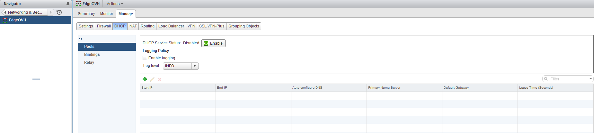
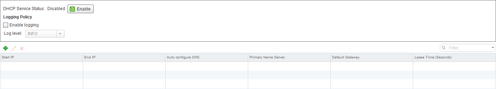
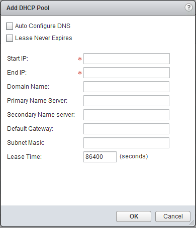
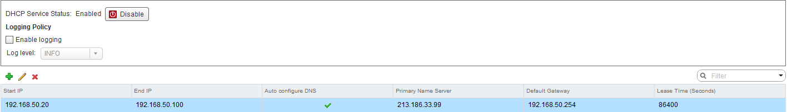

**Last Updated on 11/22/2021**

## Objective

DHCP allows automatic assignment of private IPs to VMs behind your NSX Edge Services Gateway.

**This guide explains how to setup the DHCP service**

## Requirements

- Be an administrative contact of your [Hosted Private Cloud infrastructure](https://www.ovhcloud.com/en-gb/enterprise/products/hosted-private-cloud/) to receive login credentials
- Have a user account with access to vSphere as well as the specific rights for NSX (created in the [OVHcloud Control Panel](https://www.ovh.com/auth/?action=gotomanager&from=https://www.ovh.co.uk/&ovhSubsidiary=GB))
- Have an [NSX Edge Services Gateway](https://docs.ovh.com/en/private-cloud/how-to-deploy-an-nsx-edge-gateway/) deployed

## Instructions

### Interface access

First, in the vSphere interface menu, go to the `Networking and Security`{.action} dashboard.

{.thumbnail}

On the left side, navigate to the `NSX Edges`{.action} section then click on the appliance you're setting up.

{.thumbnail}

In the `DHCP`{.action} tab,  you'll see 3 options:

- "Pools" ;
- "Bindings".

{.thumbnail}

### Menu "Pools"

Le menu "Pools" vous permet dans un premier temps d'activer ou de désactiver le service DHCP de la Edge via le bouton "DHCP Service Status". Par défaut, le DHCP est désactivé.

Vous pouvez également activer la politique d'évènements en cochant la case "Enable logging" puis vous pouvez modifier le type d'évènements répertoriés via le menu déroulant "Log level". Vous pouvez ainsi définir si vous ne souhaitez conserver que les erreurs, les alertes ou encore les notifications.

{.thumbnail}

Le bouton "+" (petit plus vert) vous permet de gérer les plages d'attribution DHCP générales. Les deux premières cases vous permettent d'activer ou non les paramètres suivants :

- "Auto Configure DNS" : configure automatiquement les DNS sur les machines virtuelles qui vont se configurer en DHCP ;
- "Lease Never Expires" : la non-expiration du bail DHCP (par défaut, le bail expire au bout de 86400 secondes).

Vous avez ensuite les champs suivants qui peuvent vous être utiles :

- "Start IP" : l'IP de départ de la plage qui peut être attribuée par le DHCP ;
- "End IP" : l'IP de fin de la plage qui peut être attribuée par le DHCP ;
- "Domain Name" : le nom de domaine utilisé par le serveur DHCP si il existe ;
- "Primary Name server" : le DNS primaire attribué aux machines virtuelles par le DHCP ;
- "Secondary Name server" : le DNS secondaire attribué aux machines virtuelles par le DHCP ;
- "Default Gateway" : la passerelle attribuée aux machines virtuelles par le DHCP ;
- "Subnet Mask" : le masque de sous-réseau attribué aux machines virtuelles par le DHCP ;
- "Lease Time" : la durée du bail DHCP (non applicable si vous avez précédemment coché la case "Lease Never Expires").

Vous pouvez cliquer sur "OK" quand votre configuration est finalisée et vous pourrez la modifier ultérieurement si nécessaire.

{.thumbnail}

Voici un exemple de configuration :

{.thumbnail}

### Menu "Bindings"

Ce menu a la même fonction que le menu "Pools" mais pour une attribution manuelle de certaines IP. Pour cela, il vous suffit de cliquer sur le bouton "+" (petit plus vert).

Vous pouvez attribuer manuellement ces IP en fonction de deux critères qui influeront sur les champs proposés.

{.thumbnail}

VM NIC Binding :

- "Interface" : interface de la Edge concernée ;
- "VM Name" : nom de la machine virtuelle ;
- "VM vNIC Index" : adaptateur réseau de la Edge ;
- "Host Name" : nom de la machine virtuelle ;
- "IP Address" : adresse IP attribuée à la carte réseau ;
- "Subnet Mask" : masque de sous-réseau attribué à la carte réseau ;
- "Domain name" : nom de domaine attribué à la carte réseau ;
- "Primary Name Server" : DNS primaire attribué à la carte réseau si la case "Auto Configure DNS" est décochée ;
- "Secondary Name Server" : DNS secondaire attribué à la carte réseau si la case "Auto Configure DNS" est décochée ;
- "Default Gateway" : passerelle par défaut attribuée à la carte réseau ;
- "Lease Time" : durée du bail DHCP en seconde (par défaut 86400) si la case "Lease Never Expires" n'est pas cochée.

{.thumbnail}

MAC Binding :

- "MAC Address" : adresse MAC de la carte réseau de la machine virtuelle ;
- "Host Name" : nom de la machine virtuelle ;
- "IP Address" : adresse IP attribuée à la carte réseau ;
- "Subnet Mask" : masque de sous-réseau attribué à la carte réseau ;
- "Domain name" : nom de domaine attribué à la carte réseau ;
- "Primary Name Server" : DNS primaire attribué à la carte réseau si la case "Auto Configure DNS" est décochée ;
- "Secondary Name Server" : DNS secondaire attribué à la carte réseau si la case "Auto Configure DNS" est décochée ;
- "Default Gateway" : passerelle par défaut attribuée à la carte réseau ;
- "Lease Time" : durée du bail DHCP en secondes (par défaut 86400) si la case "Lease Never Expires" n'est pas cochée.

{.thumbnail}

Si nous prenons un exemple de chaque règles nous obtenons :

{.thumbnail}
