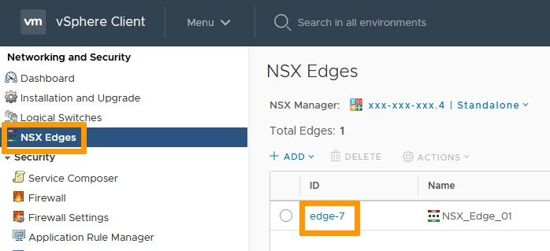
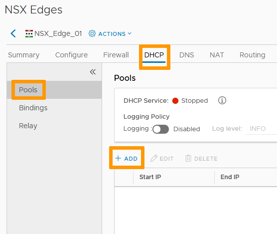
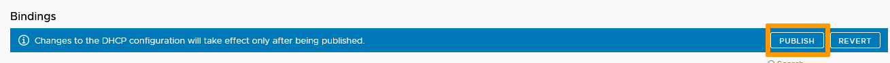
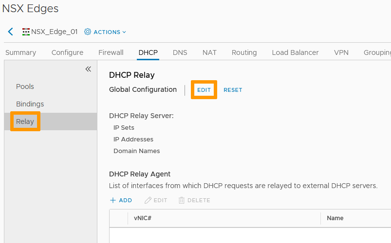
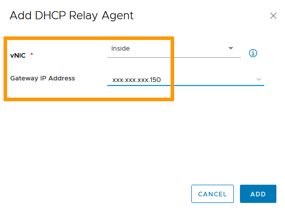
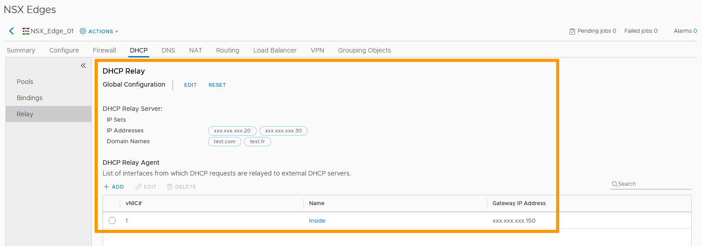

**Dernière mise à jour le 22/11/2021**

## Objectif

Le DHCP permet une attribution automatique d'adresses IP aux machines virtuelles résidentes derrière votre NSX Edge Services Gateway.

**Découvrez comment paramètrer le service DHCP sur une Edge NSX.**

## Prérequis

- Être contact administrateur de l'infrastructure [Hosted Private Cloud](https://www.ovhcloud.com/fr-ca/enterprise/products/hosted-private-cloud/) afin de recevoir des identifiants de connexion.
- Avoir un identifiant utilisateur actif avec les droits spécifiques pour NSX (créé dans l'[espace client OVHcloud](https://ca.ovh.com/auth/?action=gotomanager&from=https://www.ovh.com/ca/fr/&ovhSubsidiary=qc))
- Avoir déployé une [NSX Edge Services Gateway](https://docs.ovh.com/ca/fr/private-cloud/comment-deployer-une-nsx-edge-gateway/)

## En pratique

### Accès à l'interface

Dans l'interface vSphere, rendez-vous dans le tableau de bord `Mise en réseau et sécurité`{.action}.

{.thumbnail}

Sur la gauche de votre écran, naviguez vers `Dispositifs NSX Edge`{.action} puis cliquez sur le dispositif à paramétrer.

{.thumbnail}

Dans la section `DHCP`{.action}, il y a 3 options :

- Pools
- Liaisons
- Relais

Nous allons paramétrer ces 3 services.    

Commençons par `Pools`{.action}.

{.thumbnail}

### Menu Pools

Le menu `Pools`{.action} permet d'activer les fonctions traditionnelles du DHCP.

Ajoutons un scope et démarrons le service. Cliquez sur `+ Ajouter`{.action}.

Dans la fenêtre Nouveau « DHCP Pool », remplissez les informations nécessaires :

- Adresse IP de début : première IP utilisable par le service DHCP.
- Adresse IP de fin : dernière IP utilisable par le service DHCP.
- Nom de domaine : facultatif mais peut être utile pour votre DNS.
- Serveur de noms principal / secondaire : ce sont vos paramètres DNS personnalisés (vous pouvez activer la « configuration automatique DNS »).
- Passerelle par défaut : facultatif.
- Masque de sous-réseau.
- Vous pouvez activer la « non expiration des baux » ou modifier leur durée si besoin.
- D'autres options avancées sont disponibles dans l'onglet `Options DHCP`{.action} mais sont hors du cadre de ce guide.

{.thumbnail}

Cliquez sur `Ajouter`{.action}.

Le pool DHCP est prêt mais vous devez cliquer sur `Démarrer`{.action} puis `Publier`{.action} pour lancer le service et enregistrer les changements.

{.thumbnail}

Le DHCP est alors opérationel. 
Le statut du service et les informations basiques sont désormais visibles.

{.thumbnail}

### Menu Liaisons

Sur la gauche, cliquez sur `Liaisons`{.action}.    
Cette option réserve une addresse IP à une interface réseau particulière en fonction d'informations spécifiques.    

Cliquez sur `+ Ajouter`{.action}.

{.thumbnail}

Il y a 2 façons de créer une liaison :

- Utiliser la liaison de cartes réseau de VM.
- Utiliser la liaison MAC.

Pour la liaison de cartes réseau de VM, entrez les informations suivantes:

- Interface : l'interface de la *Edge Services Gateway* qui distribuera les addresses.
- Nom de la VM : VM cible.
- Index VM vNIC : nom de la carte réseau cible.
- Nom d'hôte.
- Addresse IP : addresse réservée.
- Masque de sous-réseau.
- Nom de domaine (facultatif).
- Passerelle par défaut (facultatif)
- Vous pouvez activer la « non expiration des baux » ou modifier leur durée si besoin.

{.thumbnail}

N'oubliez pas vos `Paramètres DNS`{.action}.    
Vous pouvez les renseigner manuellement ou les configurer automatiquement.     

Cliquez sur `Ajouter`{.action}.

{.thumbnail}

Cliquez sur `+ Ajouter`{.action} et sélectionnez `Utiliser la liaison MAC`{.action}.

- Adresse MAC : adresse MAC de la carte réseau cible. 
- Nom d'hôte.
- Addresse IP : addresse réservée.
- Masque de sous-réseau.
- Nom de domaine (facultatif).
- Passerelle par défaut (facultatif).
- Vous pouvez activer la non expiration des baux ou modifier leur duréé si besoin.

{.thumbnail}

À nouveau, n'oubliez pas vos `Paramètres DNS`{.action}.

Cliquez sur `Ajouter`{.action}.

{.thumbnail}

Vous pouvez à présent `Publier`{.action} vos changements.

{.thumbnail}

Les Liaisons DHCP et leurs paramètres de base sont maintenant visibles.

{.thumbnail}

### Menu Relais

Pour la dernière option, cliquez sur `Relais`{.action}.

> [!primary]
> L'ajout d'un relais DHCP implique la présence de routages existants vers les serveurs DHCP.    

Nous allons d'abord `Modifier`{.action} la configuration globale.    

{.thumbnail}

Vous pouvez ajouter :

- Des objets prédéfinis dans votre *NSX Edge Services Gateway*.
- Les addresses IP de serveurs DHCP.
- Des noms de domaines.

Cliquez sur `Enregistrer`{.action} quand tout est complété.

{.thumbnail}

Cliquez sur `+ Ajouter`{.action} pour paramètrer un agent.     

{.thumbnail}

La vNIC sera l'interface de la *Edge Services Gateway* qui fera suivre les requêtes DHCP.    
L'adresse IP de la passerelle est celle qui fera suivre les requêtes.

Cliquez sur `Ajouter`{.action}.

{.thumbnail}

Cliquez sur `Publier`{.action} pour enregistrer les changements.

{.thumbnail}

Votre relais DHCP fonctionnera après un petit temps d'attente.

{.thumbnail}

## Aller plus loin

Échangez avec notre communauté d'utilisateurs sur <https://community.ovh.com>.
