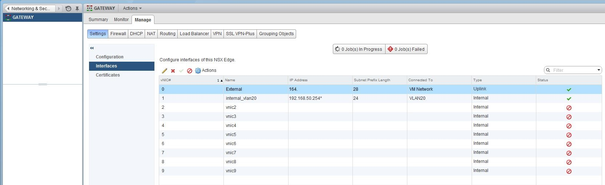
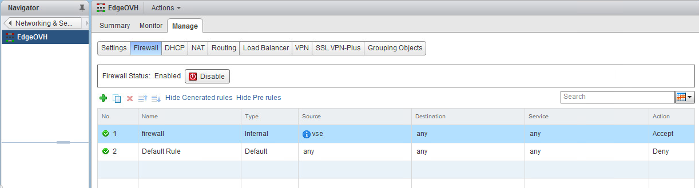
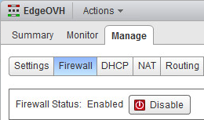
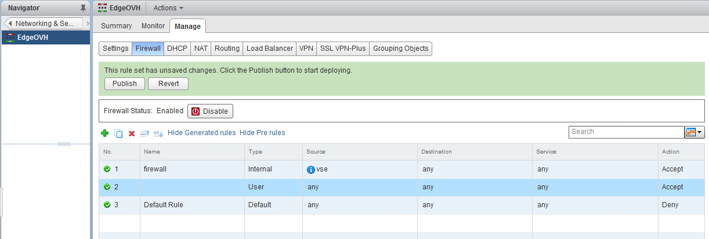
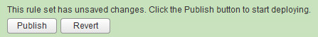
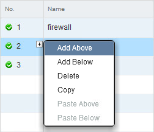
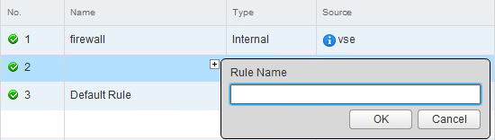
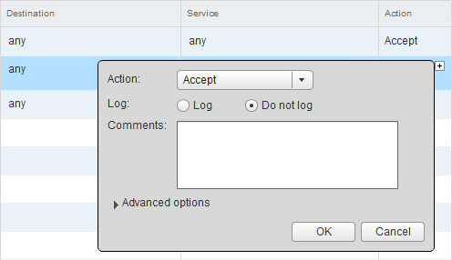
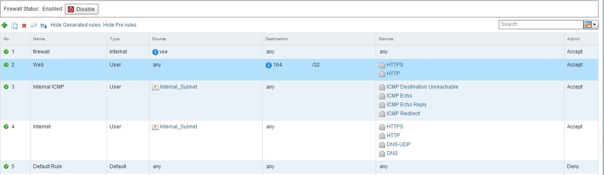

**Dernière mise à jour le 27/02/2019**

## Objectif

Le pare-feu permet d'appliquer des restrictions de communication par le trafic géré par la Edge, via plusieurs paramètres configurables en terme de source ou de destination par exemple.

**Ce guide explique la configuration de ce pare-feu**

## Prérequis

- Disposer d'un utilisateur ayant accès  à [l'interface de gestion NSX](https://docs.ovh.com/fr/private-cloud/acceder-a-l-interface-de-gestion-nsx/)

## En pratique

Pour commencer, rendez-vous dans la partie "NSX Edges" afin de trouver la liste des Edges déjà déployées. Vous pourrez alors effectuer un double-clic sur votre Edge pour accéder à sa configuration.

{.thumbnail}

Cliquez sur l'onglet "Manage" puis "Firewall" afin d'accéder aux fonctionnalités de pare-feu spécifiques au trafic qui transitera via cette Edge. Dans l'exemple ci-dessous, des règles sont déjà présentes du fait du choix de cette fonctionnalité lors du déploiement.

{.thumbnail}

Vous pouvez très simplement activer ou désactiver la fonctionnalité de pare-feu de cette Edge via un simple bouton.

{.thumbnail}

La désactivation du pare-feu désactive également les règles de NAT.

Cliquez sur `Add Rule` (petit `+`{action} vert) afin d'ajouter une règle de pare-feu. Cela ajoute simplement une ligne supplémentaire avec des valeurs par défaut dans la liste des règle (la règle 2 dans la capture ci-dessous).

{.thumbnail}

La règle nouvellement ajoutée se placera juste avant la dernière règle dans le cas présent car l'ordre des règles est important. La règle d'autorisation ne serait pas prise en compte si elle était placée après la règle de refus de l'intégralité du trafic. Seule la première règle qui correspond au trafic sera appliquée, les règles suivantes ne seront pas consultées.

Pour configurer la règle nouvellement ajoutée, il vous suffit de passer votre souris sur chacun des champs, laissant ainsi apparaître divers icônes en fonction du champ choisi ("+" ou "IP" par exemple).

Aucune règle n'est appliquée avant que vous ayez cliqué sur "Publish" en haut de page. Cela sera nécessaire à chaque modification. Le bouton "Revert" permet de n'appliquer aucune nouvelle règle et de revenir à l'état en place à la dernière publication de règles.

{.thumbnail}

## Détails sur les champs d'une règle

Cette partie permet d'aborder les diverses possibilités que vous avez avec chacun des champs d'une règle, afin que vous puissiez ensuite configurer vos règles en fonction de vos besoins.

### No.

Cliquer sur le petit `+`{action} au niveau du numéro d'une règle permet d'avoir les possibilités suivantes :

- "Add Above" : ajouter une règle avant la règle sélectionnée (équivalent de "Add Rule") ;
- "Add Below" : ajouter une règle après la règle sélectionnée (équivalent de "Add Rule") ;
- "Delete" : supprimer la règle sélectionnée ;
- "Copy" : copier les paramètres de la règle sélectionnée ;
- "Paste Above" : coller les paramètres précédemment copiés avant la règle sélectionnée ;
- "Paste Below" : coller les paramètres précédemment copiés après la règle sélectionnée.

{.thumbnail}

### Name

Cliquer sur le petit `+`{.action} au niveau de la colonne "Name" d'une règle permet simplement de nommer la règle.

Il est toujours préférable de donner un nom explicite à vos règles afin de pouvoir les retrouver rapidement en cas de besoin de modification par la suite.

{.thumbnail}

### Source et Destination

Cliquer sur le petit `+`{.action} au niveau de la colonne `Source` ou `Destination` d'une règle permet de définir plusieurs paramètres de source ou de destination du trafic. Vous pouvez sélectionner plusieurs éléments comme un cluster, une machine virtuelle ou encore un groupe d'IP ou de groupes de ports distribués.

Vous avez également un bouton `IP`{.action} vous permettant de renseigner directement des IP sans passer par la liste de possibilités du bouton `+`{.action}.

{.thumbnail}

La source et la destination d'une même règle ne doivent pas forcément se baser sur les mêmes éléments. Vous pouvez par exemple avoir une source en provenance d'un groupe d'IP et une destination correspondant à un cluster.Vous pouvez créer des [groupes d'objets]({legacy}7766837). Cela vous permet d'indiquer par exemple que toutes les machines virtuelles qui incluent "Web" dans leur nom font partie du groupe. Ce groupe peut alors être renseigné en source ou destination pour appliquer une règle à toutes les machines virtuelles qui incluent "Web", sans avoir à modifier la règle à chaque ajout.

### Service

Cliquer sur le petit `+`{.action} au niveau de la colonne "Service" d'une règle permet de définir les services concernés par la règle. Vous avez une liste exhaustive par défaut mais vous pouvez également ajouter un service personnalisé et le port associé via le bouton `New Service...`{.action}.

{.thumbnail}

### "Action"

Cliquer sur le petit "+" au niveau de la colonne `Action` vous permet de définir si la règle accepte ou refuse le trafic renseigné dans les champs précédents. Dans la majorité des cas, si vous disposez d'une règle de refus global, vous ajouterez principalement des règles d'autorisation.

{.thumbnail}

## Exemples de règles

Dans l'exemple ci-dessous, l'utilité des règles est la suivante:

{.thumbnail}

- 1 : règle par défaut permettant de ne pas restreindre les fonctionnalités de la Edge en elle-même quelles que soient vos configurations ;
- 2 : règle qui autorise le flux HTTP (port 80) et HTTPS (port 443) vers une IP spécifique ;
- 3 : règle qui autorise le flux ICMP (ping sur IPv4) depuis tout le réseau interne vers n'importe quelle destination ;
- 4 : règle qui autorise plusieurs flux de protocoles sortant vers n'importe quelle destination ;
- 5 : règle par défaut qui refuse tout le trafic n'étant pas autorisé dans les règles précédentes.

## Aller plus loin

Échangez avec notre communauté d'utilisateurs sur <https://community.ovh.com>.