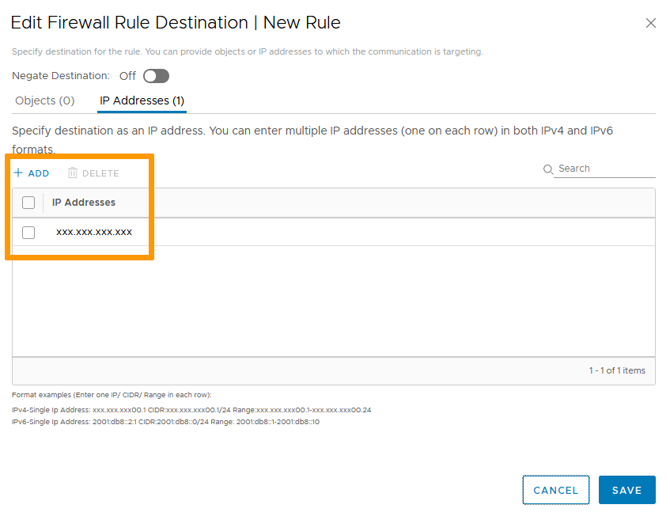
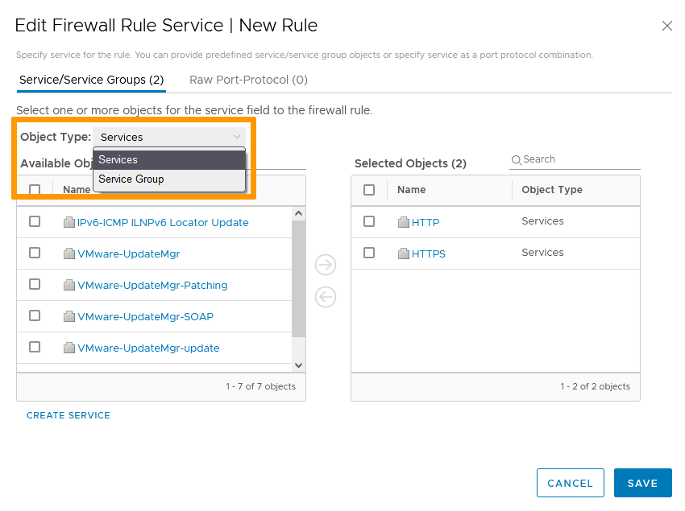
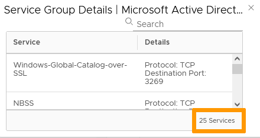
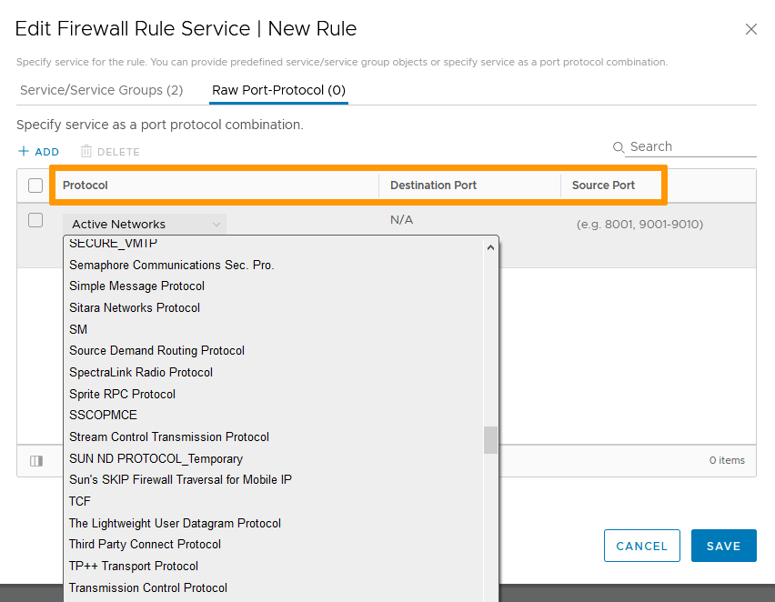
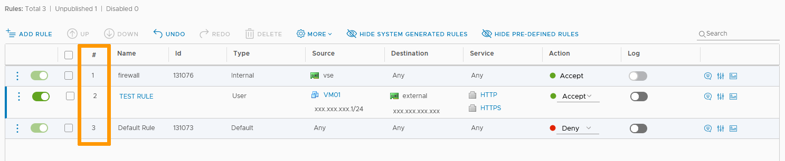

**Dernière mise à jour le 25/11/2021**

## Objectif

Le service de pare-feu NSX accepte ou refuse le trafic réseau en fonction de règles appliquées à des objets ou groupes d'objets.

**Ce guide explique comment créer ces règles**

## Prérequis

- Être contact administrateur de l'infrastructure [Hosted Private Cloud](https://www.ovhcloud.com/fr/enterprise/products/hosted-private-cloud/), afin de recevoir des identifiants de connexion.
- Avoir un identifiant utilisateur actif avec les droits spécifiques pour NSX (créé dans l'[espace client OVHcloud](https://www.ovh.com/auth/?action=gotomanager&from=https://www.ovh.com/fr/&ovhSubsidiary=fr))
- Avoir déployé une [NSX Edge Services Gateway](https://docs.ovh.com/fr/private-cloud/comment-deployer-une-nsx-edge-gateway/)

## En pratique

### Accès à l'interface

Dans l'interface vSphere, rendez-vous dans le tableau de bord `Mise en réseau et sécurité`{.action}.

{.thumbnail}

Sur la gauche de votre écran, naviguez vers `Dispositifs NSX Edge`{.action} puis cliquez sur le dispositif à paramétrer.

{.thumbnail}

La section Pare-Feu montre le statut et un bouton pour démarrer ou arrêter le service.

> [!primary]
>
> Toute modification doit être publiée avant d'être active. Vous n'arrêterez pas le service d'un seul clic.     

{.thumbnail}

### Règles de pare-feu

La base d'une règle de pare-feu est de contrôler des services identifiés, en provenance de sources spécifiques et en direction de destinations définies.     

Cliquez sur `+ Ajouter une règle`{.action}.

La nouvelle règle apparaît avec les champs suivants :

- Bouton (*slider*) d'activation
- Coche de sélection pour des actions spécifiques (changement de priorité, suppression...)
- Nom
- ID
- Type
- Source
- Destination
- Service
- Action
- Bouton (*slider*) de journal (*log*)
- Paramètres avancés

{.thumbnail}

> [!warning]
>
> Par défaut, une règle a pour source et destination `Quelconque`, soit une sélection de tout le trafic. Pour des raisons de sécurité, il est recommandé d'éviter les règles globales .
>

Nommez la règle via un clic sur le nom. Les champs`ID` and `Type` seront automatiquement complétés.

#### Source

La source définit l'origine du trafic.

Survolez le champ et cliquez sur le symbole du `crayon`{.action}. Vous pouvez ajouter des objets et/ou des addresses IP.

> [!primary]
>
> Si vous activez « Inverser la source », la règle s'appliquera à toutes les sources sauf celles sélectionnées.

Cliquez sur `Enregister`{.action}.

{.thumbnail}

{.thumbnail}

#### Destination

La destination définit la cible du trafic.

Survolez le champ et cliquez sur le symbole du `crayon`{.action}. Les possibilités sont les mêmes que pour les sources.

> [!primary]
>
> Si vous activez « Inverser la source », la règle s'appliquera à toutes les destinations sauf celles sélectionnées.

Cliquez sur `Enregister`{.action}.

{.thumbnail}

{.thumbnail}

#### Service

Le service définit le type de trafic visé.

Survolez le champ et cliquez sur le symbole du `crayon`{.action}. Vous pouvez utiliser des services et groupes existants ou ajouter des ports/protocoles bruts. 

> [!primary]
>
> Cliquer sur un service ou un groupe existant vous montrera une descripion des ports et protocoles utilisés.

Cliquez sur `Enregister`{.action}.

{.thumbnail}

{.thumbnail}

{.thumbnail}

#### Action

L'action définit comment le traffic sera dirigé.

Trois options vous sont proposées, sélectionnez celle qui vous convient :

- Accepter : Le trafic est autorisé.
- Refuser : Le trafic est bloqué sans autre forme de communication.
- Rejeter : Le trafic est bloqué et un message de port inaccessible est envoyé à la source.     

{.thumbnail}

#### Journal

S'il est activé, le bouton *slider* de journal (Log) enregistre les évenements qui concernent la règle.

#### Paramètres avancés

Outre la possibilité d'ajouter des commentaires et de consulter des statistiques, une section de **paramètres avancés** vous permet de définir si le traffic visé est entrant, sortant ou bidirectionnel et, en cas de NAT, si la règle s'applique à la source originale ou traduite.

{.thumbnail}

### Priorités des règles

La règle nouvellememnt créée est à présent visible dans la liste. 

Le nombre assigné à la règle définit sa priorité. 
Les règles sont appliquées de haut en bas et a première règle qui s'applique au trafic annule toutes les suivantes.

Cela implique qu'en cas de conflit, c'est la règle avec le plus forte priorité (le plus petit nombre) qui sera appliquée.  

Vous pouvez modifier l'ordre des règles en la cochant et en utilisant les flèches haut et bas.

{.thumbnail}

### Publier les règles

La création/modification de règles n'est pas enregistrée tant que vous ne cliquez pas sur `Publier`{.action}.

{.thumbnail}

{.thumbnail}

## Aller plus loin

Échangez avec notre communauté d'utilisateurs sur <https://community.ovh.com>.
