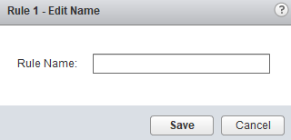
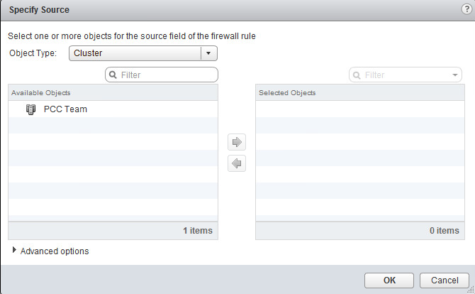

Afin de réaliser ce guide, il vous faut [accéder à l'interface de gestion NSX]({legacy}7766338).

Pour commencer, cliquez sur le menu "Firewall" à gauche de l'interface pour avoir accès à la gestion du firewall distribué.

{.thumbnail}

Vous pouvez configurer des règles de couche 3 (L3) depuis l'onglet "General" et des règles de couche 2 (L2) depuis l'onglet "Ethernet".

Les règles de couche 2 sont appliquées avant les règles de couche 3.

Par défaut, tout le trafic de couche 2 et 3 est autorisé sur votre réseau.

Sur l'image suivante, les icônes sous les menus permettent, dans l'ordre de gauche à droite, de :

- ajouter une règle après la règle sélectionnée
- copier la règle sélectionnée
- supprimer la règle sélectionnée
- remonter la règle sélectionnée dans l'arborescence
- redescendre la règle sélectionnée dans l'arborescence
- charger une configuration sauvegardée de règles
- exporter la configuration actuelle de règles
- supprimer les filtres en place
- créer un filtre

{.thumbnail}

Exemple de configuration
------------------------

Dans l'exemple suivant :

- la règle 1 autorise tout le trafic ICMP sur tout le réseau (entrant, sortant et interne)
- la règle 2 autorise toutes les VMs inclues dans le groupe "Web" (créé au préalable) à communiquer avec les VM inclues dans le groupe "mySQL" (créé au préalable) sur le service "MySQL" (service par défaut proposé dans la gestion des règles NSX).
- les règles 3 à 5 sont les règles par défaut du firewall, passées à "Block" pour ne pas autoriser le trafic de manière générale si il ne correspond pas aux autorisations précédentes

{.thumbnail}

Les règles s'appliquent dans l'ordre croissant. Si une règle est appliquée car elle correspond au trafic, les règles suivantes ne seront pas appliquées.

Ajouter une règle de firewall distribué
---------------------------------------

L'ajout de règle est similaire que ce soit via l'onglet "General" ou "Ethernet", nous détaillerons donc simplement l'ajout de règle de manière globale avec l'exemple du menu "Global".

Cliquez sur "Add Rule" (petit "+" vert à droite de la ligne "Couche de section par défaut 3) afin d'ajouter une règle de firewall. Cela ajoute simplement une ligne supplémentaire avec des valeurs par défaut dans la liste des règle (la règle 1 dans la capture ci-dessous).

{.thumbnail}

Aucune règle n'est appliquée avant que vous ayez cliqué sur "Publish", en haut de page. Cela sera nécessaire à chaque modification. Le bouton "Revert" permet de n'appliquer aucune nouvelle règle et de revenir à l'état en place à la dernière publication de règles.

{.thumbnail}

### No.

Cliquer sur le petit crayon de modification au niveau du numéro d'une règle permet d'avoir les possibilités suivantes.

- Add Above : Ajouter une règle avant la règle sélectionnée (équivalent du "Add Rule")

- Add Below : Ajouter une règle après la règle sélectionnée (équivalent du "Add Rule")

- Delete : Supprimer la règle sélectionnée

- Copy : Copier les paramètres de la règle sélectionnée

- Paste Above : Coller les paramètres précédemment copiés avant la règle sélectionnée

- Paste Below : Coller les paramètres précédemment copiés après la règle sélectionnée

{.thumbnail}

Vous pouvez également cliquer sur l'icône à gauche du numéro de règle afin de l'activer ou la désactiver.

### Name

Cliquer sur le petit crayon de modification au niveau de la colonne "Name" d'une règle permet simplement de nommer la règle.

Il est toujours préférable de donner un nom explicite à vos règles afin de pouvoir les retrouver rapidement en cas de besoin de modification par la suite.

{.thumbnail}

### Source et destination

Cliquer sur le petit crayon de modification au niveau de la colonne "Source" ou "Destination" d'une règle permet de définir plusieurs paramètres de source ou destination du trafic. Vous pouvez sélectionner plusieurs éléments comme un cluster, une machine virtuelle ou encore un groupe d'IPs ou de groupes de ports distribués.

Vous avez également un bouton "IP" vous permettant de renseigner directement des IPs sans passer par la liste de possibilité du bouton de modification.

{.thumbnail}

La source et la destination d'une même règle ne doivent pas forcément se baser sur les mêmes éléments. Vous pouvez par exemple avoir une source en provenance d'un groupe d'IPs et une destination correspondant à un cluster.Vous pouvez créer des [groupes d'objets]({legacy}7766837). Cela vous permet d'indiquer par exemple que toutes les machines virtuelles qui incluent "Web" dans leur nom font parti du groupe. Ce groupe peut alors être renseigné en source ou destination pour appliquer une règle à toutes les machines virtuelles qui incluent "Web", sans avoir à modifier la règle à chaque ajout.

### Service

Cliquer sur le petit crayon de modification au niveau de la colonne "Service" d'une règle permet de définir les services concernés par la règle. Vous avez une liste exhaustive par défaut mais vous pouvez également ajouter un service (et port associé) personnalisé via le bouton "New Service..." ou encore via l'icône de port présent sous le crayon de modification.

{.thumbnail}

### Action

Cliquer sur le petit crayon de modification au niveau de la colonne "Action" vous permet de définir si la règle autorise, bloque ou rejète le trafic renseigné dans les champs précédents. Dans la majorité des cas, si vous disposez d'une règle de refus globale, vous ajouterez principalement des règles d'autorisation.

Le menu déroulant "Direction" permet de définir si la règle s'applique spécifiquement sur le trafic entrant, sortant ou les deux.

Le menu déroulant "Type" permet d'appliquer la règle sur le trafic IPv4, IPv6, ou les deux.

Vous pouvez ajouter un tag ainsi que des commentaires si besoin pour votre utilisation.

{.thumbnail}

### Applied To

Cliquer sur le petit crayon de modification au niveau de la colonne "Applied To" vous permet de définir si la règle s'applique sur tous les cluster sur lequel est installé le firewall distribué (par défaut, cela s'appliquera donc sur la totalité du trafic) ou si cela doit être appliqué sur une ou plusieurs Edges déjà déployées.

L'avantage de cela est que si vous disposez de plusieurs Edges, vous pouvez généraliser certaines règles de filtre de base et appliquer des règles spécifiques à certaines Edges si elles n'ont pas toutes la même utilisation.

{.thumbnail}

Ajouter une section de règles de firewall distribué
---------------------------------------------------

Pour ajouter une section, il vous suffit de cliquer sur l'icône de répertoire, a drotie de la section "Couche de section par défaut 3".

Il vous suffira ensuite de nommer la section ainsi que de confirmer si elle sera positionnée avant ou après la section utilisée pour la créer.

{.thumbnail}

Le fonctionnement est ensuite similaire à la section par défaut pour l'ajout de règles.

{.thumbnail}
