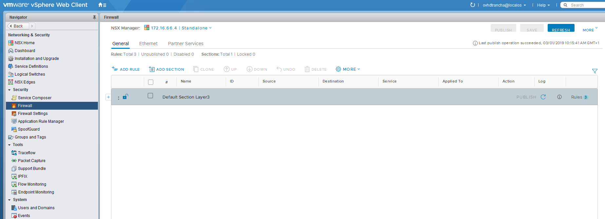
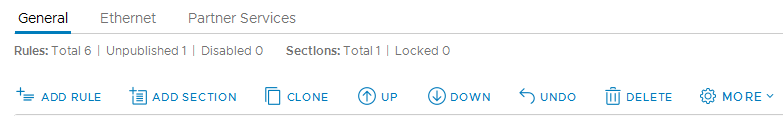
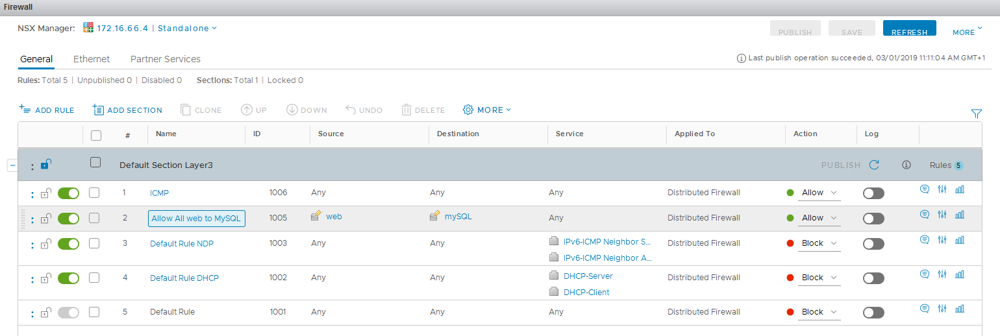
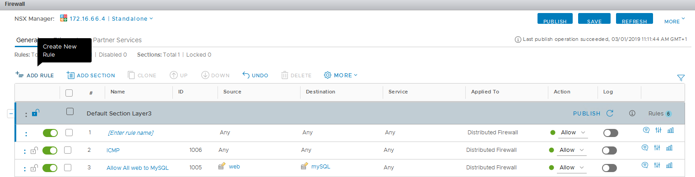
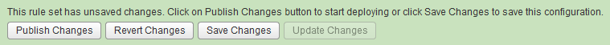

**Dernière mise à jour le 28/02/2019**

## Objectif

Le firewall distribué permet 

**Ce guide explique comment établir cette solution**

## Prérequis

- Disposer d'un utilisateur ayant accès  à [l'interface de gestion NSX](https://docs.ovh.com/fr/private-cloud/acceder-a-l-interface-de-gestion-nsx/)

## En pratique

Pour commencer, cliquez sur le menu "Firewall" à gauche de l'interface pour avoir accès à la gestion du firewall distribué.

{.thumbnail}

Vous pouvez configurer des règles de couche 3 (L3) depuis l'onglet "General" et des règles de couche 2 (L2) depuis l'onglet "Ethernet".

Les règles de couche 2 sont appliquées avant les règles de couche 3.

Par défaut, tout le trafic de couche 2 et 3 est autorisé sur votre réseau.

Sur l'image suivante, les icônes sous les menus permettent, dans l'ordre de gauche à droite, de :

- ajouter une règle après la règle sélectionnée
- ajouter une section
- copier la règle sélectionnée
- remonter la règle sélectionnée dans l'arborescence
- redescendre la règle sélectionnée dans l'arborescence
- annuler la dernière action
- supprimer la règle sélectionnée

Puis en cliquant sur le bouton `Plus`{.action} vous disposez des actions suivantes : 

- déplacer vers : permettant de déplacer une règle a un numéro précis.
- développer toutes les sections
- réduire toutes les sections
- activer toutes les règles séléctionnées
- activer les journaux de règles
- désactiver toutes les règles séléctionnées
- désactiver les journaux de règles

{.thumbnail}

### Exemple de configuration

Dans l'exemple suivant :

- la règle 1 autorise tout le trafic ICMP sur tout le réseau (entrant, sortant et interne)
- la règle 2 autorise toutes les VMs inclues dans le groupe "Web" (créé au préalable) à communiquer avec les VM inclues dans le groupe "mySQL" (créé au préalable) sur le service "MySQL" (service par défaut proposé dans la gestion des règles NSX).
- les règles 3 à 5 sont les règles par défaut du firewall, passées à "Block" pour ne pas autoriser le trafic de manière générale si il ne correspond pas aux autorisations précédentes

{.thumbnail}

Les règles s'appliquent dans l'ordre croissant. Si une règle est appliquée car elle correspond au trafic, les règles suivantes ne seront pas appliquées.

### Ajouter une règle de firewall distribué

L'ajout de règle est similaire que ce soit via l'onglet "General" ou "Ethernet", nous détaillerons donc simplement l'ajout de règle de manière globale avec l'exemple du menu "Global".

Cliquez sur `+ Ajouter une règle`{.action} "Couche de section par défaut 3) afin d'ajouter une règle de firewall. Cela ajoute simplement une ligne supplémentaire avec des valeurs par défaut dans la liste des règle (la règle 1 dans la capture ci-dessous).

{.thumbnail}

Aucune règle n'est appliquée avant que vous ayez cliqué sur "Publier", en haut de page. Cela sera nécessaire à chaque modification. Le bouton "Actualiser" permet de n'appliquer aucune nouvelle règle et de revenir à l'état en place à la dernière publication de règles.

{.thumbnail}

Pour chaque règle, plusieurs actions et champs sont disponibles : 

- L'icone en début de ligne symbolisé par 3 points verticaux ({.thumbnail}) permet plusieurs actions : 
	- Ajouter une règle au-dessus
	- Ajouter une règle en dessous
	- Copier la règle
	- Coller la règle au-dessus
	- Coller la règle en dessous

- L'icone ({.thumbnail}) situé juste après permet d'activer ou de désctiver la règle.
- Le numéro de la règle permettant de définir dans quel ordre elle sera traitée.
- Le nom de la règle
- L'ID de la règle
- La source, qui peut être une IP, ou un objet (machine virtuelle, vApp, roupe de sécurité...)
- La destination, qui peut être une IP, ou un objet (machine virtuelle, vApp, groupe de sécurité...)
- Le service,  faisant parti des services (AD, HTTP...) par défaut on un que vous pouvez avoir crée. Cela peut également être un port en brut si vous n'avez pas défini votre service.
- L'élement sur lequel va être appliqué la règle, cela pourra être le pare-feu distribué ou bien votre ou vos edges
- L'action de la règle, elle peut autoriser, bloquer ou rejeter le trafic
- L'icone ({.thumbnail}) permettant d'activé ou désactivé les journaux pour cette règle.

Trois dernières icones sont disponibles en bout de ligne, voici leur description de gauche a droite : 

- Ajout d'un commentaire sur la règle
- Paramètres avancés, permettant de préciser la direction (entrant ou sortant ou entrant et sortant), le type de paquet (IPv4 ou IPv6)
- Les statistiques de la règle.

### Ajouter une section

Pour ajouter une section, il vous suffit de cliquer sur `Ajouter une section`{.action}.

L'ajout de section présente plusieurs avantages :

- Isoler certaines règles en fonction de votre activité et de l'élément sur lequel vous appliquez vos règles.
- Verrouiller la section pour éviter qu'un autre utilisateur effectue des modification dans le même temps

> [!primary]
>
> La gestion de priorité et d'éxécution d'une section est similaire aux règles du pare-feu.
> Une section situé en amont verra ses règles appliqué avant les règles d'une section situé en aval.

## Aller plus loin

Échangez avec notre communauté d'utilisateurs sur <https://community.ovh.com>.