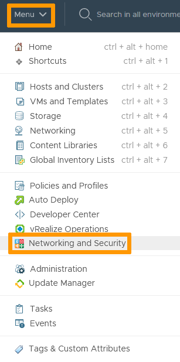
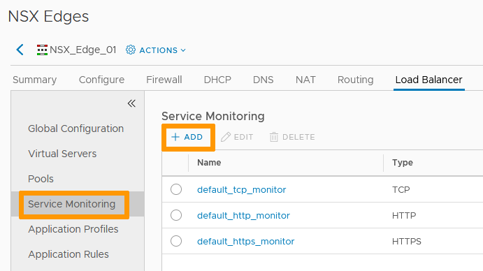
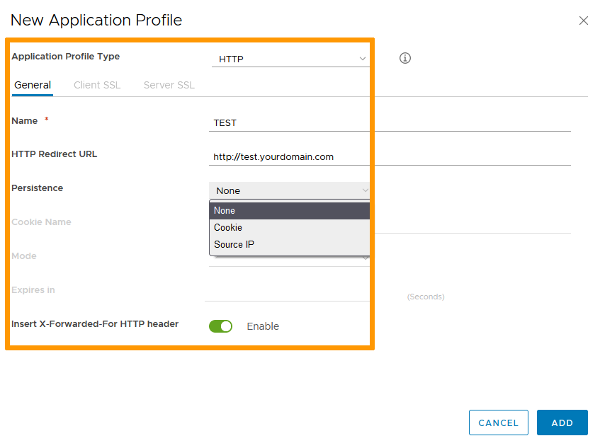
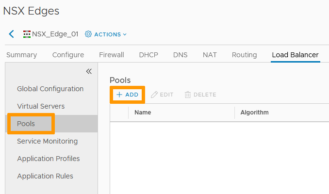
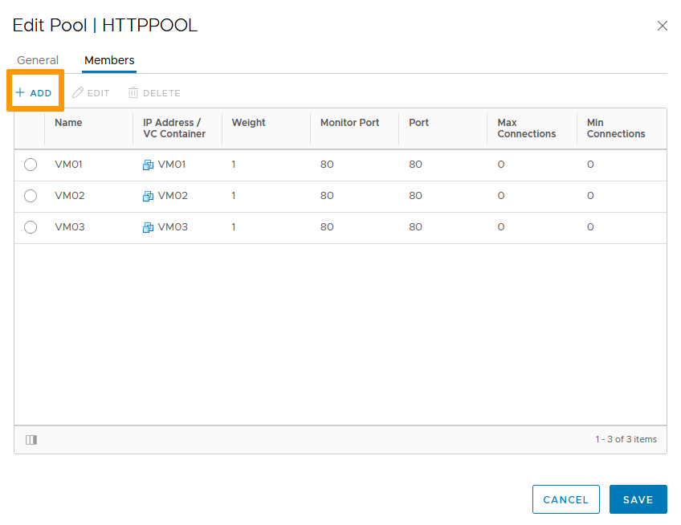
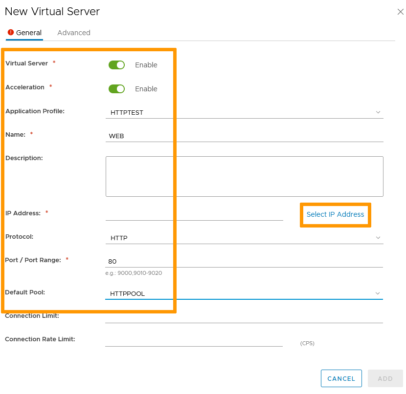
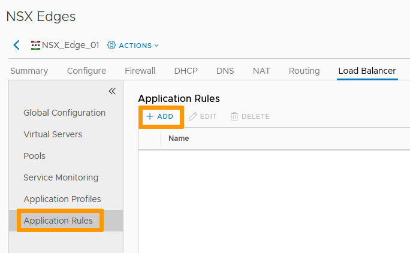

**Last Updated on 29th November 2021**

## Objective

The NSX Edge load balancing service spreads traffic from a specified public or private IP accross several defined VMs in your infrastructure.

**This guide explains how to setup the NSX Edge Load Balancer**

## Requirements

- being an administrative contact of your [Hosted Private Cloud infrastructure](https://www.ovhcloud.com/es-es/enterprise/products/hosted-private-cloud/) to receive login credentials
- a user account with access to vSphere as well as the specific rights for NSX (created in the [OVHcloud Control Panel](https://www.ovh.com/auth/?action=gotomanager&from=https://www.ovh.es/&ovhSubsidiary=es))
- a deployed [NSX Edge Services Gateway](/pages/cloud/private-cloud/nsx_deploying_edge_gateway)

## Instructions

### Interface access

In the vSphere interface menu, go to the `Networking and Security`{.action} dashboard.

{.thumbnail}

On the left side, navigate to the `NSX Edges`{.action} section then click on the appliance you're setting up.

{.thumbnail}

The Load Balancer tab shows the status of the service and its basic configuration.

### Global Configuration

In the `Global Configuration`{.action} tab, click on `Edit`{.action}.

{.thumbnail}

Enable options as needed:

- Load Balancer: global service.
- Acceleration: enabled, Load Balancer engine works at layer 4 (faster) vs layer 7 if disabled. 
- Logging: capture logs for the service (log level to be set as intended).

Click `Save`{.action} when ready.

{.thumbnail}

The service is now active.

#### Service Monitor

A service monitor defines health check parameters for a particular type of network traffic. When you associate a service monitor with a pool, the pool members are monitored according to the service monitor parameters.

By default, three monitors are set up in the NSX Edge:

- TCP
- HTTP
- HTTPS

In the `Service Monitoring`{.action} tab, click `+ Add`{.action}.     

{.thumbnail}

Set a name and choose the type of monitor you are setting up. You can customize Interval, Timeout and Retries as well.

Click `Add`{.action}.

{.thumbnail}

Your monitor is added to the list.

#### Application Profiles

An application profile defines the behavior of a particular type of network traffic. After configuring a profile, you associate the profile with a virtual server. The virtual server then processes traffic according to the values specified.

In the `Application Profiles`{.action} tab, click `+ Add`{.action}.     

{.thumbnail}

Set the type and name of the profile.     
Set the other options in regards to the type chosen.     

Two settings of note:

- Persistence allows session data tracking by cookie or source IP
- Inserting X-Forwarded-For HTTP header keeps the originating IP of a client connecting through the load balancer

Click `Add`{.action}.

{.thumbnail}

Your profile is now available.

#### Pools

A server pool manages load balancer distribution methods and has a service monitor attached to it for health check parameters.

In the `Pools`{.action} tab, click `+ Add`{.action}.     

{.thumbnail}

Name the pool.

Select the Algorithm to apply:

- **IP-HASH** selects a server based on a hash of the source IP address and the total weight of all the running servers
- **LEASTCONN** distributes client requests to multiple servers based on the number of connections already on the server
- **ROUND_ROBIN** uses each server in turn according to the weight assigned to it
- **URI** hashes the left part of the URI and divides by the total weight of the running servers. The result designates which server receives the request. This ensures that a URI is always directed to the same server if no server goes up or down.
- **HTTPHEADER** looks up the HTTP header in each HTTP request
- **URL** looks up the argument in the query string of each HTTP GET request 

Choose the Monitor to be used.

> [!primary]
> To make client IP addresses visible to the back-end servers, enable the Transparent option.    

{.thumbnail}

In the `Members`{.action} tab, `+ Add`{.action} the servers that will be used for the pool.

Click `Add`{.action}.

{.thumbnail}

Your pool is now ready for use.

#### Virtual Servers

A virtual server is an NSX Edge internal or uplink interface used to redirect traffic.

In the `Virtual Servers`{.action} tab, click `+ Add`{.action}.     

{.thumbnail}

Set all fields as needed using the previously created objects or using previously existing ones.     

You can manually enter the IP that will be redirected or click `Select IP Address`{.action}.

{.thumbnail}

Select the vNIC and IP if you did.

Click `OK`{.action} then `Add`{.action}.

{.thumbnail}

Your virtual server is now active.

#### Application Rules

An application rule is a server-side script using the HAProxy syntax to manipulate and manage traffic.

In the `Application Rules`{.action} tab, click `+ Add`{.action}.     

{.thumbnail}

Name your rule and copy your script.

Click `Add`{.action} when done.

{.thumbnail}

You can now apply the rule in the Advanced section of your Virtual Server.

The Load Balancer is now fully configured.

{.thumbnail}

## Go further

Join our community of users on <https://community.ovh.com/en/>.
