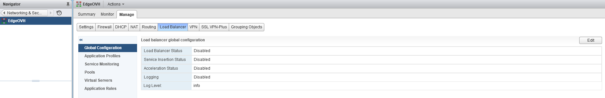
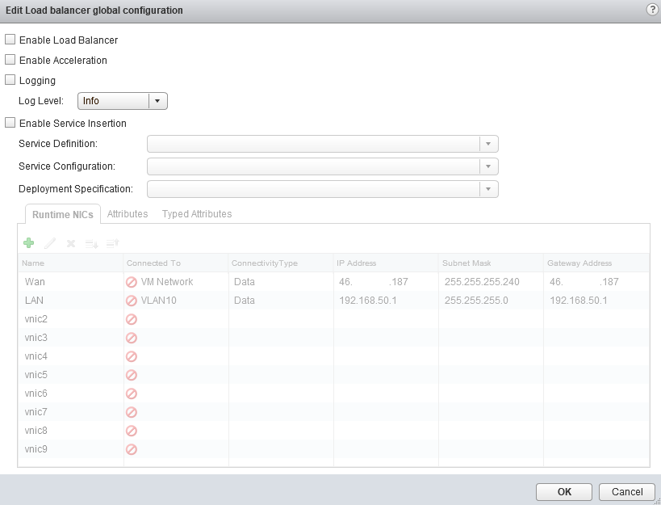
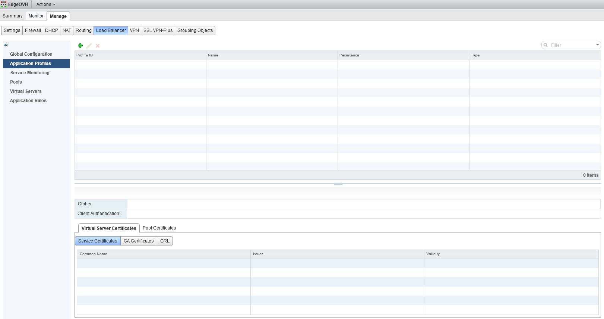
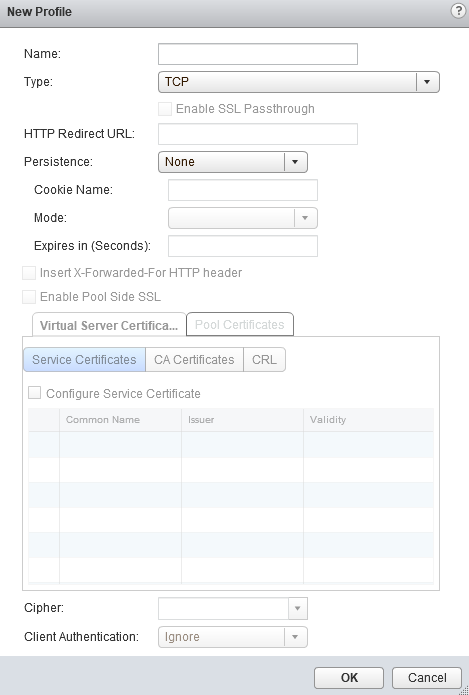
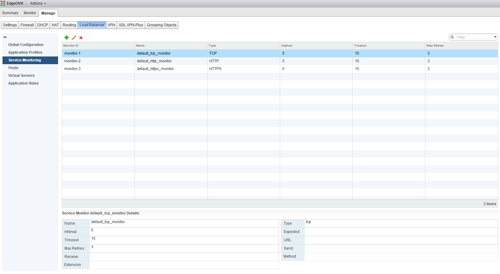
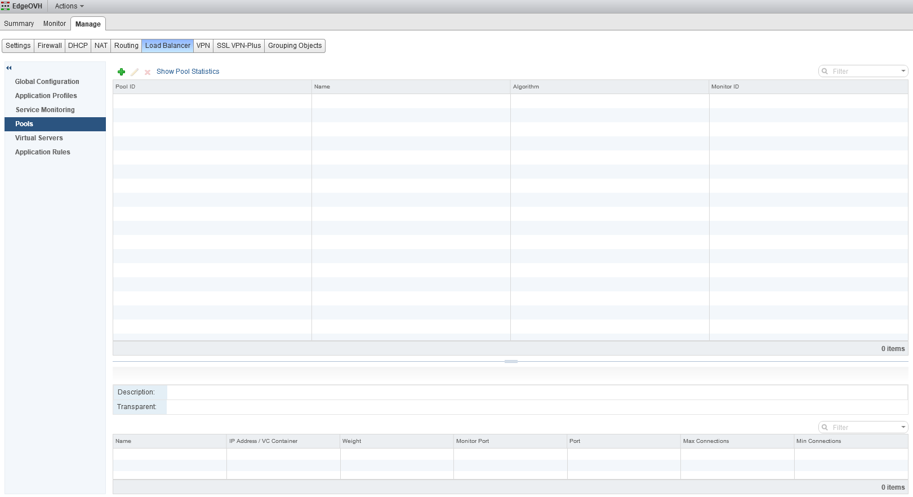
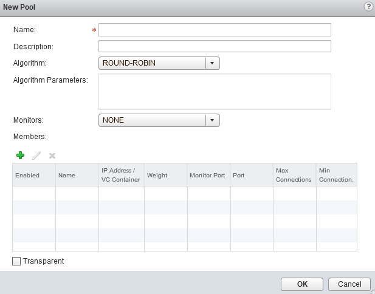
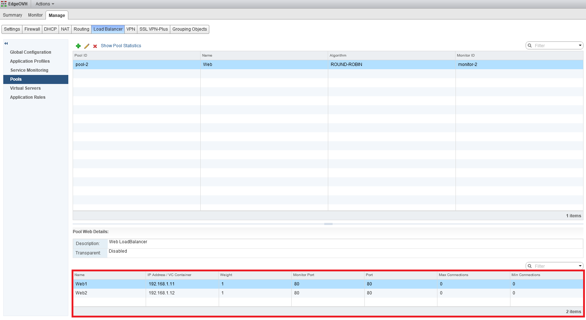
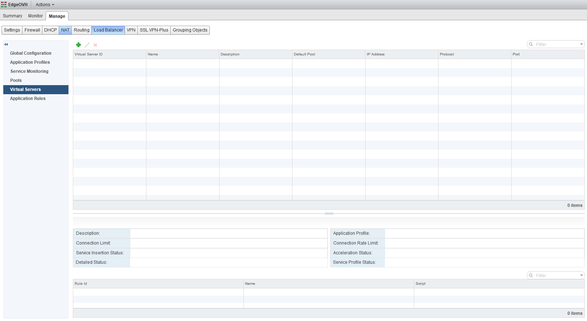
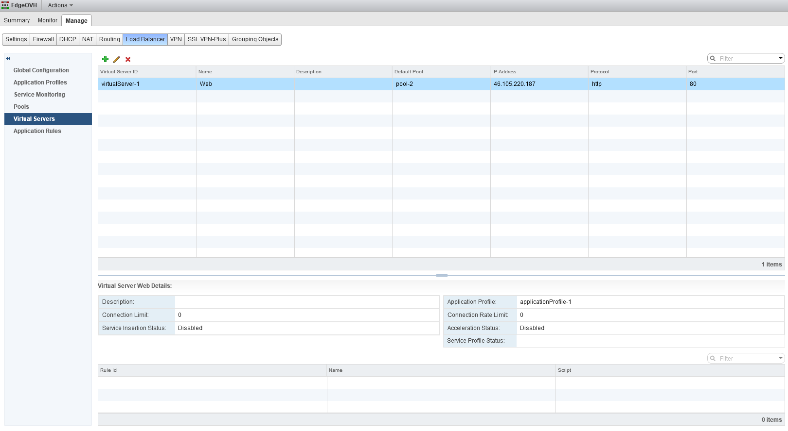

**Dernière mise à jour le 27/02/2019**

## Objectif

La fonctionnalité d'équilibrage de charge NSX permet de répartir la charge du trafic depuis une IP publique ou privée unique vers plusieurs VMs en adressage IPs privé.

## Prérequis

- Disposer d'un utilisateur ayant accès  à [l'interface de gestion NSX](https://docs.ovh.com/fr/private-cloud/acceder-a-l-interface-de-gestion-nsx/)

## En pratique

Depuis la Edge souhaitée, rendez-vous dans la partie "Gérer" pour ensuite accéder à l'onglet "Load Balancer".

{.thumbnail}

### Configuration globale

Vous pouvez alors visualiser le menu "onfiguration globale" disposant d'un bouton `Modifier`{.action} vous permettant de configurer les options suivantes.

- Enable Load Balancer : Active la fonctionnalité de Load Balancer si coché.
- Enable Accelerator : Utilise le Load Balancer de couche 4 (réseau) le plus rapide plutôt que de couche 7 (applicatif) si coché.
- Logging : Active le logs du Load Balancer si coché. Le type de log conservé est défini par le menu déroulant "Log Level".
- Enable Service Insertion : Permet au Load Balancer d'utiliser les "Third Party Appliance" de revendeurs si coché.

{.thumbnail}

### Profils d'application

Le menu "Profils d'application" permet de gérer des profils sur la partie haute et des certificats sur la partie basse. Ces profils sont utilisés pour configurer le Load Balancer en lui même.

{.thumbnail}

Pour ajouter un "Profil d'application", vous pouvez cliquer sur `Add` (petit `+`{.action} vert).

Vous pouvez configurer les paramètres suivants :

- Name : Nom du profil, le plus explicite possible pour vous.
- Type : Le type de trafic utilisé pour le Load Balancing. Les types disponibles selon votre utilisation sont TCP, UDP, HTTP et HTTPS.
- Persistence : Le moyen utilisé par le Load Balancer pour identifier une session et rediriger cette session toujours vers le même serveur final.

Les autres champs permettent d'affiner le suivi de la répartition selon votre besoin.

{.thumbnail}

### Surveillance des services

Par défaut, 3 monitorings sont en place, en TCP, HTTP et HTTPS.

{.thumbnail}

Vous pouvez utiliser le bouton `Add` (petit `+`{.action} vert) pour ajouter des règles de monitoring personnalisées.

### Pools

Un pool est une liste de serveurs ou d'IPs vers lesquels le Load Balancer va répartir le trafic.

{.thumbnail}

Cliquez sur le bouton `Add` (petit `+`{.action} vert) afin de créer un nouveau pool. Cela vous permet de configurer les champs suivants :

- Name : Le nom du pool, si possible explicite pour ne pas confondre les pools entre eux.
- Description : Complément d'information vous permettant de savoir à quoi vous sert le pool par rapport aux autres.
- Algorithm : Défini le type de répartition entre les serveurs finaux.
    - IP\_HASH : Cet algorithme effectue une fonction de hashage (hash) sur l'adresse IP source puis divise le résultat par le nombre de serveurs actuellement actifs. La même adresse IP source sera alors toujours redirigée vers le même serveur tant que celui-ci reste actif.

    - LEAST\_CONN : Sélectionne le serveur qui a le moins de connexions actives, c'est le paramètre recommandé pour de longues sessions avec peu de trafic. L'algorithme *RoundRobin* est appliqué sur les groupes de serveurs qui ont le même nombre de connexion actives.

    - ROUND\_ROBIN : Sélectionne les serveurs les uns après les autres pour chaque connexion, c'est l'algorithme par défaut.

    - URI : Cet algorithme effectue une fonction de hashage (hash) sur une partie, ou sur l'URI entière, puis divise le résultat par le nombre de serveurs actuellement actifs. Le même URI sera alors toujours redirigée vers le même serveur tant que celui-ci reste actif.

- Algorithm Parameters : Permet d'ajouter des règles spécifiques d'algorithme.
- Monitors : Applique le monitoring choisi parmi les "Services Monitoring" configurés dans le menu associé.

{.thumbnail}

Vous pouvez finalement ajouter des membres au pool via le bouton `Add` (petit `+`{.action} vert"). Vous pouvez configurer les champs suivants :

- Name : Le nom du membre.
- IP Address / VC Container : Un des serveurs finaux qui recevra le trafic réparti. Vous pouvez entrer manuellement une IP ou cliquer sur "Select" pour choisir directement un élément de l'infrastructure comme une VM.
- Port : Le port sur lequel sera redirigé le trafic.
- Monitor Port : Le port surveillé sur le membre pour définir son fonctionnement.

Nous prendrons l'exemple de 2 membres mais vous pouvez en ajouter plus.

{.thumbnail}

### Serveurs virtuels

Le menu "Serveurs virtuels" vous permet de configurer les points d'entrée publics de vos Load Balancer. L'IP configurée doit être une IP de la Edge.

{.thumbnail}

Pour ajouter un **Serveur virtuel**, cliquez sur le bouton `Add` (petit `+`{.action} vert). Vous pouvez alors configurer les champs suivants :

- Enable Virtual Server : Active le "Serveur virtuel" si coché.
- Application Profile : Permet d'utiliser un "Profil d'application" configuré précédemment.
- Name : Le nom du "Serveur virtuel".
- IP Address : Indiquez manuellement une IP publique de la Edge ou sélectionnez la depuis le bouton "Select IP Address" vous proposant toutes les IPs publiques de la Edge.
- Protocol : Le protocole utilisé pour la répartition de charge.
- Port : Le port utilisé par la répartition de charge.
- Default Pool : Sélectionnez un "Pool" créé et configuré précédemment.

Votre **Serveur virtuel** est ensuite prêt et fonctionnel.

{.thumbnail}

> [!primary]
>
> En cas de besoin de mise en place de certificat SSL, n’hésitez pas à vous référer à la [documentation officielle VMware](https://kb.vmware.com/s/article/2113945).
>

## Aller plus loin

Échangez avec notre communauté d'utilisateurs sur <https://community.ovh.com>.