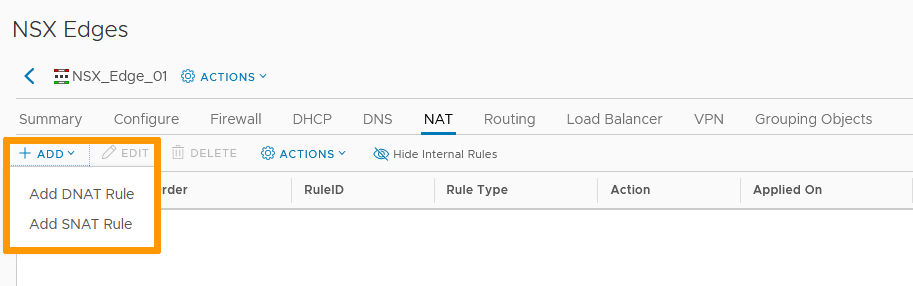
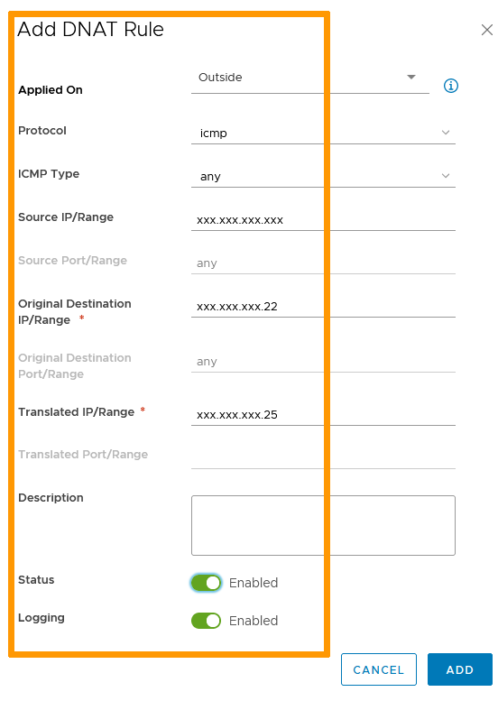
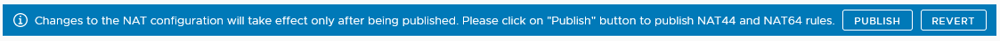
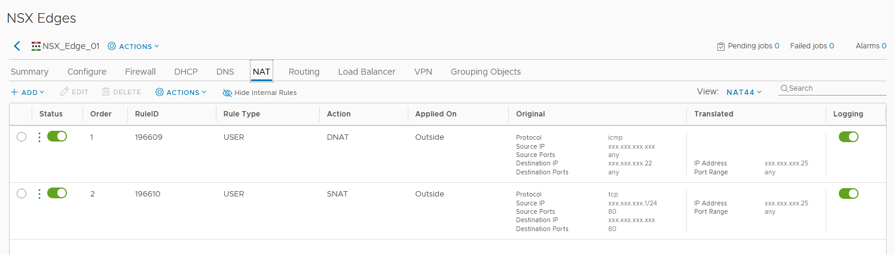

**Dernière mise à jour le 26/11/2021**

## Objectif

NAT signigie « traduction d'addresses réseau »(*Network Address Translation*). Cela permet de rediriger une ou de multiples adresses vers une autre. Il y a deux types de NAT :

- DNAT est le NAT de destination. Il modifie l'adresse de destination et s'applique au trafic entrant.
- SNAT est le NAT de source. Il modifie l'adresse source et s'applique au trafic sortant.

**Ce guide explique comment créer des règles NAT.**

## Prérequis

- Être contact administrateur de l'infrastructure [Hosted Private Cloud](https://www.ovhcloud.com/fr/enterprise/products/hosted-private-cloud/), afin de recevoir les identifiants de connexion.
- Avoir un identifiant utilisateur actif avec les droits spécifiques pour NSX (créé dans l'[espace client OVHcloud](https://www.ovh.com/auth/?action=gotomanager&from=https://www.ovh.com/fr/&ovhSubsidiary=fr))
- Avoir déployé une [NSX Edge Services Gateway](https://docs.ovh.com/fr/private-cloud/comment-deployer-une-nsx-edge-gateway/)

## En pratique

### Accès à l'interface

Dans l'interface vSphere, rendez-vous dans le tableau de bord `Mise en réseau et sécurité`{.action}.

{.thumbnail}

Sur la gauche de votre écran, naviguez vers `Dispositifs NSX Edge`{.action} puis cliquez sur le dispositif à paramétrer.

{.thumbnail}

Allez dans la section `NAT`{.action}.

### DNAT

Cliquez sur `+ Ajouter`{.action} puis sur `Ajouter une règle DNAT`{.action}.

{.thumbnail}

Paramétrez comme suit :

- l'interface de trafic entrant (pour le DNAT, votre interface publique);
- le protocole et sous-protocoles visés;
- l'IP ou plage IP source;
- si applicable, le port source;
- l'IP de destination originale (généralement, votre IP publique);
- si applicable, le port original;
- l'IP ou plage IP traduite;
- activez ou désactivez la règle;
- activez ou désactivez la journalisation.  

Cliquez sur `Ajouter`{.action}.

{.thumbnail}

### SNAT

Cliquez sur `+ Ajouter`{.action} puis sur `Ajouter une règle SNAT`{.action}.

{.thumbnail}

Paramétrez comme suit :

- l'interface de trafic sortant;
- le protocole et sous-protocoles visés;
- l'IP ou plage IP source;
- si applicable, le port source;
- l'IP ou plage IP de destination;
- si applicable, le port de destination;
- l'IP ou plage IP traduite;
- activez ou désactivez la règle;
- activez ou désactivez la journalisation;

Cliquez sur `Ajouter`{.action}.

{.thumbnail}

### Publier

Les règles créées ou modifiées ne seront enregistrées et actives qu'après avoir cliqué sur `Publier`{.action}.

{.thumbnail}

Les règles sont alors fonctionnelles.

{.thumbnail}

## Aller plus loin

Échangez avec notre communauté d'utilisateurs sur <https://community.ovh.com>.
