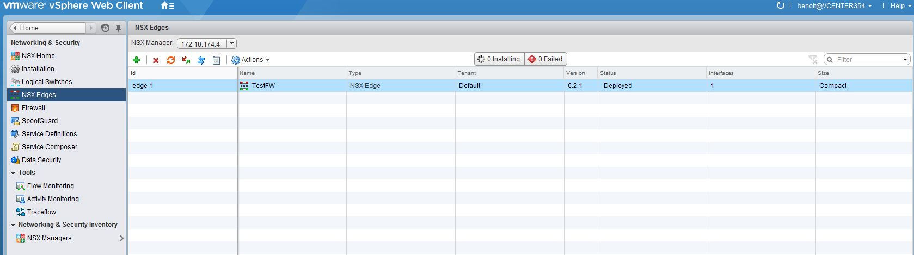
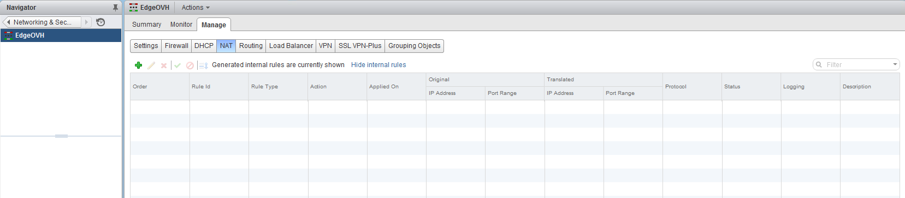
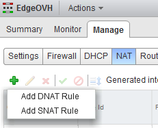
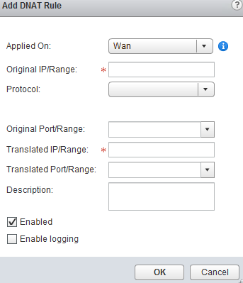
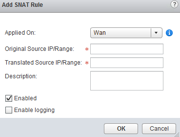
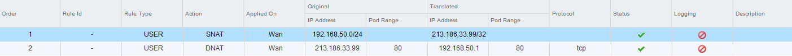

**Dernière mise à jour le 27/02/2019**

## Objectif

Le NAT permet de gérer une redirection du trafic arrivant sur la Edge, que ce soit en privé ou en public, vers une autre destination en fonction de multiples paramètres configurables.

**Ce guide expliquement comment créer des règles NAT**

## Prérequis

- Disposer d'un utilisateur ayant accès  à [l'interface de gestion NSX](https://docs.ovh.com/fr/private-cloud/acceder-a-l-interface-de-gestion-nsx/)

## En pratique

Pour commencer, rendez-vous dans la partie "NSX Edges" afin de trouver la liste des Edges déjà déployées. Dans l'exemple ci-dessous nous avons déjà une Edge déployée sur laquelle il faut effectuer un double-clic.

{.thumbnail}

Rendez-vous dans l'onglet "NAT" afin d'avoir accès à la page de configuration des règles de NAT de la Edge sur laquelle vous êtes.

{.thumbnail}

Pour créer une règle, cliquez sur "Add" (petit "+" vert) afin d'avoir accès à deux types de règles possibles :

- "Add DNAT Rule" : pour créer une règle concernant le trafic qui a pour destination vos VMs (public vers privé) ;
- "Add SNAT Rule" : pour créer une règle concernant le trafic provenant de vos VMs (privé vers public).

{.thumbnail}

Le pare-feu de la Edge doit être actif pour que les règles de NAT soient prises en compte.

### Ajouter une règle DNAT

Le choix de "Ajouter une règle DNAT" vous propose la possibilité de l'appliquer sur chaque interface réseau de la Edge.

Vous pouvez configurer l'IP source du trafic (ou la plage complète, en indiquant le préfixe) au niveau de la carte réseau publique de la Edge ainsi que le protocole pris en compte.

Vous pouvez ensuite configurer le port appelé initialement et le router sur un port similaire ou différent en fonction du besoin vers une IP interne (ou une plage complète, en indiquant le préfixe).

{.thumbnail}

### Ajouter une règle SNAT

"Ajouter une règle SNAT" vous offre la possibilité de l'appliquer sur chaque interface réseau de la Edge.

Vous pouvez simplement configurer l'IP privée source (ou la plage complète, en indiquant le préfixe) et l'IP publique traduite afin de permettre la sortie du trafic.

{.thumbnail}

N'oubliez pas de publier les règles afin qu'elles soient prises en compte.

### Exemple de règles

Vous trouverez ci-dessous un exemple de configuration NAT.

- La règle 1 permet une sortie de l'intégralité de la plage privée configurée (192.168.50.0/24) quel que soit le port utilisé vers une IP publique unique configurée sur la Edge.

- La règle 2 permet une redirection d'une IP publique (Original IP Address, 213.186.33.99 qui est le DNS OVH utilisé en IP publique dans l'exemple) vers une IP privée (192.168.50.1 dans l'exemple) si l'IP publique est atteinte sur son port 80. Dans l'exemple, un appel sur le port 80 de l'IP publique redirige vers le port 80 de l'IP privée, mais le port pourrait être différent de part et d'autre.

{.thumbnail}

Selon votre version de NSX, des colonnes supplémentaires peuvent ou non être disponibles.

## Aller plus loin

Échangez avec notre communauté d'utilisateurs sur <https://community.ovh.com>.