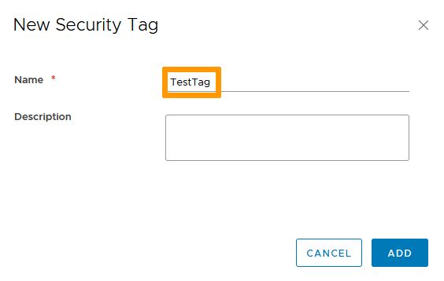
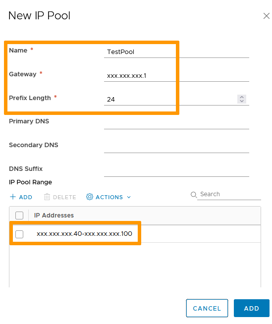
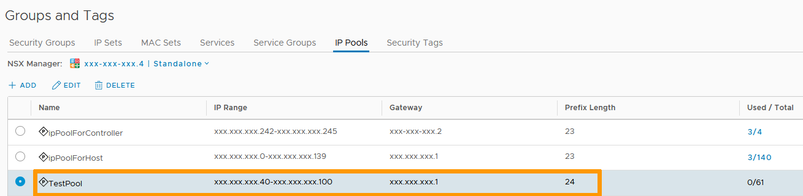
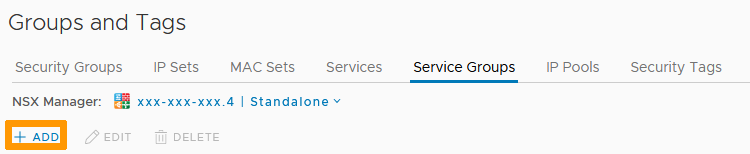
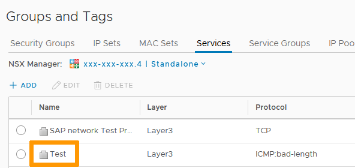
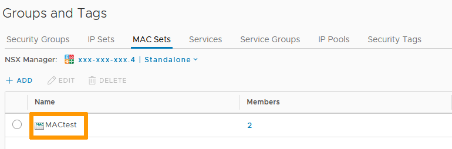
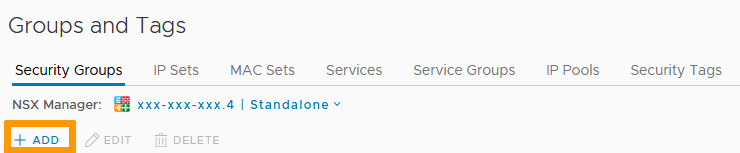
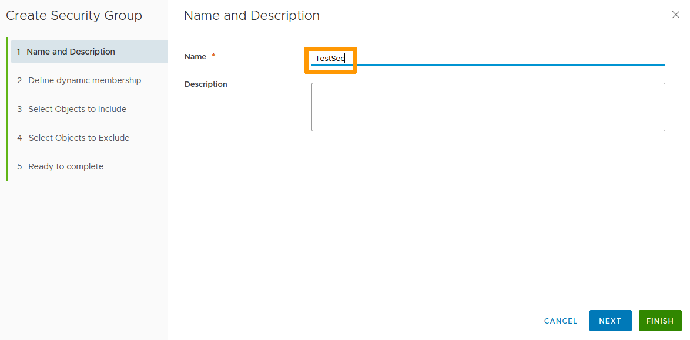
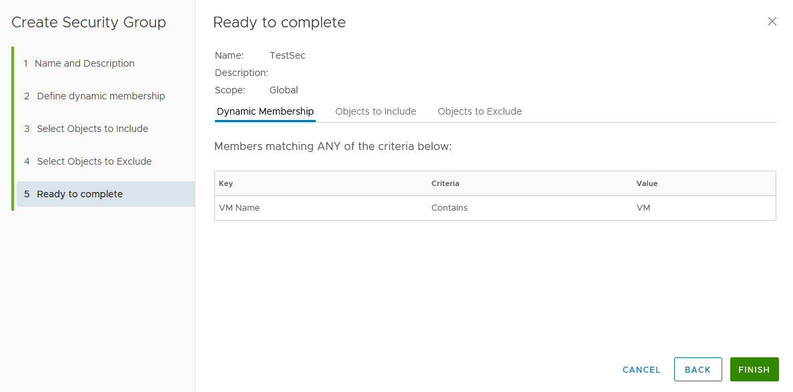
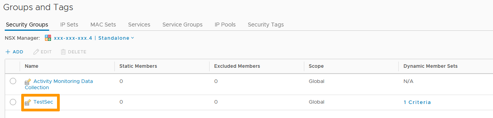

**Last updated 24th November 2021**

## Objective

An object, in the Network Security world, is a singular item that can be assigned rules.    
*Examples: IP address, machine name, service, network port, MAC adress...*

Leveraging object groups limits the number of necessary rules and simplifies management.

**This guide explains how to create/manage groups.**

## Requirements

- being an administrative contact of your [Hosted Private Cloud infrastructure](https://www.ovhcloud.com/en-ca/enterprise/products/hosted-private-cloud/) to receive login credentials
- a user account with access to vSphere as well as the specific rights for NSX (created in the [OVHcloud Control Panel](https://ca.ovh.com/auth/?action=gotomanager&from=https://www.ovh.com/ca/en/&ovhSubsidiary=ca))
- a deployed [NSX Edge Services Gateway](/pages/cloud/private-cloud/nsx_deploying_edge_gateway)

## Instructions

### Interface access

In the vSphere interface menu, go to the `Networking and Security`{.action} dashboard.

{.thumbnail}

On the left side, navigate to the `Groups and Tags`{.action} section.

The section shows 7 types of grouping methods:

- Security Tags
- IP Pools
- Service Groups
- Services
- MAC Sets
- IP Sets
- Security Groups

{.thumbnail}

### Security Tags

Tags are metadata added to VMs to flag and sort them easily.    

To create one, in the `Security Tags`{.action} tab, click on `+ Add`{.action}.

{.thumbnail}

The tag itself is just a keyword so you can use any name for it.

{.thumbnail}

Once created, select it in the list and click `+ Assign VM`{.action}

{.thumbnail}

Choose the VM(s) you want to assign the tag to and use the arrows to put them in the "Selected Objects" section.

Click `OK`{.action} when done.

{.thumbnail}

Your Security Tag is done and assigned to VM(s).

{.thumbnail}

### IP Pools

IP Pools are ranges of IPs.     

To create one, in the `IP Pools`{.action} tab, click on `+ Add`{.action}.

{.thumbnail}

A pool will need a Name, Gateway and prefix length to be useable. The DNS info are optional.

IPs need to be added as a range (xxx.xxx.xxx.xxx-xxx.xxx.xxx.xxx).

Click `Add`{.action} when done.

{.thumbnail}

Your IP Pool is now set up and available.

{.thumbnail}

### Service Groups

Service Groups are collections of existing Services and/or Service Groups.     

To create one, in the `Service Groups`{.action} tab, click on `+ Add`{.action}.

{.thumbnail}

Your group will need a name and objects added. The available objects will be of two types:

- Service Groups
- Services

You can highlight various items from either types and drop them in the "Selected Oblects" section.

Click `Add`{.action} when done.

{.thumbnail}

Your Service Group is now set up and available.

{.thumbnail}

### Services

Services are applications running at the network layer and above. They typically are linked to network ports and protocols for communications.

To create one, in the `Service`{.action} tab, click on `+ Add`{.action}.

{.thumbnail}

Most of the commonly used services are already listed but you can define new ones to allow, to be more granular or create specific ports collections.

Click `Add`{.action} when done.

{.thumbnail}

Your Service is now set up and available.

{.thumbnail}

### MAC Sets

MAC Sets are collections of MAC addresses (a MAC is a physical address of a network component).     

To create one, in the `MAC Sets`{.action} tab, click on `+ Add`{.action}.

{.thumbnail}

Name your set then add the physical addresses as needed.

Click `Add`{.action} when done.

{.thumbnail}

Your Mac Set is now set up and available.

{.thumbnail}

### IP Sets

IP sets are collections of IP adresses.     

To create one, in the `IP Sets`{.action} tab, click on `+ Add`{.action}.

{.thumbnail}

Name your set then add the addresses as needed. IPs can be added as single (xxx.xxx.xxx.xxx), range (xxx.xxx.xxx.xxx-xxx.xxx.xxx.xxx) or CIDR (xxx.xxx.xxx.x/xx).

Click `Add`{.action} when done.

{.thumbnail}

Your IP Set is now set up and available.

{.thumbnail}

### Security Groups

Security Groups are collections of network objects.     

To create one, in the `Security Groups`{.action} tab, click on `+ Add`{.action}.

{.thumbnail}  

Name your set then click `Next`{.action}.     

{.thumbnail}

Security Groups allow for dynamic membership. You can define a single or set of variables that will automatically assign/unassign objects.    

> [!primary]
>
> You can leave this part empty if you do not wish to use the functionality.

Click `Next`{.action}.

{.thumbnail}

You can now add any existing Group/Object to the "Selected Objects" section to include them in the group.

Click `Next`{.action}

{.thumbnail}

If there is a specific object that needs to be left out (a single member of a whole group you selected previously for example), find it in the "Objects to Exclude" window.

Click `Next`{.action}

{.thumbnail}

Review your settings and click `Finish`{.action}

{.thumbnail}

Your Security Group is now set up and available.

{.thumbnail}

## Go further

Join our community of users on <https://community.ovh.com/en/>.
