**Dernière mise à jour le 27/02/2019**

## Objectif

Les groupes d'objets permettent d'inclure plusieurs paramètres permettant ensuite de gérer des règles sur ces groupes qui s'appliqueront ensuite à tous les services pour lesquelles ces règles correspondent.

**Ce guide explique comment effectuer ce regroupement**

## Prérequis

- Disposer d'un utilisateur ayant accès  à [l'interface de gestion NSX](https://docs.ovh.com/fr/private-cloud/acceder-a-l-interface-de-gestion-nsx/)

## En pratique

Les groupes peuvent être gérées de manière ponctuelle au niveau de la source ou destination des règles de Firewall par exemple, mais il peut être plus simple de la gérer de manière globale via la partie "Groupes et balides".

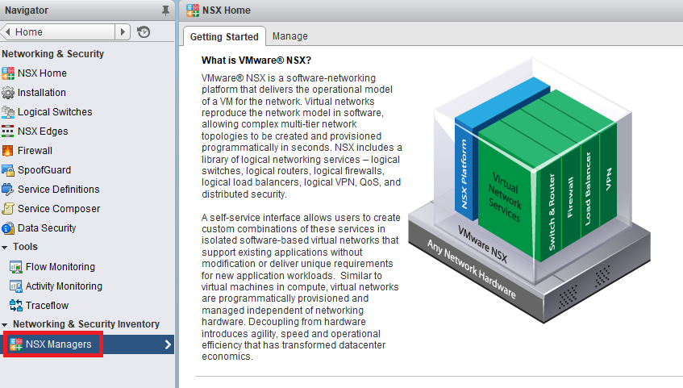{.thumbnail}

Les groupes suivants peuvent être configurés :

### Groupes de sécurité

Les groupes de sécurité permettent de créer des groupes d'objet qui correspondront à une règle spécifique définie dans le groupe.

Vous pouvez ajouter un groupe de sécurité en cliquant sur le bouton `+ Ajouter`{.action}.

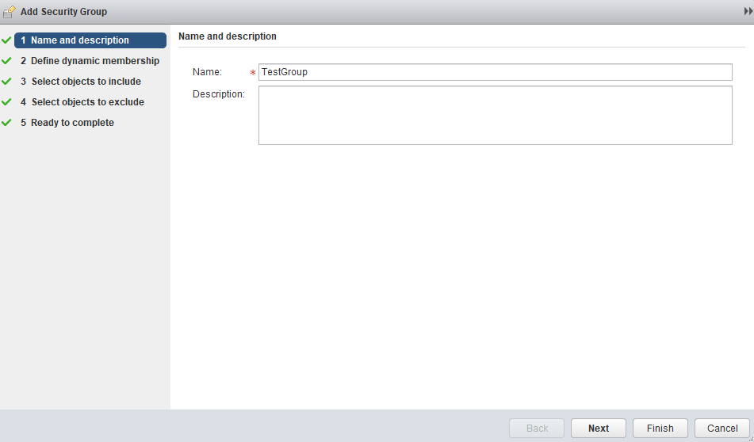{.thumbnail}

Vous pouvez ensuite sélectionner les membres de critères. Dans l'exemple ci-dessous, le groupe inclura toutes les VMs dont le nom dans vSphere contiendra "Test" ou "Trial". Vous pouvez cliquer sur "Add" pour ajouter des règles au membre.

Le champ "Match" permet de définir si toutes les règles doivent correspondre pour l'appartenance au groupe ou si un seul critère est nécessaire.

Les critères peuvent se baser sur des informations différents. Ainsi, un critère peut se baser sur le contenu du nom d'une VM, et un second dont le nom commence par des caractères particulier.

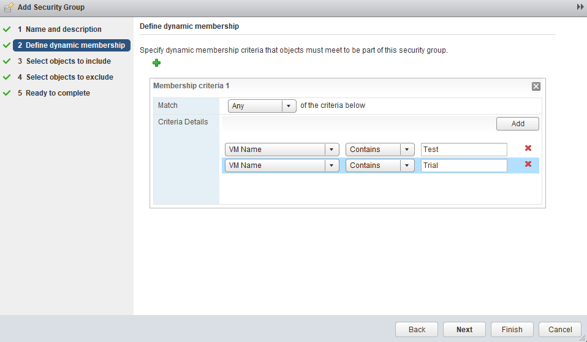{.thumbnail}

L'étape suivante permet d'indiquer si d'autres objets sont inclus dans cette règle de sécurité, qu'ils correspondent ou non aux critères configurés précédemment.

Les objets peuvent être d'autres groupes de sécurité, des cluster, et biens d'autres choses.

Cette étape est optionnelle, vous pouvez directement poursuivre si vous ne souhaitez pas d'exception.

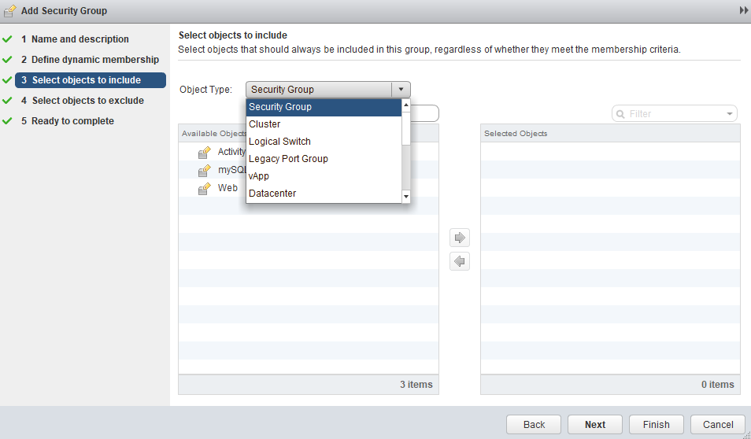{.thumbnail}

L'étape suivante est similaire mais pour que des éléments ne soient pas ajoutées au groupe de sécurité même si ils répondent aux critères.

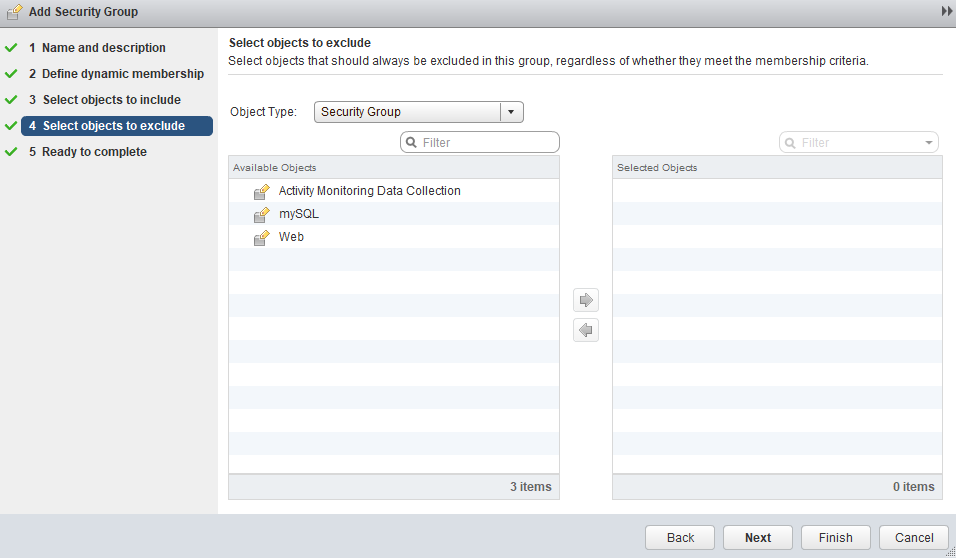{.thumbnail}

Obtenez finalement le résumé du groupe de sécurité que vous pouvez vérifier avant de valider.

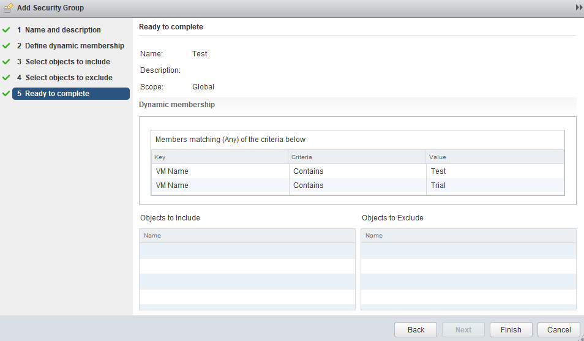{.thumbnail}

Le groupe de sécurité est fonctionnel et peut être utilisé en tant que source ou destination d'une règle de firewall.

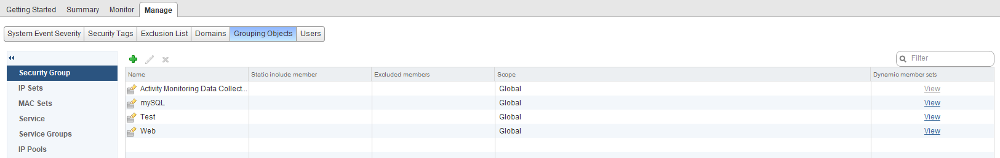{.thumbnail}

### Ensembles d'adresses IP

Les "Ensembles d'adresses IP" permettent de créer des groupes d'IPs qui peuvent ensuite être utilisés dans des règles de firewall ou de NAT ensuite.

Rendez-vous dans la partie "Ensembles d'adresses IP" pour avoir accès au tableau associé.

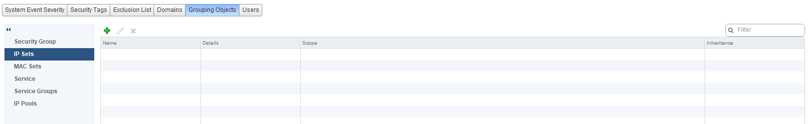{.thumbnail}

Cliquez sur `+ Ajouter`{.action} pour ajouter un groupe d'IP. Vous pouvez renseigner les champs suivants :

- Name : Le nom du groupe d'IP, explicite pour vous afin de différenciez vos différents groupes.
- Description : Une description facultative du groupe afin de les différencier entre eux.
- IP Addresses : Les IPs inclues dans le groupe (IP unique, sous réseau entier ou plage précise en réspéctant la syntaxe rappelée sous le champ).

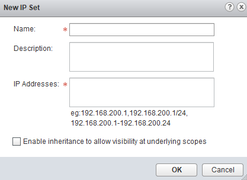{.thumbnail}

Le groupe est créé.

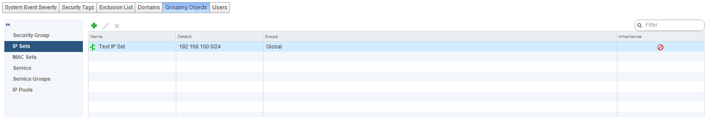{.thumbnail}

### Ensembles MAC

Les "Ensembles MAC" permettent de créer des groupes d'adresses MAC qui peuvent ensuite être utilisés dans des règles de firewall ensuite.

Rendez-vous dans la partie "MAC Sets" pour avoir accès au tableau associé.

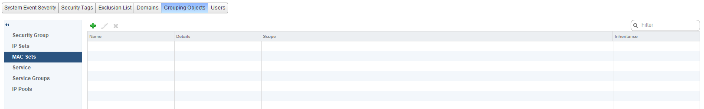{.thumbnail}

Cliquez sur `+ Ajouter`{.action} pour ajouter un groupe d'adresses MAC. Vous pouvez renseigner les champs suivants :

- Name : Le nom du groupe d'IP, explicite pour vous afin de différenciez vos différents groupes.
- Description : Une description facultative du groupe afin de les différencier entre eux.
- MAC Addresses : Les adresses MAC inclues dans le groupe (au moins deux, séparées par des virgules).

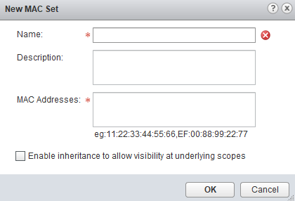{.thumbnail}

Le groupe est créé.

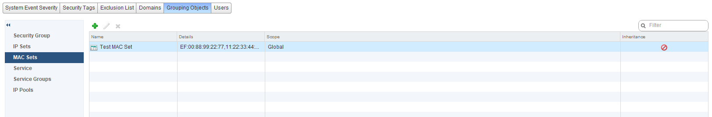{.thumbnail}

### Services

La partie "Services" vous permet d'avoir accès à une liste prédéfinie de services connus. Vous pourrez par exemple retrouver le service "HTTP" qui correspond au protocole TCP sur port 80 ou encore le service "HTTPS" en TCP sur le port 443.

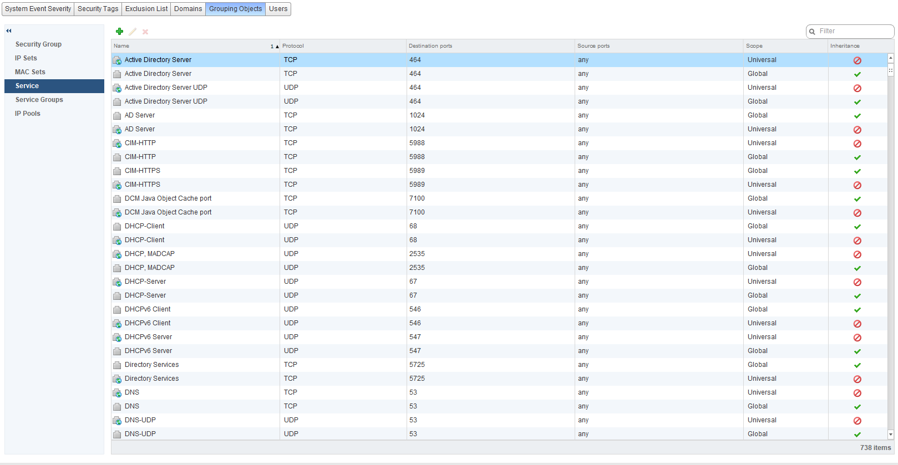{.thumbnail}

Cliquez sur `+ Ajouter`{.action} pour ajouter un service personnalisé. Dans le cas présent, nous ajouterons un port personnalisé pour l'accès en SSH, afin de ne pas utiliser le port 22 par défaut.

Les options avancées permettent, dans l'exemple du TCP, d'ajouter des ports sources pour détailler le type de traffic attendu par ce service.

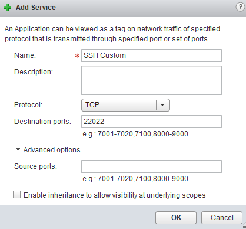{.thumbnail}

Le nouveau service est maintenant disponible pour la création de règles, par exemple firewall.

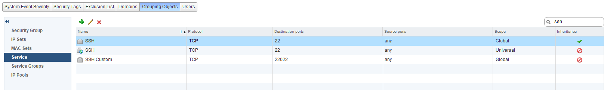{.thumbnail}

### Groupes de services

La partie "Groupes de services" vous permet de gérer les services abordés dans la partie précédente, et d'en faire des groupe qui sont complémentaires pour vos utilisations.

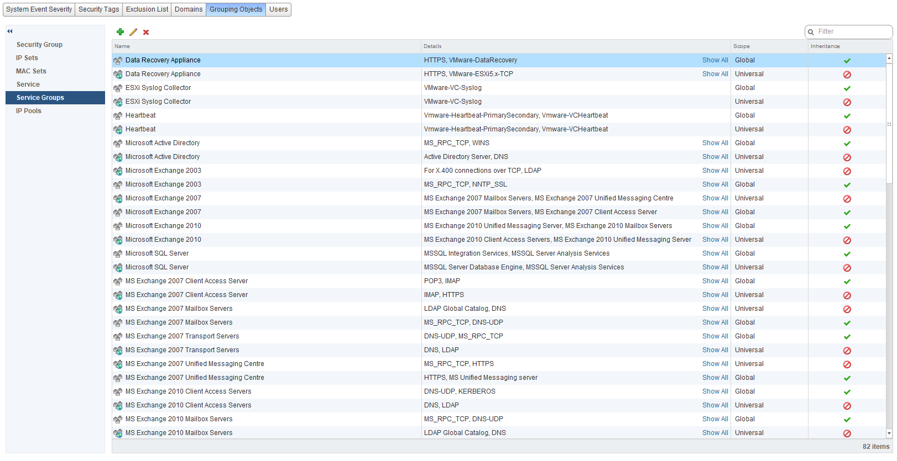{.thumbnail}

Cliquez sur `+ Ajouter`{.action} pour ajouter un groupe de services personnalisé. Cet ajout vous permet de définir les services inclus dans votre groupe de service.

Afin d'ajouter les services au groupe, sélectionnez les dans la colonne de gauche et ajoutez-les dans la colonne de droite.

Via le menu déroulant "Object Type", vous pouvez également inclure des groupes de service dans ce groupe de service plutôt que des services seuls.

Dans l'exemple suivant, nous allons créer un service appelé "Web" permettant de gérer le HTTP et HTTPS simultannément ensuite dans les règles NSX.

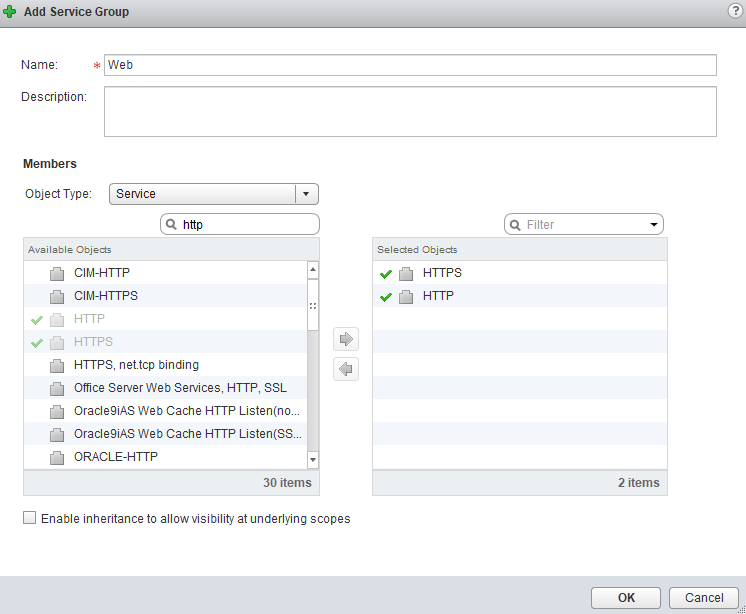{.thumbnail}

Le groupe de services personnalisés est ensuite disponible.

{.thumbnail}

### Pools d'adresses IP

> [!warning]
>
> La partie "Pools d'adresses IP" est reservée aux administrateurs OVH. Une modification des pools d'IPs pourraient créer différents dysfonctionnements et entrainer une remise en place complexe.
>

## Aller plus loin

Échangez avec notre communauté d'utilisateurs sur <https://community.ovh.com>.